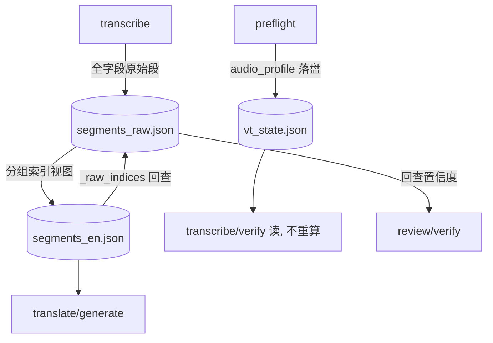

## 需求概述

建立流水线数据契约总线（ADR-035），从根上杜绝阶段间「参数丢失 / 重复重算 / 变换丢字段」这类系统性问题，不做补丁式修补。

## 触发案例（历史问题）

1. `duration` 断线：`analyze_audio` 不 probe、`_resolve_routing` 不传，导致 `adaptive_vad` / `separate_vocals` 自动推荐永远 False（ADR-034 §1.2）。
2. `merge` 合并段时新建 dict 只留 `start/end/text/words`，丢弃 `no_speech_prob` / `avg_logprob` / `compression_ratio`，导致 review 的 G1（及后续 G3）在合并后时间轴拿不到信号 A 而休眠，verify 的 LOW_CONFIDENCE 道同样被削弱。

## 已确认决策

1. 范围走 M1–M3：契约表 + 消灭重算 + 非破坏段存储；M4（统一进程内 RunPayload 传参）暂缓。
2. 字段携带用 Z2 非破坏视图：原始段（`segments_raw.json`，全字段）永不覆盖；merge 只产「分组索引视图」，下游按索引回查原始置信度，不聚合、不覆盖、不丢。
3. 数据分工：`vt_state.json` = 全局/运行级参数（duration、silence_intervals、routing、阶段状态）；`segments_raw.json` = 每段字幕级参数（no_speech_prob/avg_logprob/compression_ratio 跟段绑死）。
4. MAJOR_VERSION_PLAN 落位为 P0 地基任务（暂定编号 T10），排在 T8 之前；T8/T9/TRANSLATION-WORKFLOW 引用它。
5. 守住 `state.py` 现有契约：「state 是增强，永不是 gate」——gates 只看 segments/zh 产物文件，state 损坏不能阻断管道。
6. 用户用自然语言驱动 agent、翻 `videos/` 下产物看结果、从不敲命令 → 所有审计/校验结果必须落盘成文件，不依赖 stdout。

## 完整性清单（需登记的数据，覆盖 8 类 + 额外项）

- preflight：audio_profile（duration/mean_db/max_db/silence_fraction/silence_intervals）、routing（style/vad/adaptive_vad/separate_vocals/vad_threshold）。
- transcribe：原始段（含三个置信度字段）、detected_lang.json、chunk 参数与 chunk_0.json 缓存、align 后端与对齐词级时间戳、audio_source（vocals.wav 路径，显式记录而非靠 fingerprint 反推）。
- merge：合并视图（segments_en.json，带分组索引）。
- review/fill_gaps：审查判定（MISSING/HALLUCINATION/CLEAN + g1/g2/g3 窗口 + unrecoverable）、恢复段（自带置信度）。
- translate：engine/proxy/glossary/persona/src/tgt/style、translate_task.json、pending.json。
- generate：subtitle style、四个成品 srt、generate_opts sidecar。
- verify：issues 清单、semantic_reread_task/result.json、verify attempts、verify_align 漂移报告。
- 环境/配置：model 名/路径、device/compute_type/threads、toolchain 的 ffmpeg/ffprobe/demucs 路径、config 解析结果、CLI 旗标（如 --no-review）。
- 系统性项：缓存指纹规则统一（transcribe 指纹 / review digest / vocal_sep fingerprint 各自为政需收编）、`pipeline_def.STAGES` 与 `state.STAGE_ORDER` 两套 stage id 需对齐。

## 验收标准

- 契约表覆盖全部数据且命名唯一；silencedetect 全链只算一次；merge 不再丢任何字段（契约测试绿）；G1 能在合并后时间轴拿到信号 A；全量 pytest 绿；文档同步（ADR-035 + MAJOR_VERSION_PLAN T10 + T8/T9/workflow 引用更新）；审计落盘文件。

## 技术栈

- 纯 Python 3.10+（现有项目，无新运行时依赖）。
- 沿用项目既有 idiom：`pipeline_def.STAGES` / `capabilities.CAPS` 的「声明式纯数据表 + 引擎解释」模式，新契约表照此实现，不做散文式接口文档。
- 测试沿用 pytest；契约测试用真实段 fixtures 驱动。

## 实现方案

总体策略：把「阶段间传什么数据」从散落的文件名/字段名/重算逻辑中抽出来，收敛进一张可执行、可校验的声明式 `artifacts` 表；然后分三步迁移（M1 登记现状 → M2 消灭重算 → M3 非破坏段存储），每步独立可交付、可回滚。

关键决策：

- **Z2 非破坏**：`segments_raw.json` 作为原始段唯一事实来源、不可变；merge 不再重建段 dict，而是产出「字幕视图 + 分组索引 `_raw_indices`」，置信度一律按 `_raw_indices` 回查 raw，永不做 min/max 聚合。
- **state 升 schema v2**：新增 `audio_profile` 数据段（duration/silence_intervals），成为全局参数唯一落点；load 对旧 schema 做兼容迁移（缺失即按现有 artifacts 重建，仍不阻断）。
- **五条铁律**（写入 ADR-035，且可被测试强制）：① 单一生产（一个数据只准 `produced_by` 阶段写，其余只读）② 变换必须 copy-then-override（未知字段默认保留）③ 命名单一来源（字段名/文件后缀/参数名/stage id/decision key 全从表取，禁止模块自造）④ 边界校验（CI 硬失败 + 运行时 loud warn + `--strict` 下 exit）⑤ state 永不做 gate。
- **向后兼容**：`segments_en.json` 仍是下游可读的合并字幕（text/words/start/end 不变），新增 `_raw_indices` 不破坏 translate/generate 现有消费；review/verify 显式使用 `_raw_indices` 回查。

## 架构设计

数据流按「生产者 → 契约表 → 消费者」收敛：



- 契约层：`artifacts.py` 声明式表 + 校验器（`validate_artifact` / `enforce_contract`）。
- 状态层：`state.py` schema v2，承载全局参数 + 阶段状态 + 哈希链。
- 数据层：raw 段文件不可变；merge 视图带分组索引；review 缓存独立。
- 各阶段适配层：transcribe/merge/fill_gaps/review/verify/translate 只通过契约表定位与读写，不重算、不自造名。

## 目录结构

```
video-translate/
├── docs/adr/035-pipeline-data-contract.md      # [NEW] ADR-035 正文：契约表 schema + 五条铁律 + Z2 + M1-M3 迁移 + 验收
├── src/video_translate/
│   ├── artifacts.py                            # [NEW] 声明式数据契约表 + 校验器 + 命名单一来源常量
│   ├── state.py                                # [MODIFY] schema v2：新增 audio_profile 数据段，兼容旧 schema 迁移
│   ├── pipeline_def.py                         # [MODIFY] STAGES 与 state.STAGE_ORDER 对齐，引用 artifacts 常量
│   ├── pipeline.py                             # [MODIFY] build_ctx 改查表定位产物
│   ├── merge.py                                # [MODIFY] Z2：产分组索引视图 _raw_indices，不重建/不覆盖原始段
│   ├── fill_gaps.py                            # [MODIFY] review/G1/G2 按 _raw_indices 回查置信度；读 state 静音不重算
│   ├── review.py                               # [MODIFY] signal_a_state 支持从 raw 段回查
│   ├── verify.py                               # [MODIFY] LOW_CONFIDENCE 从 raw 回查；静音读 state
│   ├── translate.py                            # [MODIFY] 若消费段字段则适配视图（预计小改）
│   ├── cli.py                                  # [MODIFY] 去 654 行重算、查表定位、--strict 校验、审计落盘文件
│   ├── audio_profile.py                        # [MODIFY] duration 确认、silence_intervals 落盘接口
│   └── vocal_sep.py                            # [MODIFY] audio_source 显式记录
├── MAJOR_VERSION_PLAN.md                       # [MODIFY] 新增 T10 地基任务（P0，T8 前），T8/T9 涉及文件加「读 artifacts 表」
├── docs/TRANSLATION-WORKFLOW.md                # [MODIFY] 数据流改为按 artifacts 表描述
└── tests/
    ├── test_pipeline_field_contract.py         # [NEW] 跨阶段契约测试：transcribe→merge→fill_gaps 全链字段存活
    └── (既有测试)                               # [MODIFY] 随契约调整的 test_review/test_doctor 等
```

## 关键代码结构

契约表条目（声明式，纯数据）：

```python
class Artifact(TypedDict):
    id: str                       # 唯一规范名
    file: str                     # 路径模板，如 "{base}.segments_raw.json"
    fields: tuple[str, ...]       # 已知字段
    carry: tuple[str, ...]        # 必须穿透下游变换的字段
    produced_by: str              # 唯一生产者 stage id
    consumed_by: tuple[str, ...]  # 消费者 stage id
    recompute: bool               # False = 禁止下游重算
```

state schema v2 的全局参数落点：

```python
# vt_state.json
{
  "schema_version": 2,
  "audio_profile": {
      "duration": 131.2,
      "mean_db": -33.3,
      "silence_fraction": 0.54,
      "silence_intervals": [[0.0, 1.2], [2.3, 2.8]]
  }
}
```

merge 视图（Z2 非破坏，带分组索引）：

```python
# segments_en.json 每项新增 _raw_indices 回查指针，text/words 为投影
{
  "start": 6.98, "end": 9.2,
  "text": "...", "words": [...],
  "_raw_indices": [3, 4, 5]          # 指向 segments_raw.json 源段
}

def resolve_confidence(seg, raw_segments) -> list[dict]:
    """按 _raw_indices 回查原始段，取回 no_speech_prob/avg_logprob。"""
```

## 实现注意事项

- **性能**：silencedetect/duration 全链只算一次，省掉 transcribe/verify 的重复 ffmpeg 探测；回查置信度为按索引 O(1) 读内存/文件，无额外解码。
- **缓存影响**：`segments_en.json` 增加 `_raw_indices` 会改变内容哈希 → review digest / segments_sha 变化 → review 缓存与下游指纹自动失效，需在契约表中显式声明「哪些参数进指纹、哪些字段仅穿透」。
- **日志落盘**：契约校验结果与 `[audit]` 审计行同时写 `videos/<base>.review.log`，满足用户翻文件不翻 stdout 的用法；避免日志泄露路径之外的大 payload。
- **回滚**：M1 纯登记零行为变化；M2/M3 各自可独立回退（state 旧 schema 可重建、raw 文件始终保留）；golden 按单轨 bare 本地重跑确认不回归。
- **不越界**：本计划只做契约地基与迁移，G3（ADR-034 §6.3）作为后续任务在总线之上实现。

## Agent Extensions

### SubAgent

- **code-explorer**
- Purpose: M1 阶段全面盘点所有数据项、文件后缀、字段名与跨模块调用点，确保契约表无遗漏。
- Expected outcome: 产出完整数据清单与调用点映射，作为 artifacts.py 登记与命名收敛的依据。

### Skill

- **lsp-code-analysis**
- Purpose: M3 阶段对 merge 输出与 segments 字段做语义级引用分析，找出所有下游消费点，确保非破坏改造不破坏 translate/generate/verify。
- Expected outcome: 列出全部受影响的定义、引用与调用层级，指导 Z2 改造范围与回归用例。