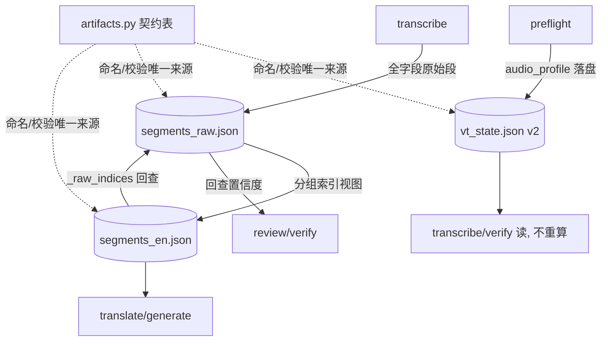

## 产品概述

建立流水线数据契约总线（ADR-035），从根上杜绝阶段间"参数丢失、重复重算、变换丢字段"的系统性问题，不做补丁式修补。核心是把"阶段间传什么数据"从散落的文件名、字段名、重算逻辑中抽出，收敛进一张可执行、可校验的声明式 `artifacts` 契约表，并按 M1–M3 三步迁移落地。

## 核心特性

1. **声明式契约表**：所有数据的命名、文件模板、字段、生产者、消费者、是否允许重算、必须穿透下游的字段，全部登记在一张纯数据表，成为唯一事实来源。
2. **五条铁律**：单一生产（一个数据只准生产者阶段写）、变换 copy-then-override（未知字段默认保留）、命名单一来源（禁止模块自造）、边界校验（CI 硬失败 + 运行时告警 + strict 退出）、state 永不做 gate。
3. **非破坏段存储（Z2）**：`segments_raw.json` 全字段不可变；merge 只产出带 `_raw_indices` 的分组索引视图，下游按索引回查原始置信度，不聚合、不覆盖、不丢。
4. **消灭重算**：silencedetect 静音区间与 duration 只在 preflight 计算一次落盘，transcribe/verify 改为读取，杜绝同一声学事实被重复探测。
5. **state 升级 schema v2**：承载全局/运行级参数（duration、silence_intervals、routing、阶段状态），旧 schema 可兼容迁移且不阻断。
6. **契约测试与校验器**：跨阶段字段存活测试 + 运行时边界校验，让字段丢失从"静默退化"变成"当场报错"。
7. **重写 AGENTS.md 编码规范 harness**：收敛四块内容——数据传输总线、项目目的与系统架构、强约束、编码规范（SDD + TDD），严格控制行数保持精简。
8. **全量文档同步**：MAJOR_VERSION_PLAN 新增 P0 地基任务 T10 并更新 T8/T9 引用，TRANSLATION-WORKFLOW 改为按契约表描述数据流，ADR-035 与相关 Spec 同步。
9. **编码规范固化**：SDD（先写 Spec/ADR 定契约）与 TDD（先写测试再实现），杜绝"前面乱写、后面修补"的复发。

## 技术栈选择

- 纯 Python 3.10+，复用现有项目，无新运行时依赖。
- 沿用项目既有 idiom：`pipeline_def.STAGES` / `capabilities.CAPS` 的"声明式纯数据表 + 引擎解释"模式，契约表照此实现，不做会漂移的散文式接口文档。
- 测试沿用 pytest，契约测试用真实段 fixtures 驱动。

## 实现方案

总体策略：把阶段间数据流转抽成可执行、可校验的声明式 `artifacts` 表，分三步迁移，每步独立可交付、可回滚。

关键决策：

- **Z2 非破坏视图**：`segments_raw.json` 为原始段唯一事实来源且不可变；merge 不再重建段 dict，而是产出"字幕视图 + 分组索引 `_raw_indices`"；置信度一律按 `_raw_indices` 回查 raw，永不做 min/max 聚合。
- **state schema v2**：新增 `audio_profile` 数据段（duration、mean_db、silence_fraction、silence_intervals），成为全局参数唯一落点；load 对旧 schema 兼容迁移，缺失即按现有 artifacts 重建，仍不阻断。
- **向后兼容**：`segments_en.json` 仍是下游可读的合并字幕（text/words/start/end 不变），新增 `_raw_indices` 不破坏 translate/generate 现有消费；review/verify 显式使用 `_raw_indices` 回查。
- **编码规范 SDD + TDD**：先写 ADR-035 与 Spec 定契约，再写契约测试，最后实现；所有新模块（如 `artifacts.py`）先测试后落地。

## 架构设计

数据流按"生产者 → 契约表 → 消费者"收敛：



- 契约层：`artifacts.py` 声明式表 + 校验器（`validate_artifact` / `enforce_contract`）。
- 状态层：`state.py` schema v2，承载全局参数 + 阶段状态 + 哈希链。
- 数据层：raw 段文件不可变；merge 视图带分组索引；review 缓存独立。
- 规范层：`AGENTS.md` 承载 SDD + TDD + 五条铁律 + 架构定位，保持精简。

## 目录结构

```
video-translate/
├── AGENTS.md                                  # [MODIFY] 重写 harness：数据传输/架构/强约束/SDD+TDD，精简
├── docs/adr/035-pipeline-data-contract.md     # [NEW] ADR-035：契约表 schema + 五条铁律 + Z2 + M1-M3 + 验收
├── src/video_translate/
│   ├── artifacts.py                           # [NEW] 声明式契约表 + 校验器 + 命名单一来源常量
│   ├── state.py                               # [MODIFY] schema v2：audio_profile 数据段，兼容迁移
│   ├── pipeline_def.py                        # [MODIFY] STAGES 与 STAGE_ORDER 对齐，引用契约常量
│   ├── pipeline.py                            # [MODIFY] build_ctx 改查表定位产物
│   ├── merge.py                               # [MODIFY] Z2：产 _raw_indices 分组视图，不重建不覆盖
│   ├── fill_gaps.py                           # [MODIFY] 按 _raw_indices 回查置信度；静音读 state 不重算
│   ├── review.py                              # [MODIFY] signal_a_state 支持从 raw 回查
│   ├── verify.py                              # [MODIFY] LOW_CONFIDENCE 从 raw 回查；静音读 state
│   ├── translate.py                           # [MODIFY] 消费段字段时适配视图（预计小改）
│   ├── cli.py                                 # [MODIFY] 去 654 行重算、查表定位、--strict、审计落盘
│   ├── audio_profile.py                       # [MODIFY] duration 确认、silence_intervals 落盘接口
│   └── vocal_sep.py                           # [MODIFY] audio_source 显式记录
├── MAJOR_VERSION_PLAN.md                      # [MODIFY] 新增 T10（P0，T8 前），T8/T9 加"读 artifacts 表"
├── docs/TRANSLATION-WORKFLOW.md               # [MODIFY] 数据流改为按契约表描述
└── tests/
    ├── test_pipeline_field_contract.py        # [NEW] 跨阶段契约测试：全链字段存活
    └── (既有测试)                              # [MODIFY] test_review/test_doctor 等随契约调整
```

## 关键代码结构

```python
class Artifact(TypedDict):
    id: str                       # 唯一规范名
    file: str                     # 路径模板，如 "{base}.segments_raw.json"
    fields: tuple[str, ...]       # 已知字段
    carry: tuple[str, ...]        # 必须穿透下游变换的字段
    produced_by: str              # 唯一生产者 stage id
    consumed_by: tuple[str, ...]  # 消费者 stage id
    recompute: bool               # False = 禁止下游重算
```

```python
# vt_state.json (schema v2)
{
  "schema_version": 2,
  "audio_profile": {
      "duration": 131.2,
      "mean_db": -33.3,
      "silence_fraction": 0.54,
      "silence_intervals": [[0.0, 1.2], [2.3, 2.8]]
  }
}
```

```python
# segments_en.json 每项新增回查指针，text/words 为投影
{
  "start": 6.98, "end": 9.2,
  "text": "...", "words": [...],
  "_raw_indices": [3, 4, 5]
}

def resolve_confidence(seg, raw_segments) -> list[dict]:
    """按 _raw_indices 回查原始段，取回 no_speech_prob/avg_logprob。"""
```

## 实现注意事项

- **性能**：silencedetect/duration 全链只算一次，省去 transcribe/verify 重复 ffmpeg 探测；回查置信度为按索引 O(1) 读取，无额外解码。
- **缓存影响**：`segments_en.json` 增加 `_raw_indices` 会改变内容哈希，导致 review digest / segments_sha 变化，review 缓存与下游指纹自动失效；需在契约表显式声明"哪些参数进指纹、哪些字段仅穿透"。
- **日志落盘**：契约校验结果与 `[audit]` 审计行同时写 `videos/<base>.review.log`，满足翻文件不翻 stdout 的用法；避免写入大 payload。
- **回滚**：M1 纯登记零行为变化；M2/M3 各自可独立回退（state 旧 schema 可重建、raw 文件始终保留）；golden 单轨 bare 本地重跑确认不回归。
- **规范精简**：AGENTS.md 重写后保持低行数，只留四块核心内容，不复制 ADR/Spec 全文，只给入口与索引。
- **不越界**：本计划只做契约地基与迁移；G3（ADR-034 §6.3）作为后续任务在总线之上实现。

## Agent Extensions

### SubAgent

- **code-explorer**
- Purpose: M1 阶段全面盘点所有数据项、文件后缀、字段名与跨模块调用点，确保契约表无遗漏。
- Expected outcome: 产出完整数据清单与调用点映射，作为 artifacts.py 登记与命名收敛的依据。

### Skill

- **lsp-code-analysis**
- Purpose: M3 阶段对 merge 输出与 segments 字段做语义级引用分析，找出全部下游消费点，确保非破坏改造不破坏 translate/generate/verify。
- Expected outcome: 列出全部受影响的定义、引用与调用层级，指导 Z2 改造范围与回归用例。