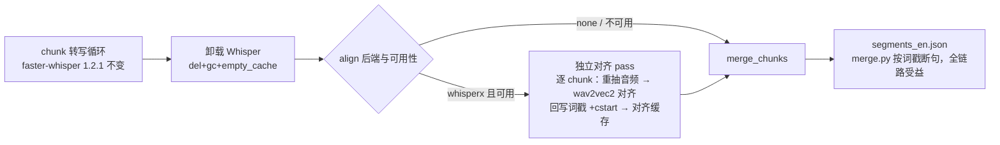

## 用户需求

规划 T4 阶段开发：为现有「视频 → 双语字幕」流水线引入**强制声学对齐**能力，修复极端语速下的词级时间戳漂移。沿用既定开发流程：先产出架构决策记录（ADR）与行为规格说明（Spec）交用户过目，确认后以测试先行（TDD）方式实现。

## 产品概述

在转写完成后新增一道**可选的时间轴精修工序**：用声学强制对齐把每个词的起止时间校准到真实发音，使字幕与语音严丝合缝，消除快语速、长台词场景下「字幕抢跑/滞后」的观感问题。默认关闭（现有行为零变化）；开启后仅在具备高性能计算条件的环境实际生效，其余环境自动回退并打印提示，主流程绝不中断。

## 核心功能

- **对齐开关**：转写与全流程命令新增对齐后端选项（默认关闭），支持命令行参数、环境变量、项目配置文件三级覆盖
- **词级时间戳精修**：对齐仅修正每个词的起止时间及由此推导的段落边界，绝不改动文本内容、断句分组与段落顺序
- **优雅降级**：显式开启但不满足运行条件（组件未安装、当前机器不支持、语言无可用对齐模型）时，打印告警并自动回退关闭状态继续执行，退出码不变
- **断点续跑**：对齐结果按分块独立缓存；重跑复用「转写缓存 + 对齐缓存」两层；切换对齐模式不触发重新转写
- **环境自检**：诊断命令显示对齐组件安装状态与安装指引
- **质量验收**：已知漂移样本对齐后时间戳误差小于 150 毫秒，可用现有声学校验通道量化对比

**观感效果**：字幕出现/消失与说话声精确同步，快语速长台词不再提前或延后。

## Tech Stack

- 运行时：Python ≥3.10（项目现状不变）
- 转写核心：`faster-whisper==1.2.1` 钉版**不动**（不换核心，守住既有确定性）
- 对齐组件：`whisperx`（仅使用其 wav2vec2 对齐能力：`load_align_model` + `align`），进 `pyproject` 新增 `[gpu]` 可选依赖组；Mac / 默认安装零新依赖
- 包管理：uv（pyproject 变更同一 commit 内重跑 `uv lock`，规则 R3）
- 测试：pytest 全 mock（Mac 无 GPU/无库环境可跑，覆盖降级路径）

## Implementation Approach

四个关键决策（写入 ADR-028）：

1. **只借用对齐，不换核心**：仅 import whisperx 的对齐函数，转写仍走 faster-whisper 1.2.1——最小化依赖冲突面，对应 ADR-013「仅对齐不换核心」的正向设计。
2. **独立对齐 pass + 独立缓存层**：chunk 转写缓存（DTW 词戳）不动；对齐作为「chunk 转写后、merge 前」的独立工序，逐 chunk 产出对齐缓存文件。**不把 align 追加进转写指纹**——若进指纹，切换对齐模式会触发全量重转写（GPU 最贵一步），而对齐本身便宜可重跑；独立缓存层同样实现「不同对齐模式产物隔离」（铁律 3 的目标），且转写指纹保持历史哈希字节兼容（golden 保护）。
3. **分步执行守 8GB 显存红线**：chunk 转写循环结束 → 显式卸载 Whisper（`del` + `gc` + `torch.cuda.empty_cache`，T2 已有模式）→ 加载 wav2vec2 对齐模型（约 1.2GB）→ 对齐完再次清理。
4. **逐段安全回退**：对齐返回词数与原段词数不匹配（whisperx 重分词等罕见情况）时，该段保留 DTW 词戳并告警，其余段正常回写，绝不整批失败。

**不变量**：text / 段数 / 顺序 / 断句分组不变，仅改 `words[].start/end` 与由词推导的段边界；对齐音源与转写音源一致（人声分离开启时用 `vocals.wav`，时间轴经 ADR-017 时长不变量锚定原片）；语言自动检测结果从转写 info 传递给对齐 pass，语言无 wav2vec2 模型 → 告警整批跳过。

### 数据流



## Implementation Notes

- **性能**：wav2vec2 模型只加载一次复用全部 chunk；chunk 音频用既有 `extract_chunk` 重抽（ffmpeg，确定性，快）；切换 `--align` 不重转写。
- **缓存命名**：对齐产物 `{base}.{fp}.chunk_{ci}.whisperx.json`（后端直接入名，天然隔离，未来新后端零冲突）；`fp` 为既有转写指纹。对齐中断后重跑仅补缺失块。
- **降级矩阵（铁律 2）**：显式 whisperx +（Mac | 未安装 | 语言无模型）→ stderr 告警 + 回退 none 继续跑，退出码 EXIT_OK 不变。
- **依赖风险**：whisperx 拉入的 faster-whisper/ctranslate2 须与 1.2.1 钉版在 uv 解析下兼容；冲突时按 ADR-013 回退预案（降 whisperx 版本，或改用 transformers wav2vec2 直接实现——torch 已是核心依赖）；R6 五项准入清单（跨平台/指纹/显存/等价实现/lockfile）写入 Spec 22。
- **日志**：沿用 `progress(...)` 回调与既有 stderr 告警风格；不打印大 payload。
- **范围外**：`resegment` 命令暂不接对齐（Spec 22 注明）；说话人分离属 T5。
- **验收**：pytest 全绿（Mac mock）；`--align none` 路径与现状字节级一致（golden）；GPU 盒鲍德温漂移样本误差 < 150ms（`verify --video` 声学 lane 量化留档）。

## Directory Structure

```
video-translate/
├── docs/
│   ├── adr/
│   │   ├── 013-whisperx-gpu-forced-alignment.md  # [MODIFY] 状态更新：延后 → 已由 ADR-028 落地
│   │   └── 028-whisperx-alignment-pass.md        # [NEW] 实现级决策：仅对齐不换核心/独立 pass+独立缓存/分步显存/逐段回退/依赖准入
│   └── specs/
│       └── 22-whisperx-alignment.md              # [NEW] 行为契约：CLI/配置三级覆盖/缓存命名/降级矩阵/不变量/TDD 清单
├── src/video_translate/
│   ├── align.py            # [NEW] 对齐模块：whisperx_available()/align_fingerprint()/align_segments()/显存清理
│   ├── config.py           # [MODIFY] Config.align 字段 + VT_ALIGN + toml [transcribe].align
│   ├── transcribe.py       # [MODIFY] transcribe_video 新增 align_backend 参数；chunk 循环后卸载模型 → 独立对齐 pass → 对齐分块缓存
│   └── cli.py              # [MODIFY] transcribe/run 加 --align；doctor 加 whisperx 状态行；降级告警
├── tests/
│   ├── test_align.py       # [NEW] 探测/指纹/不变量/词数不匹配回退/显存清理/降级（全 mock）
│   ├── test_config.py      # [MODIFY] align 三级覆盖与非法值
│   └── test_transcribe.py  # [MODIFY] align=none golden 字节兼容；对齐缓存写入与二次复用；merge 消费对齐词戳
├── pyproject.toml          # [MODIFY] 新增 [gpu] extra（whisperx 钉版本）
├── uv.lock                 # [MODIFY] 同 commit 重跑（R3）
├── TOOLCHAIN.md            # [MODIFY] 依赖矩阵 + GPU 盒安装：uv sync --extra gpu
├── README.md               # [MODIFY] 功能与用法示例
├── AGENTS.md               # [MODIFY] 五阶段状态机/红线表补对齐说明
└── MAJOR_VERSION_PLAN.md   # [MODIFY] T4 → DONE + 修订记录
```

## Key Code Structures

```python
# src/video_translate/align.py（照 vocal_sep.py 模块模式）
ALIGN_BACKENDS = ("none", "whisperx")

def whisperx_available() -> bool:
    """惰性 import 探测；Mac/未安装返回 False。"""

def align_segments(segments: list[dict], audio_path: str, language: str | None,
                   *, align_backend: str = "whisperx", progress=print) -> list[dict]:
    """chunk 内 segment 词级时间戳强制对齐。
    不变量：text/段数/顺序/分组不变，仅改 words[].start/end 及段边界；
    词数不匹配的段：保留 DTW 词戳 + 告警（逐段安全回退）。"""

def release_align_memory() -> None:
    """卸载 wav2vec2：del + gc + torch.cuda.empty_cache（T2 模式）。"""
```

```python
# transcribe_video 集成点（签名追加，默认值保证零回归）
def transcribe_video(..., align_backend: str = "none", ...) -> str:
    # chunk 循环不变（含转写语言检测 info.language 收集）
    # [NEW] 循环后：del model + 显存清理
    # [NEW] align_backend != "none" 且可用 → 逐 chunk：
    #   读 chunk json → extract_chunk 重抽 wav → 减 cstart 对齐 → 回写词戳(+cstart)
    #   → 存 {base}.{fp}.chunk_{ci}.whisperx.json（对齐缓存，断点续跑）
    # merge_chunks → segments_en.json（不变）
```