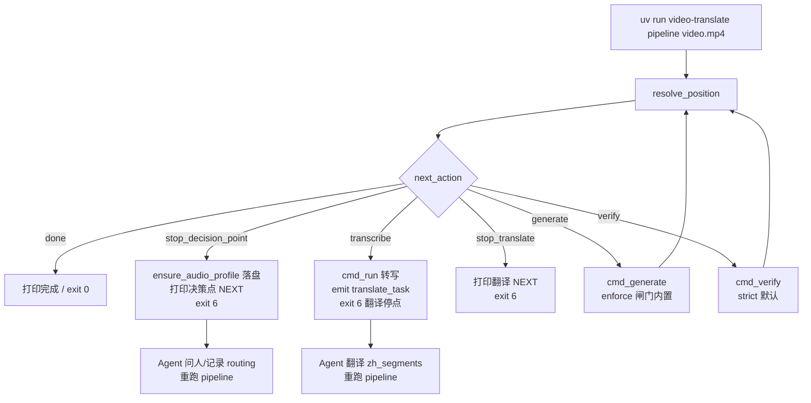

## 产品概述

落地 T8「Pipeline 单一入口 + Agent 协议瘦身」：新增 `pipeline` 幂等推进器子命令，让「该跑哪一步」完全由代码状态机决定，Agent 只需重复调用 `pipeline` 即可推进，不再记忆 generate/verify 参数；同时把 AGENTS.md 从 Phase 0–4 逐命令编排散文瘦身为纯行为协议。落地后即可用单一入口跑通 Nobody 视频。

## 核心特性

1. **`pipeline` 幂等推进器**：每次调用先 `resolve_position()` 定位，再执行「当前该做的下一步」，推进到下一个协作挂起点；重复调用自动续跑，底层 `run`/`generate`/`verify` 保留为原语、行为不变。
2. **两个停点**：决策点（preflight 后）与翻译（transcribe 后，exit 6）。挂起后 Agent 接手（问人 / 翻译），落盘产物（routing / zh_segments.json）后重跑 `pipeline` 自动续下一段。
3. **`--prompt` 三档**：`always`（默认，决策点问人 + 超时自动）/ `never`（不挂，直接按画像自动路由）/ `require-profile`（硬闸，无 explicit routing 即 exit 8）。
4. **决策点与 ADR-034 调和**：ADR-034 已把 `profile_recommendation` 硬编码 `vad=False/adaptive_vad=False/separate_vocals=False`（默认裸跑），因此决策点从「style/vad/separate 三项」收窄为「翻译风格 style 一项」（默认 film）；vad/separate 退化为 `pipeline` 的显式 CLI flag 覆盖。`--require-profile` 硬闸语义保留。
5. **Agent 协议瘦身**：AGENTS.md §3 删除 Phase 0–4 逐命令编排，只留入口调用、挂起职责、红线反模式、决策点协议与退出码速查。
6. **文档同步**：新增 ADR-033 与 Spec 24（Spec 23 已被「环境定位」占用，原计划撞号需修正），更新 MAJOR_VERSION_PLAN T8 状态与 TRANSLATION-WORKFLOW 数据流。

## 核心验收

- `pipeline` 首次调用：preflight 画像落盘后挂起决策点（exit 6，NEXT 标注 decision point）；落盘 routing 后重跑自动续 transcribe → 翻译挂起（exit 6）；翻译后重跑自动续 generate → verify → done。
- `--prompt never` 决策点不挂、直接自动路由；`--require-profile` 无 explicit routing 即 exit 8。
- 底层 `run`/`generate`/`verify` 行为零变化（golden 不回归）。
- 全量 pytest 绿，`test_pipeline_advance.py` 覆盖 `next_action` 纯函数与 prompt 校验。

## 技术栈

- 纯 Python 3.10+，零新运行时依赖，复用现有项目。
- 沿用既有 idiom：`pipeline_def.STAGES` 纯数据表 + `pipeline.py` 引擎解释 + `cli.py` 只执行。
- 测试沿用 pytest；SDD + TDD 先行（铁律 4）。

## 实现方案

总体策略：把「推进器」做成 **pipeline.py 里的纯决策函数 `next_action()`** + **cli.py 里的 `cmd_pipeline()` 执行器**，二者分工与现有架构一致（引擎纯报告/决策，cli 执行 I/O）。决策点靠 `--prompt` 三档控制，复用已存在的 `_resolve_routing`（含画像兜底 + `--require-profile` 硬闸 + origin 分级落盘）。

### 关键决策

1. **推进器 = 纯决策 + 薄执行**：`next_action(pos, prompt_mode, routing_explicit)` 返回 `done | stop_decision_point | transcribe | stop_translate | generate | verify` 六个动作之一，零 I/O、可单测；`cmd_pipeline` 把动作映射到既有执行器（`cmd_run`/`cmd_generate`/`cmd_verify`）。不新造状态机阶段，不复制执行逻辑。

2. **决策点收窄为 style 一项**（与 ADR-034 调和）：ADR-034 §6.1 已把画像降级为参考、默认裸跑，`profile_recommendation` 恒返回 `vad=False/adaptive_vad=False/separate_vocals=False`。故决策点不再问 VAD/分离，只问翻译风格（默认 film，源自 config）。vad/separate 仍可作为 `pipeline` 的显式 `--vad`/`--separate-vocals` flag 传入（经 `_resolve_routing` 的 `CLI flag > routing > 画像推荐` 合并，origin=explicit）。此决策与 ADR-034 铁律 5 一致。

3. **停点复用 exit 6**：决策点停点与翻译停点都用 `EXIT_AWAITING_AGENT(6)`，仅以 NEXT 块文本区分（`decision point` vs `translate`）。`--require-profile` 硬闸继续走现有 `_resolve_routing` 返回 `(None, "explicit")` → exit 8 路径，不另起炉灶。

4. **画像落盘去重**：把 `_resolve_routing` 内「无快照则 analyze_audio + record_audio_profile + record_acoustics」抽成 `_ensure_audio_profile(outdir, base, input_path, cfg)`，供 `_resolve_routing` 与 `cmd_pipeline` 决策点共用。已核实 `_resolve_routing` 仅一处调用（cli.py:1162），抽取零行为变化、零风险。

5. **向后兼容**：`prompt` 默认 `always` 只影响新 `pipeline` 子命令；`run`/`generate`/`verify` 及其参数、退出码、golden 产物完全不变。`run --require-profile` 旧 flag 保留。

### 架构设计



- 决策层（pipeline.py）：`next_action` 纯函数，决定动作。
- 执行层（cli.py）：`cmd_pipeline` 分派到既有 `cmd_run`/`cmd_generate`/`cmd_verify`。
- 状态层（state.py）：`routing`/`audio_profile` 落盘复用现有接口，不新增。
- 规范层（AGENTS.md）：瘦身为入口 + 挂起职责 + 红线 + 决策点协议 + 退出码表。

### 目录结构

```
video-translate/
├── docs/adr/033-control-plane-pipeline-entry.md   # [NEW] ADR-033：pipeline 幂等推进器决策（动作表/三档 prompt/exit 6 复用/与 ADR-034 调和）
├── docs/specs/24-pipeline-behavior.md             # [NEW] Spec 24：pipeline 行为契约（CLI 形态/停点/NEXT 块/退出码/不变量，TDD 清单）
├── src/video_translate/config.py                  # [MODIFY] Config 新增 prompt: str = "always"；env VT_PROMPT / toml [pipeline].prompt；三值校验
├── src/video_translate/pipeline.py                # [MODIFY] 新增 next_action() 纯函数（六个动作），不动现有 resolve_position/render_next
├── src/video_translate/cli.py                     # [MODIFY] 抽取 _ensure_audio_profile；新增 cmd_pipeline；注册 pipeline 子命令（--prompt/--style/--vad/--separate-vocals/--engine 等）
├── AGENTS.md                                      # [MODIFY] §3 瘦身为 pipeline 入口 + 挂起职责；§4.5 决策点改为 style 单项；§3.5 退出码表保留
├── docs/TRANSLATION-WORKFLOW.md                   # [MODIFY] 数据流与入口改为 pipeline 子命令
├── MAJOR_VERSION_PLAN.md                          # [MODIFY] T8 状态置 DONE；修正 Spec 23→24 撞号引用；决策点与 ADR-034 调和注记
└── tests/test_pipeline_advance.py                 # [NEW] next_action 纯函数 + prompt 配置校验 + cmd_pipeline 分派（mock 执行器）
```

### 关键代码结构

```python
# pipeline.py — 纯决策函数（零 I/O，可单测）
def next_action(pos: dict[str, Any], *, prompt_mode: str,
                routing_explicit: bool) -> str:
    """返回 done | stop_decision_point | transcribe | stop_translate
    | generate | verify。prompt_mode ∈ {always, never, require-profile}。"""
```

```python
# config.py — 新增字段（与既有 style/vad/adaptive_vad 同链路）
prompt: str = "always"  # VT_PROMPT / [pipeline].prompt
# 校验：值必须 ∈ {"always", "never", "require-profile"}，非法值 warn 回退 "always"
```

## 实现注意事项

- **Blast radius**：只新增 `pipeline` 子命令与 `next_action`；`cmd_run`/`cmd_generate`/`cmd_verify` 不动逻辑，仅 `_ensure_audio_profile` 抽取（已确认单调用点，零行为变化）。`run --require-profile` 保留。
- **性能**：`pipeline` 是薄分派器，无新解码/探测；画像仍全链只算一次（复用 state 快照），不重复 ffmpeg。
- **缓存/指纹**：不新增产物文件，不改 segments/zh/srt 内容，review digest 与 segments_sha 不受影响。
- **日志**：决策点/翻译停点复用 `_print_pipeline_next` 落 NEXT 块与 `[route] origin=` 审计行，遵守「翻文件不翻 stdout」的用法；不写大 payload。
- **兼容**：`prompt` 默认 always 只作用于新命令；旧 `run` 路径无 `--prompt`，行为不变。

## Agent Extensions

### Skill

- **lsp-code-analysis**
- Purpose: 实施 cli.py 重构前，语义定位 `_resolve_routing`、`record_audio_profile`、`record_acoustics`、`cmd_run`、`cmd_generate`、`cmd_verify` 的全部定义与调用点，确认 `_ensure_audio_profile` 抽取与 `cmd_pipeline` 分派的波及范围不遗漏、不误伤。
- Expected outcome: 得到上述符号的完整引用清单与调用层级，指导安全抽取与分派，并支撑回归用例边界。