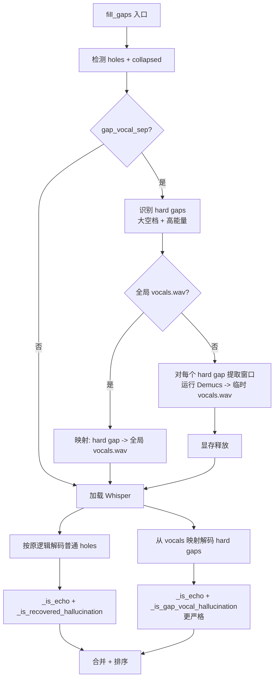

## 产品概述

为 `video-translate` 转写流水线增加一个可选的“硬洞人声分离召回”能力：在 `fill_gaps` 阶段自动识别“大空档 + 高音频能量”的候选窗口，对这些窗口临时跑 Demucs 人声分离，再用 Whisper 单次解码，最后用比常规恢复段更严格的过滤器筛选，把被笑声/BGM 压住的真实语音补回时间轴。

## 核心功能

- 独立 opt-in：新增 `--gap-vocal-sep` flag（默认关），不跟随全局 `--separate-vocals`。
- 硬洞识别：基于空档长度与窗口音量（mean/max dB）筛选候选窗口，避免对静音洞浪费算力。
- 窗口级 Demucs：在 `fill_gaps` 加载 Whisper 之前先对硬洞窗口做人声分离，遵守 ADR-017 的 Demucs/Whisper 串行显存调度。
- 严格后过滤：在现有 `_is_recovered_hallucination` 基础上进一步收紧 `no_speech_prob`、`avg_logprob`，并增加歌词/重复吟唱模式识别，拦截 821s 类 BGM 歌词幻觉。
- 端到端验证：在 `videos/Nobody Can Handle Christopher Walken's STRANGE Hum.mp4` 上重新转写、翻译、生成字幕，验证 5:45（332–352s）、6:17（377–388s）、13:41（821–833s）三个关键区域。

## 技术栈

- 语言：Python 3.x
- 转写：faster-whisper（已有）
- 人声分离：Demucs（已有 `vocal_sep.py` 封装）
- 音频分析：ffmpeg `volumedetect` / `silencedetect`（已有 `audio_profile.py`）
- 测试：pytest + unittest.mock（与现有测试体系一致）

## 实现策略

采用“先写 SDD/TDD，再实现，最后端到端验证”的顺序。

1. **模块拆分**：新增 `src/video_translate/gap_vocal_sep.py`，承担硬洞识别、窗口 Demucs、严格过滤三个职责；`fill_gaps.py` 只负责 orchestration，保持单一职责。
2. **显存调度**：在 `fill_gaps` 内部，先完成 hole/collapse 检测，再判断是否存在硬洞；若有，先释放/不加载 Whisper，跑完窗口 Demucs 生成临时 `vocals.wav` 映射，然后统一加载 Whisper 解码。避免 Demucs 与 Whisper 同驻。
3. **复用全局 vocals.wav**：若用户已开 `--separate-vocals` 且 `audio_source` 为 vocals.wav，则跳过窗口 Demucs，直接复用全局人声轨解码硬洞。
4. **严格过滤**：新增 `_is_gap_vocal_hallucination`：

- `no_speech_prob >= 0.5` 丢弃（比常规 0.6 更严）；
- `avg_logprob < -0.8` 丢弃（比常规 -1.0 更严）；
- 保留原 A/B/D 信号（重叠、语速、零时长词）；
- 新增简单歌词/重复模式信号：短窗口内同一 bigram 重复 2 次及以上，或首尾词重复且整体 nsp 偏高。

5. **配置与 CLI**：新增 `--gap-vocal-sep`、`--gap-vocal-sep-min-gap`、`--gap-vocal-sep-energy-db`、`--gap-vocal-sep-max-db` 四个 flag；对应 `Config` 字段与 env 变量。

## 架构设计



## 目录结构

```
src/video_translate/
├── gap_vocal_sep.py        # [NEW] 硬洞识别、窗口 Demucs、严格过滤
├── fill_gaps.py            # [MODIFY] 接入 gap_vocal_sep 的调度逻辑
├── cli.py                  # [MODIFY] 新增 CLI flags 并透传
├── config.py               # [MODIFY] 新增 Config 字段与 env 映射
└── vocal_sep.py            # [MODIFY] 必要时暴露内部 helper 供窗口复用

tests/
├── test_gap_vocal_sep.py   # [NEW] TDD：纯函数 + mock Demucs/Whisper
└── test_fill_gaps_bare.py  # [MODIFY] 回归：确保默认路径不变

docs/
├── adr/030-gap-vocal-separation.md       # [NEW] SDD：决策、约束、后果
└── specs/24-gap-vocal-separation.md      # [NEW] SDD：算法、接口、默认值
```

## 关键接口

```python
# gap_vocal_sep.py
def recover_hard_gaps(
    input_path: str,
    segments: list[dict],
    holes: list[tuple[float, float]],
    *,
    model_name: str = "large-v3",
    min_gap: float = 5.0,
    energy_mean_db: float = -30.0,
    energy_max_db: float = -10.0,
    no_speech_thr: float = 0.5,
    avg_logprob_thr: float = -0.8,
    audio_source: str | None = None,
    device: str | None = None,
    compute_type: str | None = None,
    progress=print,
) -> tuple[list[dict], dict[tuple[float, float], str]]:
    """Return recovered segments for hard gaps + map of gap->vocals_wav path."""
```

## 实现注意事项

- **向后兼容**：`gap_vocal_sep=False` 时，`fill_gaps` 行为字节级不变；现有回归测试必须全绿。
- **缓存策略**：窗口 Demucs 使用临时目录，不污染视频目录；失败时优雅回退到原音频解码或直接跳过该洞。
- **声学铁律**：每个临时 vocals.wav 必须与原窗口时长一致（±0.05s），否则丢弃。
- **性能**：硬洞通常只有 1–5 个，逐个跑 Demucs 可接受；若后续发现瓶颈，可优化为拼接多个洞一次性分离。
- **日志**：每次硬洞识别、Demucs 调用、过滤结果都打印 `[gap-vocal-sep]` 前缀日志，便于排查 377s/821s 案例。

## Agent Extensions

- **code-explorer**
- Purpose: 在实现阶段深度探索 `fill_gaps.py` 与 `vocal_sep.py` 的集成点，确认 Demucs/Whisper 显存调度、临时文件生命周期、以及现有 `_is_recovered_hallucination` 的调用位置。
- Expected outcome: 输出一份集成点清单与推荐的函数注入位置，确保新模块与现有流水线无缝衔接。