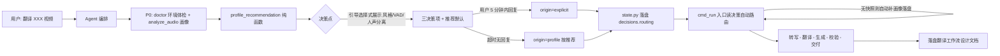

## 产品概述

将翻译流水线 P0（环境体检 + 音频画像）到 P1（转写）之间的交接，改造成「引导选择式决策点」。用户只说一句话「翻译 XXX 视频」即可，全程不敲 CLI 命令。Agent 自动完成画像后，用结构化选择题把三个决策项（翻译风格 / VAD 策略 / 人声分离）连同推荐默认值摆给用户，默认等待 5 分钟：用户回复则按其选择执行，超时未回复则按画像推荐自动执行，随后全自动完成转写、翻译、生成、校验与交付。最终落盘一份《翻译工作流设计文档》，完整记录需求、设计、配置。

## 核心功能

- P0 画像完成后触发决策点：Agent 用引导选择式展示三个决策项及推荐默认值，默认等待 5 分钟，超时按推荐执行
- 决策点超时时间可配置：默认 300 秒（5 分钟），通过 `VT_DECISION_TIMEOUT_SECONDS` 配置
- 画像推荐纯函数化：产出风格 / VAD / 人声分离三项的结构化推荐及理由，供 doctor 与决策点共用
- 决策落盘可追溯：最终三决策以 origin（explicit=用户拍板 / profile=画像推荐）写入 `vt_state.json`
- VAD 三参数、`decision_timeout_seconds`、`merge_enabled` 进入配置体系（`.env` / `.video-translate.toml`）
- demucs / nvidia-smi / 模型缓存目录收口到 toolchain 中央登记，消灭调用点现场 `shutil.which` / `os.environ.get`
- run 入口兜底：无画像快照时自动画像并落盘，不裸跑无画像参数
- 修正 ADR-031 D8 状态、CURRENT_PIPELINE.md 作废标注、AGENTS.md 新增「Agent 决策点协议」
- 新增《翻译工作流设计文档》，详细写出需求、设计、配置及超时时间配置位置

## 流程不可跳步的三层保证

| 环节 | 保证方式 | 硬度 |
| --- | --- | --- |
| 画像（P0 产出） | `run` 入口强制：转写前查画像快照，无则自动补画像落盘，绝不裸跑无画像 | 代码硬控 |
| 决策点（三决策项 + 5 分钟超时） | AGENTS.md「Agent 决策点协议」+ 超时值可配置 | Agent 协议 |
| 其余步骤（转写→翻译→生成→校验） | 状态机 `status`/`[NEXT]` 块/exit 6·8 追踪 | 代码硬控 |


## 技术栈

- 纯 Python 3.13（复用项目现有栈，零新增外部依赖）
- 复用模块：`audio_profile.py`（analyze_audio/recommend_vad/route_vad_chunk）、`state.py`（record_decision/ensure_state）、`toolchain.py`（resolve_tool/tool_available/_GLOBAL_TOOLCHAIN）、`config.py`（Config/env_map/load_toml）、`cli.py`（cmd_run/cmd_doctor/exit 0-8）
- 测试：pytest（基线 416 passed / 12 skipped，纯函数优先）

## 实现方案

### 总体策略

「决策点」是 Agent 协议层行为（用户在聊天里回复，CLI 无法感知聊天，因此 5 分钟超时是 Agent 等待行为，不是 CLI sleep）。CLI 代码层只负责：推荐纯函数化、决策落盘、配置化（含超时值）、工具链收口、run 兜底。两者配合：Agent 按协议停下来做引导选择式提问，代码保证即使 Agent 失守直接 run，也会自动画像落盘、不裸跑错误参数。

### 关键决策

- **推荐逻辑纯函数化**：新增 `audio_profile.profile_recommendation(prof)`，整合 `cli.py doctor`（327-360 行）散落的 `recommend_vad`、强 BGM 判断、风格默认，产出统一三决策推荐结构，doctor 与 run 共用，避免双份决策逻辑漂移。
- **风格推荐无画像依据，默认 film**：风格由用户偏好决定，画像只决定 VAD 与人声分离；`profile_recommendation` 的 style 字段恒返回 config 默认（film），决策点允许用户覆盖。
- **决策点超时配置化**：`Config` 新增 `decision_timeout_seconds: int = 300`；`env_map` 新增 `decision_timeout_seconds -> VT_DECISION_TIMEOUT_SECONDS`；`_INT_ENV` 补充；`.env.example` 与设计文档同步说明。Agent 在决策点通过读配置感知超时值，超时后按推荐执行。
- **决策落盘用 decisions 双 key**：`decisions.audio_profile` 存画像快照 + 推荐；`decisions.routing` 存三决策最终值 + origin。复用 `record_decision()` + `save()`，向后兼容。
- **run 兜底放在 cmd_run 入口而非 pipeline_def gate**：ADR-030 规定 stage gate 只查产物文件、永不查 state；画像快照存于 state 属增强，故 run 入口直接查 state 并自动补画像，符合既有原则。
- **vad_threshold 默认对齐 `transcribe.VAD_THRESHOLD = 0.35`**，低电平场景由推荐函数给出 0.1 覆盖值。

### 架构设计



### 数据流

`analyze_audio(video)` → `profile_recommendation(prof)` → `record_audio_profile()` 落盘 `decisions.audio_profile` → 决策点（Agent 引导选择式 + 读 `decision_timeout_seconds` 超时）→ `record_routing()` 落盘 `decisions.routing`（value+origin）→ `cmd_run` 读 routing 合并（CLI flag > routing > config 默认）→ 传 `cmd_transcribe` → `_record_run_decisions` 落盘最终路由。

### 执行要点

- 性能：画像只在无快照时算一次（doctor 已算则复用），run 兜底触发一次 `analyze_audio`；决策查询 O(1) 读 state，无额外转写开销。
- 日志：落盘时打印 `[route] style=... vad=... separate_vocals=... (origin=profile|explicit)`；不打印大 payload。
- 爆炸半径：全部向后兼容——无快照时旧行为等价（run 自动补画像后仍走默认路由），仅新增 origin 分级可追溯；配置项全新增，旧 `.env` 无感。
- 工具链收口保持 `resolve_tool` 永不抛异常、fallback 裸名的既有韧性，仅消除现场读 env/which 的 CWD 漂移。

## 目录结构

```
f:/workbuddy/github/video-translate/
├── src/video_translate/
│   ├── config.py              # [MODIFY] Config 新增 vad/adaptive_vad/vad_threshold/decision_timeout_seconds 字段；env_map 新增 VT_VAD/VT_ADAPTIVE_VAD/VT_VAD_THRESHOLD/VT_DECISION_TIMEOUT_SECONDS/VT_MERGE_ENABLED；_BOOL_ENV/_FLOAT_ENV/_INT_ENV 补充；vad_threshold 默认 0.35；decision_timeout_seconds 默认 300
│   ├── audio_profile.py       # [MODIFY] 新增 AudioProfileRecommendation dataclass + profile_recommendation() 纯函数，产出 style/vad/adaptive_vad/separate_vocals/vad_threshold/rationale
│   ├── state.py               # [MODIFY] 新增 record_audio_profile()/get_audio_profile()/record_routing() 辅助函数（复用 record_decision + save，key=audio_profile/routing）
│   ├── toolchain.py           # [MODIFY] ToolchainStatus 新增 demucs_path/nvidia_smi_path 字段；_TOOL_REGISTRY 登记 demucs/nvidia-smi；新建 _DEP_REGISTRY + model_dir()；init_toolchain 解析时填充
│   ├── vocal_sep.py           # [MODIFY] demucs_bin 改 resolve_tool("demucs")；_resample_to_16k_mono 的 ffmpeg_bin 改 _GLOBAL_TOOLCHAIN.ffmpeg_path（修复 VT_FFMPEG 错 key）
│   ├── transcribe.py          # [MODIFY] nvidia-smi 探测改 tool_available("nvidia-smi")；保持 VAD_THRESHOLD=0.35
│   ├── cli.py                 # [MODIFY] doctor --video 调 profile_recommendation 并落盘；cmd_run 入口无快照自动补画像落盘 + 读 routing 自动路由 + 应用三决策；收口 HF_HOME/VT_FFMPEG_DIR 现场读取
│   └── pipeline_def.py        # [MODIFY] preflight 阶段 title/cli 更新为"环境自检 + 音频画像 + 决策点"，标注画像落盘机制
├── .env.example               # [MODIFY] 新增 VT_VAD/VT_ADAPTIVE_VAD/VT_VAD_THRESHOLD/VT_DECISION_TIMEOUT_SECONDS/VT_MERGE_ENABLED 文档说明
├── tests/
│   ├── test_config_routing.py # [NEW] 配置解析：env/toml/cli 优先级、vad_threshold/decision_timeout_seconds 类型转换、布尔解析、无效值回退
│   ├── test_profile_recommendation.py # [NEW] 推荐纯函数：干净/低电平/强 BGM/混合画像四类几何、三决策结构完整性、rationale 非空
│   └── test_run_profile_gate.py # [NEW] run 兜底：无快照自动补画像落盘、有快照复用、routing origin 分级、显式 flag 覆盖
├── docs/
│   ├── TRANSLATION-WORKFLOW.md # [NEW] 翻译工作流设计文档：需求/设计/配置全量记录，重点写清决策点超时 5 分钟的配置位置与 VAD/风格/分离的 flag 映射
│   ├── adr/031-recovered-segment-hardening.md # [MODIFY] D8 "P0→P1 批准门"改为已代码化 + 澄清其为翻译流水线决策点
│   └── CURRENT_PIPELINE.md    # [MODIFY] 顶部加"历史基线，已被 ADR-030/031 推翻"作废声明
└── AGENTS.md                  # [MODIFY] 新增"Agent 决策点协议"章节：引导选择式三决策项 + 推荐默认 + 5 分钟超时默认 + 超时配置位置；Read order 增补 CURRENT_PIPELINE 作废说明
```

## 关键代码结构

```python
# audio_profile.py — 统一推荐纯函数
@dataclass
class AudioProfileRecommendation:
    style: str                    # film / literal / bilingual_study（默认 film）
    vad: bool                     # 是否开 --vad
    adaptive_vad: bool            # 是否开 --adaptive-vad
    separate_vocals: bool         # 是否开 --separate-vocals
    vad_threshold: float | None   # 低电平场景返回 0.1，否则 None
    rationale: str                # 面向决策点的理由说明

def profile_recommendation(prof: AudioProfile, *, default_style: str = "film") -> AudioProfileRecommendation:
    """复用 recommend_vad + 静音密度/强 BGM 判断，产出可落盘、可路由的三决策统一推荐。"""

# config.py — 决策点超时配置
class Config:
    decision_timeout_seconds: int = 300  # 5 分钟，env: VT_DECISION_TIMEOUT_SECONDS

# state.py — 决策落盘辅助
def record_audio_profile(outdir, base, recommendation: AudioProfileRecommendation) -> None:
    """把画像快照 + 推荐写入 decisions.audio_profile 并 save。"""

def get_audio_profile(outdir, base) -> dict | None:
    """读取 decisions.audio_profile，无则返回 None。"""

# toolchain.py — 依赖目录登记
_DEP_REGISTRY: dict[str, str] = {
    "hf_cache": "hf_cache_dir",
    "demucs_models": "demucs_models_dir",
    "nltk_data": "nltk_data_dir",
}

def model_dir(name: str) -> str | None:
    """按 _DEP_REGISTRY 返回依赖目录绝对路径，仅回退，不现场读 env。"""
```

## Agent Extensions

### SubAgent

- **code-explorer**
- 用途：在工具链收口阶段，全仓搜索所有 `shutil.which` / `os.environ.get("VT_*")` / 直接读 `HF_HOME` 的散落调用点，确保无遗漏。
- 预期结果：产出完整散落调用点清单，验证收口后仅 `toolchain.py` 内部保留合法的 `shutil.which` fallback。