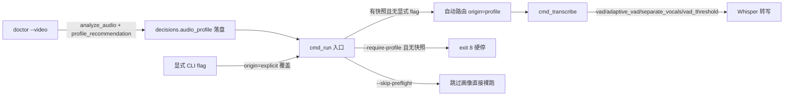

## 用户需求

用户发现翻译流水线 P0（doctor --video 音频画像）→ P1（run 转写）之间缺乏强制约束，Agent 在画像被跳过时直接进入转写，导致 VAD/人声分离路由决策缺失。用户要求系统性排查全部"软约束 / 配置盲区 / 工具链散落调用点 / 文档脱节"，并将关键闸门代码化。

## 产品概述

将 video-translate 控制平面的 P0 音频画像路由决策，从"人 / Agent 临场拍板"升级为"代码自动路由 + 可选硬闸"。`run` 自动分析音频画像并落地路由决策（origin=profile），显式 CLI 参数可覆盖（origin=explicit），`--require-profile` 变硬闸（无画像即 exit 8）。同时补齐 VAD 配置项、收口工具链散落调用点、修正过时文档。

## 核心功能

- run 自动跑音频画像并自动路由（vad / adaptive-vad / separate-vocals / vad-threshold），决策以 origin=profile 落盘，显式 flag 覆盖为 origin=explicit
- 新增 --require-profile 硬闸与 --skip-preflight 逃生门
- VAD 三参数（vad / adaptive_vad / vad_threshold）与 merge_enabled 进入配置体系（.env 与 .video-translate.toml）
- demucs / nvidia-smi / 模型缓存目录收口到 toolchain 中央登记，消灭调用点现场 shutil.which / os.environ.get
- doctor --video 的画像推荐落盘到 vt_state.json 的 decisions，不再只打印
- 修正 ADR-031 D8 状态与 CURRENT_PIPELINE.md 作废标注

## 技术栈

- 纯 Python 3.13（项目现有栈，零新增外部依赖）
- 复用现有模块：`audio_profile.py`（analyze_audio/recommend_vad）、`state.py`（decisions/record_decision/ensure_state）、`toolchain.py`（ToolchainStatus/_TOOL_REGISTRY/resolve_tool）、`config.py`（Config/env_map/load_toml）、`pipeline_def.py`（STAGES）、`cli.py`（cmd_run/cmd_doctor/exit code 0-8）
- 测试：pytest（基线 416 passed / 12 skipped）

## 实现方案

### 总体策略

把 P0→P1 的契约从"文字约束"改为"数据契约 + 代码闸门"。核心是引入**音频画像推荐快照**作为 P0 与 P1 之间的交接产物：`doctor --video` 计算推荐并落盘到 `vt_state.json` 的 `decisions`，`cmd_run` 入口读取该快照自动路由，显式 flag 覆盖，`--require-profile` 将"无快照"升级为硬闸。

### 关键决策

- **闸门放 cmd_run 而非 pipeline_def gate**：ADR-030 规定 stage gate 只查产物文件、永不查 state；画像快照存于 state 属"增强"，故强闸在 `cmd_run` 入口实现，符合既有原则。
- **推荐逻辑纯函数化**：把 `cli.py` doctor 里散落的 recommend 判断抽到 `audio_profile.profile_recommendation()`，doctor 与 run 共用，避免双份决策逻辑漂移。
- **配置默认值对齐现有常量**：`vad_threshold` 默认取 `transcribe.VAD_THRESHOLD`（0.35），避免配置层与转写层默认不一致。
- **工具链收口新建 `_DEP_REGISTRY` 与 `model_dir()`**：当前代码不存在，按规则 3 补齐目标结构后再收口调用点。

### 架构设计



### 数据流

`doctor --video` → `profile_recommendation(prof)` → `state.record_decision(decisions.audio_profile)` → `cmd_run` 读 `decisions.audio_profile` → 与 CLI/config 合并（CLI > profile > config 默认）→ 传入 `cmd_transcribe` → `_record_run_decisions` 以 origin 分级落盘。

### 执行要点

- 性能：画像快照只读不重算，`run` 仅在无快照时触发一次 `analyze_audio`（复用 doctor 已算结果）；路由决策 O(1) 查 state，无额外转写开销。
- 日志：画像路由落盘时打印 `[route] vad=... adaptive_vad=... separate_vocals=... (origin=profile|explicit)`；闸门拦截打印修复指引，不打印大 payload。
- 爆炸半径：所有改动向后兼容——无画像快照时不改变现有默认行为（仍裸跑），仅 `--require-profile` 显式开启硬闸才改变默认；配置项全部新增，旧 `.env` 无感。
- 工具链收口保持 `resolve_tool` 的"永不抛异常、fallback 裸名"既有韧性，仅消除现场读 env/which 的漂移。

## 目录结构

```
f:/workbuddy/github/video-translate/
├── src/video_translate/
│   ├── config.py              # [MODIFY] Config 新增 vad/adaptive_vad/vad_threshold 字段；env_map 新增 VT_VAD/VT_ADAPTIVE_VAD/VT_VAD_THRESHOLD/VT_MERGE_ENABLED；_BOOL_ENV/_FLOAT_ENV 补充
│   ├── audio_profile.py       # [MODIFY] 新增 profile_recommendation() 纯函数，返回统一推荐结构（vad/adaptive_vad/separate_vocals/vad_threshold/rationale）
│   ├── state.py               # [MODIFY] 新增 record_audio_profile/get_audio_profile 辅助函数（复用 record_decision，key=audio_profile）
│   ├── toolchain.py           # [MODIFY] ToolchainStatus 新增 demucs_path/nvidia_smi_path；_TOOL_REGISTRY 登记 demucs/nvidia-smi；新建 _DEP_REGISTRY 与 model_dir()
│   ├── vocal_sep.py           # [MODIFY] demucs_bin 改 resolve_tool("demucs")；ffmpeg_bin 改 _GLOBAL_TOOLCHAIN.ffmpeg_path（修复 VT_FFMPEG 错 key）
│   ├── transcribe.py          # [MODIFY] nvidia-smi 探测改 tool_available("nvidia-smi")；保持 VAD_THRESHOLD 常量
│   ├── cli.py                 # [MODIFY] doctor --video 落盘推荐；cmd_run 入口读画像自动路由 + --require-profile/--skip-preflight；收口 HF_HOME/VT_FFMPEG_DIR 读取
│   └── pipeline_def.py        # [MODIFY] preflight 阶段 title/cli 更新为"环境自检 + 音频画像"，标注画像落盘机制
├── .env.example               # [MODIFY] 新增 VT_VAD/VT_ADAPTIVE_VAD/VT_VAD_THRESHOLD/VT_MERGE_ENABLED 文档
├── tests/
│   ├── test_config_routing.py # [NEW] 配置解析：env/toml/cli 优先级、vad_threshold 类型转换、无效值回退
│   └── test_run_profile_gate.py # [NEW] run 自动路由（profile 落盘）/ 显式覆盖 / --require-profile 无画像 exit 8 / --skip-preflight 逃生门
├── docs/
│   ├── adr/031-recovered-segment-hardening.md # [MODIFY] D8 "P0→P1 批准门"改为已代码化说明，保留开发流程语义
│   └── CURRENT_PIPELINE.md    # [MODIFY] 顶部加"历史基线，已被 ADR-030/031 推翻"作废声明
└── AGENTS.md                  # [MODIFY] Read order 增补 CURRENT_PIPELINE 作废说明；§3 状态机增补 run 自动路由与 --require-profile
```

## 关键代码结构

```python
# config.py — 新增字段
class Config:
    vad: bool = False
    adaptive_vad: bool = False
    vad_threshold: float = 0.35  # 对齐 transcribe.VAD_THRESHOLD

# audio_profile.py — 统一推荐纯函数
@dataclass
class AudioProfileRecommendation:
    vad: bool
    adaptive_vad: bool
    separate_vocals: bool
    vad_threshold: float | None
    rationale: str

def profile_recommendation(prof: AudioProfile) -> AudioProfileRecommendation:
    """复用 recommend_vad + 密度/强 BGM 判断，产出可落盘、可路由的统一决策。"""

# toolchain.py — 依赖目录登记
_DEP_REGISTRY: dict[str, str] = {
    "hf_cache": "hf_cache_dir",
    "demucs_models": "demucs_models_dir",
    "nltk_data": "nltk_data_dir",
}
def model_dir(name: str) -> str | None:
    """按 _DEP_REGISTRY 返回依赖目录绝对路径，仅回退不现场读 env。"""
```

## Agent Extensions

### SubAgent

- **code-explorer**
- 用途：在工具链收口阶段，全仓搜索所有 `shutil.which` / `os.environ.get("VT_*")` / 直接读 `HF_HOME` 的散落调用点，确保无遗漏。
- 预期结果：产出一份完整的散落调用点清单，验证收口后仅 `toolchain.py` 内部保留合法的 `shutil.which` fallback。