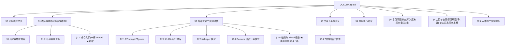

## 用户需求澄清

- **关于「Agent 引用 TOOLCHAIN.md」的疑问**：AGENTS.md 是一份**字幕流水线执行协议**（给运行该 CLI 的 AI/人类 Agent 看的），其中的「Agent」指执行「转写→翻译→生成」流水线的操作者，它在 Phase 0 自检时引用 TOOLCHAIN.md 做环境准备是**设计如此**、并非指当前编码助手「你」。该引用合理、应保留。
- **清理 TOOLCHAIN.md 的真实诉求**：当前文件因增量补文档从未收敛，出现**两份 §3/§4/§5** 撞号，以及一段写死 `f:\workbuddy\...` 机器路径、教 `Activate.ps1` 的「Python 运行时」legacy 段（与「一律 uv run」红线冲突）。需要重排为单一连续编号、删除冗余、统一措辞。

## 核心目标

重写 TOOLCHAIN.md，使章节编号连续无重复；移除硬编码路径与本机专属段；把被引用的「依赖与 wheel 镜像」与「工具与依赖管理规范」上移到正确层级；新增 §1.3 接住悬空引用；同步修正 5 处跨文件引用。

## 技术方案

纯 Markdown 文档重构，不涉及代码逻辑改动，复用现有文档约定与章节锚点。

## 改后的完整调用链（章节层级）

## 实施要点

1. **删除**原末尾 §3「Python 运行时与项目虚拟环境」（硬编码 `f:\workbuddy\...`、教 `Activate.ps1`，与 uv run 红线冲突）。
2. **删除**原末尾 §4「典型命令模板」（与前 §4 重复）。
3. **删除**原末尾 §5「备注」，将其 3 条有价值 note 并入前 §5 常见问题排查。
4. 原末尾 §3.1「依赖与 wheel 镜像」**上移为 §2.5**（挂到 §2 外部依赖工具链下），原末尾 §6「工具与依赖管理规范」**上移为真正的 §6**（标题不变）。
5. **新增 §1.3「命令入口（一律 uv run）」**，接住 AGENTS.md §1 与 specs/23 中指向不存在的 `§环境入口`/`§入口` 的悬空引用。
6. **内部引用修正**：§6.2「见 §3.1」→「见 §2.5」；§2.4「符合 §6 规范」保持不变（§6 仍是工具与依赖管理规范）。
7. **措辞统一**：全文硬编码路径、`Activate.ps1`、裸 `python` 换成 `uv run`，对齐 Spec 23 / ADR-029。
8. 附录 A 移至全文末尾（§6 之后）。

## 跨文件同步（防断链）

- `MAJOR_VERSION_PLAN.md:221`：`TOOLCHAIN.md §3.1` → `§2.5`
- `MAJOR_VERSION_PLAN.md:309`：`[TOOLCHAIN.md](TOOLCHAIN.md) §3.1` → `§2.5`
- `Makefile:43`：`TOOLCHAIN.md §3.1` → `TOOLCHAIN.md §2.5`
- `AGENTS.md:77`：`§环境入口` → `§1.3`
- `docs/specs/23-environment-location.md:5`：`TOOLCHAIN.md §入口` → `TOOLCHAIN.md §1.3`
- 注：`AGENTS.md:36/37` 用**标题**「§依赖与 wheel 镜像」引用（非编号），重排后仍有效，无需改。

## 验证

重写后 `grep` 全仓对 `TOOLCHAIN.md §3.1` / `§环境入口` / `§入口` / 旧编号的引用，确认无悬空；文档链路自洽。