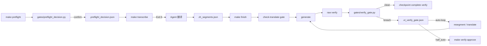

## Product Overview

把 video-translate 的交付流程从「agent 记忆驱动」升级为「程序闸门驱动」。用户已在外部设计好 gate-kit 参考实现（Phase 0→1 签字闸门、checkpoint 状态机、advisors 注册表、Gap B 硬闸门），现在需要把它落地到本地仓库，并适配本地 CLI 的实际能力。

## Core Features

- 集成 gate-kit 基础：把 `gates/`、`advisors/`、pipeline Makefile、文档拷入本地仓库并校准本地产物路径/schema。
- 实现 Gap B：`gates/verify_gate.py` 消费真实 `verify` 三 Lane 报告 + 语义回读结果，按「声学/确定性内容自动修、语义命中转半自动」分流，retry 上限 2 熔断。
- 自动修复声学 uncovered-audio 窗口走本地 `resegment --windows`，内容缺失走 `translate` 子命令重译。
- `generate` 末尾自动触发 `verify`，`make finish` 走完整 pipeline：`check-translate → generate → verify_gate → checkpoint complete verify`。
- 补齐 4 项 smoke test（uncovered-audio 自动修、语义命中半自动、retry 超限熔断、全绿通过），并保证既有 golden 测试不红。

## Tech Stack

- Python 3.13 + `uv` 项目入口（ADR-029）
- 既有 `video-translate` CLI：`faster-whisper`、`stable-whisper`、`demucs`、`whisperx`
- Gate-kit 参考文件：checkpoint/gate/preflight_decision/advisors/verify_gate 设计
- 测试：`pytest` + 本地 golden 回归

## Implementation Approach

采用「先奠基、后闸门、再接线、最后测」的分层落地：

1. **复制并校准 gate-kit 基础文件**：本地仓库目前没有 `gates/` 和 `advisors/`，因此先把参考实现按本地产物布局微调（如 `checkpoint.py` 的 `ARTIFACTS` schema 对齐 `segments_en.json` 列表结构、`generate` 产物路径对齐默认嵌套输出），再补入 Makefile 作为新目标。
2. **先修真实 `verify.py`**：让 `cmd_verify` 红线命中默认非零退出（去掉「非 strict 也退 0」的放行），并学会读取 `<base>.semantic_reread_result.json` 作为 content lane 的输入。
3. **新增 `verify_gate.py`**：这是 Gap B 核心。内部用 `subprocess` 调用 `uv run video-translate verify` 拿到三 Lane report，按 GAPB 规则 `classify → 分流 → auto_fix → retry++`；`MAX_RETRY=2` 熔断或语义命中即写 `breached=true, mode=half_auto` 并退出码 3。
4. **把闸门接到 CLI 和 Makefile**：`cmd_generate` 增加 `--video` 参数并在末尾自动跑 raw `verify`；Makefile 新增 `finish`/`verify-fix`/`verify-approve`，与本地既有 `setup`/`test`/`doctor`/`clean` 目标合并。
5. **测试闭环**：4 项 smoke test 用伪造的 `verify_report.json` 验证分流与熔断；golden 回归保证不破坏既有转写/生成行为。

## Implementation Notes

- **不要重写判据**：`verify_gate.py` 只消费 `verify.py` 已有函数（`find_uncovered_speech`、`validate_zh`、`verify_align`、`find_untranslated_latin_words`、`build_semantic_reread_task`）的产出，不重新实现。
- **本地 CLI 适配**：GAPB 里假设的 `run --skip transcribe --windows` 和按 indices 重译在本地不存在，改为 `resegment --windows`（声学窗口）和 `translate` 子命令（内容缺失）。
- **熔断与安全**：自动环仅对声学/确定性 content 开放；语义 fidelity 命中直接 half_auto、不消耗 retry；`MAX_RETRY=2`  hard-coded，避免无限循环。
- **产物文件**：新增 `.vt_verify_gate.json`、`.semantic_reread_task.json`、`.semantic_reread_result.json`、`.verify_report.json`，均落在 `videos/` 下，与既有版本化 `_vN` 产物隔离。

## Architecture Design

新增一层「编排/闸门层」位于 CLI 之上，CLI 本身不变量不改，只把原本分散的手动命令串成强制状态机：



## Directory Structure

```
f:/workbuddy/github/video-translate/
├── gates/
│   ├── checkpoint.py              # [NEW/参考拷入] 阶段状态机 + GATED 集合（verify 已在其中）
│   ├── gate.py                    # [NEW/参考拷入] 三维硬闸门/阶段顺序守卫
│   ├── preflight_decision.py      # [NEW/参考拷入] Phase 0→1 签字闸门
│   └── verify_gate.py             # [NEW] Gap B 核心：分流/自动修/熔断/半自动
├── advisors/
│   ├── __init__.py                # [NEW/参考拷入] 决策项注册表自动发现
│   ├── advisor_vocal_sep.py       # [NEW/参考拷入] 人声分离 CRITICAL 决策
│   ├── advisor_vad.py             # [NEW/参考拷入] VAD 路由建议
│   ├── advisor_style.py           # [NEW/参考拷入] 风格轨 CRITICAL 决策
│   └── ADVISORS.md                # [NEW/参考拷入] 新增决策项规范
├── src/video_translate/
│   ├── verify.py                  # [MODIFY] 默认阻断 + 消费 semantic_reread_result.json
│   └── cli.py                     # [MODIFY] generate 自动触发 verify + 新增 --video
├── Makefile                       # [MODIFY] 合并 gate-kit pipeline 目标
├── docs/
│   └── GAPB_IMPLEMENTATION.md     # [NEW] 拷入/链接到施工单
└── tests/
    └── test_verify_gate.py        # [NEW] 4 项 smoke test
```

## Agent Extensions

### SubAgent

- **code-explorer**
- Purpose: 在动手前二次确认本地 CLI 子命令的精确签名：`cmd_run` 是否支持 `--skip` 与自动参数注入、`cmd_resegment` 的 `--windows` 行为、`cmd_translate` 与 `cmd_generate` 的输入输出路径。
- Expected outcome: 给出 `verify_gate.py` 调用本地 CLI 的确切命令模板与产物路径，避免 auto_fix 写错命令。

### Skill

- **lsp-code-analysis**
- Purpose: 在修改 `src/video_translate/cli.py` 与 `src/video_translate/verify.py` 时做符号级影响分析，确认 `cmd_verify` 返回路径、`cmd_generate` 参数列表、`build_semantic_reread_task` 调用点全部正确连接。
- Expected outcome: 无遗漏 import、无错误调用签名、无未处理分支。