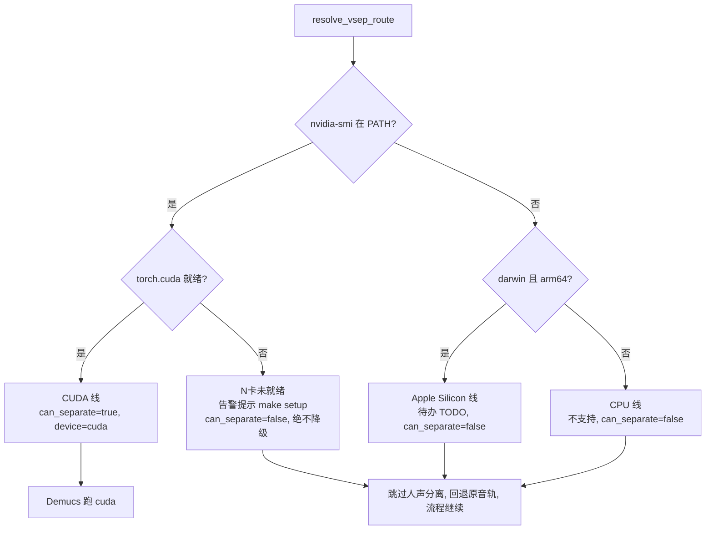

## 用户需求

将人声分离（Demucs）的设备路由从"单一 CUDA 判断 + 静默 CPU 降级"重构为**三条独立运行线**，由 doctor 一次性判定、run 阶段按判定结果执行，彻底消除"有 N 卡但环境未就绪时被误判为纯 CPU/Apple Silicon"的红线风险。

### 三线定稿

| 线 | 判定条件 | 行为 |
| --- | --- | --- |
| CUDA 线 | Windows/Linux + N 卡（nvidia-smi）+ torch.cuda 就绪 | Demucs 跑 cuda，人声分离全功能 |
| Apple Silicon 线 | darwin + arm64 | **待办（TODO）**，触发人声分离就告警"未实现"、跳过、回退原音轨、流程继续，不降级 CPU |
| CPU 线 | 无 N 卡、非 arm64 | **不搞 GPU-only 能力**（Demucs、whisperx 对齐都没有），纯 faster-whisper CPU 转写 + 基础流程 |


### 核心红线（最高优先级）

用户机器是 NVIDIA 卡 + 8G 显存，硬件满足，仅因"没装库/没初始化"（torch 装成 CPU wheel 或没跑 uv sync）导致 `torch.cuda.is_available()`=False。**这种情况必须识别为"N 卡机器但 CUDA 未就绪"**，明确告警提示运行 `make setup`（uv sync 自动装 CUDA wheel）后停住，**绝不降级到 CPU/MPS**。判定顺序保证：先判 N 卡硬件，N 卡机器无论 torch 装没装对都停在 CUDA 线，绝不落到 Apple Silicon/CPU 分支。

### 非 CUDA 线收到 GPU-only flag 的行为

对 `--separate-vocals` / `--gap-vocal-sep` / `--align whisperx` 显式请求：**告警 + 跳过该能力 + 回退原音轨 + 流程继续**，不崩溃退出。

### 环境依赖安装口径

依赖安装由 setup 自动完成（`Makefile:40` 的 `uv sync` + `pyproject.toml:69-77` 的 `[tool.uv.sources]` 按平台自动选 torch wheel：Windows/Linux 走 cu128、macOS 走 cpu）。手动安装不在本期范围。

## 技术方案

### 技术栈

- 复用现有 Python 3.13 项目结构，不新增任何依赖。
- 路由逻辑集中在 `src/video_translate/vocal_sep.py`（人声分离核心模块），三个调用点（`separate_vocals` 硬闸、`_vocal_sep_step` 早期闸、`recover_hard_gaps` 硬闸）与 doctor 展示统一消费。
- `align.py` / `transcribe.py` / `config.py` / `pyproject.toml` **无需改动**：CPU 线与 Apple Silicon 线的 `align` 自动降级 `none` 已是现状（`transcribe.py:482` 的 auto 分支检查 `torch.cuda.is_available()`，`align.py:50` 的 `whisperx_available()` 在 darwin 直接返回 False）。

### 实现方法

1. **单一路由函数 `resolve_vsep_route()`** 返回不可变路由结果 `VsepRoute`（lane/device/can_separate/message），解决上一轮发现的"三处 CUDA 判断口径不一"问题。
2. **判定顺序即红线保证**：先判 N 卡硬件（`shutil_which("nvidia-smi")`）→ 再判 Apple Silicon（`sys.platform=="darwin" and platform.machine()=="arm64"`）→ 最后 CPU。N 卡硬件存在时，无论 torch 是否就绪都返回 `lane="cuda"`，靠 `can_separate`/`message` 区分"就绪"与"未就绪提示 make setup"。
3. **结果缓存**：`resolve_vsep_route()` 用模块级缓存，避免 `_vocal_sep_step` 与 `separate_vocals` 各触发一次 torch import（torch import 较重）。
4. 删除 `_auto_device()` / `_cuda_ready()`，彻底收敛到单一真相源。

### 架构设计



### 关键代码结构

```python
@dataclass(frozen=True)
class VsepRoute:
    lane: str            # "cuda" | "apple_silicon" | "cpu"
    device: str | None   # "cuda" 或 None
    can_separate: bool   # 仅 lane=="cuda" 且 torch.cuda 就绪时为 True
    message: str         # can_separate=False 时的告警文案

def _is_nvidia_hardware() -> bool: ...   # shutil_which("nvidia-smi") is not None
def _is_apple_silicon() -> bool: ...     # sys.platform=="darwin" and platform.machine()=="arm64"
def _torch_cuda_ready() -> bool: ...     # torch.cuda.is_available() and device_count()>0，import 失败返回 False
def resolve_vsep_route() -> VsepRoute: ...
```

### 目录结构

```
project-root/
├── docs/specs/25-vsep-routing.md              # [NEW] SDD 规格：三线路由行为契约、判定矩阵、红线
├── docs/adr/031-vsep-three-lane-routing.md    # [NEW] ADR：为何拆三线、为何单一路由函数、为何删 _cuda_ready
├── src/video_translate/vocal_sep.py           # [MODIFY] 新增 VsepRoute/resolve_vsep_route/三探针；separate_vocals 硬闸消费 route；删除 _auto_device/_cuda_ready
├── src/video_translate/cli.py                 # [MODIFY] _vocal_sep_step 早期闸、doctor demucs 行、doctor --video 推荐行改为消费 route
├── src/video_translate/gap_vocal_sep.py       # [MODIFY] import 改 resolve_vsep_route；recover_hard_gaps 硬闸消费 route
├── tests/test_vsep_route.py                   # [NEW] 三线路由单元测试（mock 平台与 torch）
├── tests/test_vocal_sep.py                    # [MODIFY] 新增 separate_vocals 硬闸三线行为测试
├── tests/test_gap_vocal_sep.py                # [MODIFY] mock resolve_vsep_route，修复无 CUDA 机器上 test_runs_demucs_per_hard_gap 等断言
└── tests/test_doctor.py                       # [MODIFY] mock resolve_vsep_route 适配新 doctor 展示
```

### 实现注意事项

- **红线保护**：`_vocal_sep_step`（cli.py:492）、`separate_vocals`（vocal_sep.py:314-320）、`recover_hard_gaps`（gap_vocal_sep.py:326-331）三处闸门全部消费 `resolve_vsep_route()` 的 `can_separate`/`message`，禁止任何地方再独立判断 CUDA。
- **性能**：`resolve_vsep_route` 模块级缓存（首次计算后复用），避免重复 import torch；Demucs 与 Whisper 的"单一大模型串行"顺序不变。
- **日志**：告警走现有 `progress`/`flush_print`/`print(file=sys.stderr)` 惯例，复用 `route.message` 文案，不刷屏（`recover_hard_gaps` 仅在进入本地 Demucs 前告警一次）。
- **blast radius 控制**：CUDA 就绪机器的行为零变化（`can_separate=True` 走原路径）；`transcribe._cuda_available`（转写设备判定）与 `cli._cuda_available`（doctor 的 device/NVIDIA CUDA 显示）保留不动，仅人声分离相关改用新路由；不新增依赖、不改 pyproject/align/transcribe/config。
- **doctor --video 推荐行**（cli.py:347-351）的"vocal separation: RECOMMENDED"判定也需改用 route，仅 CUDA 线才输出 RECOMMENDED。