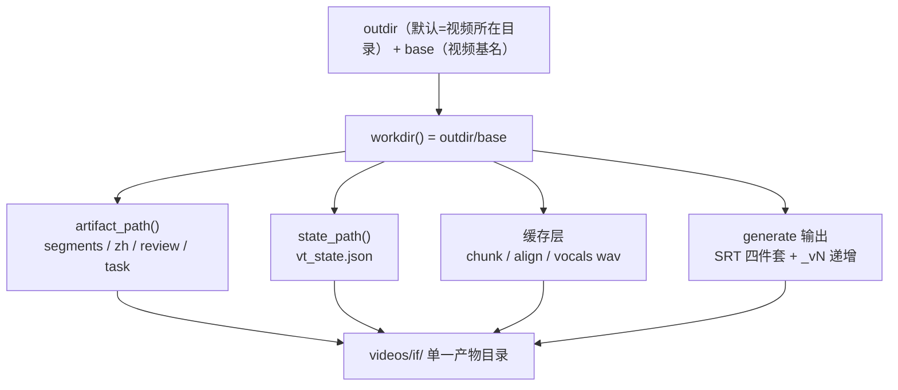

## 产品概述

将单个视频翻译过程产生的全部产物，统一收进以视频基名命名的子目录（如 `videos/if.mp4` 的产物全部落在 `videos/if/`），消除当前「交付字幕在子目录、中间产物平铺在外层」的分裂状态。

## 核心特性

- **产物根目录统一**：引入 `workdir = <outdir>/<base>/` 作为所有产物的唯一落点基准，中间产物（segments/raw/review）、翻译产物（zh/task/pending）、状态链（vt_state）、缓存（chunk/align/vocals）、最终字幕四件套全部收进该目录
- **外层只留视频本体**：`videos/` 下仅保留 `if.mp4` 等源文件，不再散落带 `<base>.` 前缀的产物
- **旧产物零处理**：原有平铺文件保留不动、不再读取、不迁移、不自动删除（用户已确认不再翻旧项目），实现中不引入回退查找逻辑
- **消除路径双层嵌套**：修复 `generate` 在 workdir 已含 base 时会生成 `videos/if/if/` 的缺陷
- **保有多视频发现能力**：`status`/`discover_bases` 改扫子目录后，仍能在一个 `outdir` 下发现所有已转写视频
- **契约先行、测试先行**：先落 ADR 目录布局契约，再改代码，测试先于实现，并同步跨阶段契约测试

## 技术栈

沿用现有项目栈：Python 3 + `uv` 管理（命令一律 `uv run ...`）、argparse CLI、声明式产物契约表 `artifacts.py`（ADR-035 唯一事实来源）、pytest 回归。

## 实现方案

### 核心策略

在契约层新增一个纯函数 `workdir(outdir, base)` 返回 `<outdir>/<base>/`，并让 `artifact_path()` 以它为基准；其余 10 个自行拼接 `outdir` 的模块统一改为调用 `workdir()`。这样「产物落在哪」只有一个事实来源，符合 D3 命名/路径单一来源铁律。

### 关键技术决策与权衡

**1. 为什么不改 `_default_outdir`**
`_default_outdir` 当前返回「视频所在目录」。若改为 `<video_dir>/<base>`，会让 `outdir` 变成 per-video 语义，导致 `status --outdir videos` 这类多视频发现场景彻底失效，且 CLI `--outdir` 契约含义漂移。保持它不变、在契约层加 `workdir` 派生层，改动面更小且语义稳定。

**2. 为什么 `workdir` 必须落在 `artifacts.py`**
产物路径归 ADR-035 契约总线管（D3）。若各模块各自 `os.path.join(outdir, base)`，就是重演「自造产物路径」的事故根因。集中到契约层后，`state.py` 等模块只需调用，不持有布局知识。

**3. 三个必须处理的陷阱**

- `generate.py:137` `sub = os.path.join(outdir, base)`：workdir 已含 base 时会产生 `videos/if/if/`；收敛为直接使用 workdir，保留 `_vN` 版本递增（防剪映缓存碰撞是 AGENTS.md 红线，不可丢）
- `pipeline.py:294` `root.glob("*.segments_en.json")`：产物进子目录后扫不到，需改为扫描子目录；`status` 默认 `--outdir videos` 依赖此能力
- `state.py:171/194/212`：阶段推断依赖平铺位置找 segments/zh/srt，不同步会误判阶段（state 虽不做 gate，但影响 status 展示与 verify 重试计数）

**4. `generate --outdir` 是 required 参数**
统一后 AGENTS.md/文档示例必须从 `videos/<base>` 改为 `videos/`，否则用户手抄旧示例会产生二次嵌套。

### 性能与复杂度

路径拼装均为 O(1) 字符串/Path 操作，无 I/O 与计算开销；`discover_bases` 由扫描当前层 glob 改为扫描子目录 glob，遍历量同量级。唯一额外开销是每个 workdir 需 `os.makedirs(exist_ok=True)`，仅在阶段启动时各执行一次，可忽略。

### 架构



### 实现备注（执行细节）

- 因用户明确不关心旧项目，**不得**添加「新位置找不到就回退旧位置」的兼容分支，也**不得**新增 migrate 命令，避免过度设计
- 旧文件不做任何删除动作，避免破坏性副作用
- `generate` 的 `flat=True` 分支（legacy，供测试/脚本确定性输出）需保留，golden 回归依赖它
- 改动前用 `code-explorer` 复核一遍自拼路径点，防止扫描遗漏（已扫出约 25 处）
- 全部命令走 `uv run pytest` / `uv run video-translate`（Windows PowerShell，H3 入口唯一）

## 目录结构

```
docs/adr/
└── 037-artifact-directory-layout.md    # [NEW] 产物目录布局契约：定义 workdir = <outdir>/<base>/，
                                        #       声明所有阶段产物一律落 workdir、旧平铺产物不再读取、
                                        #       明确 _default_outdir 语义不变与 generate 双层收敛规则

src/video_translate/
├── artifacts.py                        # [MODIFY] 新增 workdir(outdir, base)；artifact_path() 改以
│                                       #          workdir 为拼装基准（契约层唯一改动核心）
├── state.py                            # [MODIFY] state_path(43)、infer_stage(171)、
│                                       #          rebuild_state(194)、state_needs_rebuild(212) 四处
│                                       #          改用 workdir
├── transcribe.py                       # [MODIFY] _chunk_json_path(244)、chunk wav(358/447)、
│                                       #          detected_lang sidecar(383/405)、segments 输出(474)
├── align.py                            # [MODIFY] _align_cache_path(90) 改用 workdir
├── fill_gaps.py                        # [MODIFY] review_cache_path(429) 改用 workdir
├── translate.py                        # [MODIFY] 多风格 translate_task(259) 改用 workdir
├── vocal_sep.py                        # [MODIFY] vocals_wav_path(125)、mkdir(315/468)、
│                                       #          窗口分离 wav(473-474) 改用 workdir
├── generate.py                         # [MODIFY] _resolve_out_base(137) 收敛掉再套一层 base，
│                                       #          消除 if/if/ 双层；保留 _vN 递增与 flat 分支
├── pipeline.py                         # [MODIFY] _find_srt(97) 改在 workdir 解析；
│                                       #          discover_bases(294) 改扫描子目录
└── cli.py                              # [MODIFY] 1297-1300、1374、1506、1696/1698(backfill)、
                                        #          1583(vocals_wav_path 调用) 改用 workdir；
                                        #          写盘前确保 workdir 存在

tests/
├── test_artifact_directory_layout.py   # [NEW] 布局契约测试：断言全部产物落 workdir、
│                                       #       workdir 语义为 outdir/base、generate 不产生双层
├── test_pipeline_field_contract.py     # [MODIFY] S4 强制同步的跨阶段流转契约测试
└── (16 个涉及 outdir 的测试文件)        # [MODIFY] 逐一修正路径假设

docs/
├── specs/00-overview.md                # [MODIFY] 产物路径口径
├── TRANSLATION-WORKFLOW.md             # [MODIFY] 路径示例
└── adr/035-pipeline-data-contract.md   # [MODIFY] 交叉引用 ADR-037

AGENTS.md                               # [MODIFY] --outdir videos/<base> 示例改 videos/；
                                        #          产物路径说明、避坑表相关条目
README.md                               # [MODIFY] 路径示例
```

## 关键代码结构

```python
# src/video_translate/artifacts.py

def workdir(outdir: str | os.PathLike[str], base: str) -> str:
    """ADR-037: 产物根目录 = ``<outdir>/<base>/``.

    所有阶段产物（中间产物 / 缓存 / state / 最终字幕）的唯一落点基准。
    ``outdir`` 语义不变（默认 = 视频所在目录），base 子目录隔离单个视频的全部产出。
    """
    return os.path.join(str(outdir), base)


def artifact_path(artifact_id: str, outdir: str | os.PathLike[str],
                  base: str, **fmt: Any) -> str:
    """产物绝对路径 = workdir / 模板。"""
    return os.path.join(workdir(outdir, base),
                        artifact_file(artifact_id, base, **fmt))
```

## Agent Extensions

### SubAgent

- **code-explorer**
- 用途：全量复核自行拼接 `outdir` 的路径点（已扫出约 25 处分布在 9 个模块），确认 `workdir` 改造无遗漏；并排查测试文件中被忽略的平铺布局假设
- 预期结果：输出完整调用点清单，确认改造覆盖面 100%，无模块仍直接拼 `outdir`

### Skill

- **lsp-code-analysis**
- 用途：对 `artifact_path` / `workdir` / `state_path` / `vocals_wav_path` 做定义与引用导航，验证改造后各调用点的语义正确性，并预览 `generate._resolve_out_base` 的重构影响
- 预期结果：确认所有引用点指向新基准，识别因双层收敛而失效的分支