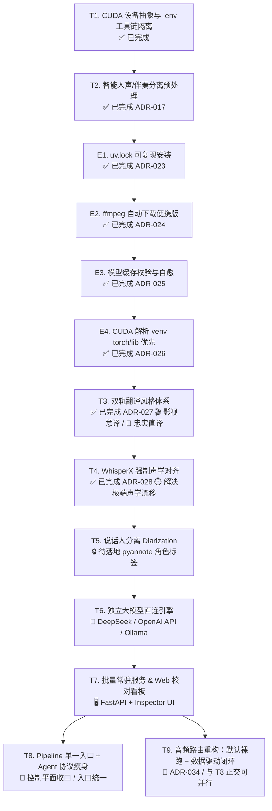

# V5 开发计划：CUDA / Windows 部署 + 翻译与声学衍生能力演进

> 状态：**阶段一已落地，全面升级修订版**
> 创建：2026-07-31
> 修订：2026-08-21（完成 T1 CUDA+.env 工具链隔离；引入双轨翻译风格与智能人声分离预处理；扩展独立 LLM API 与 Web 校对看板）
> 修订：2026-08-25（对标研究 [Voice-Pro](docs/RESEARCH-voice-pro.md) 后新增 **E1-E4 环境确定性工程**为下一阶段最高优先级；固化「依赖与外部工具管理规则」§3.2；原 T3-T7 顺延）
> 修订：2026-08-28（**T3 双轨翻译风格体系已落地**：ADR-027 + Spec 21，三轨 Persona 矩阵 + `--style` + 双轨输出，全部单测绿；**T4 WhisperX 强制声学对齐已落地**：ADR-028 + Spec 22，`--align whisperx` 词级时间戳精修，独立 pass + 独立缓存层 + 8GB 分步调度 + 优雅降级，全部单测绿）
> 修订：2026-08-29（**T4 默认化**：`--align` 默认 `none` → `auto`，CUDA + whisperx 可用即自动 whisperx，否则降级 none；同步 AGENTS/README/Spec 22/ADR-013/references 口径）
> 修订：2026-09-01（新增 **T8 Pipeline 单一入口 + Agent 协议瘦身**：控制平面收口，编排权从 Agent 收回引擎，AGENTS.md 瘦身为纯「Agent 行为协议」）
> 修订：2026-09-03（**T8 已落地**：ADR-033 + Spec 24（Spec 23 已被「环境定位」占用，故顺延为 24），`pipeline` 幂等推进器 + `--prompt` 三档 + AGENTS.md §3 瘦身；决策点收敛为翻译风格 style 一项（与 ADR-034 调和，VAD/人声分离退为显式 flag 覆盖、默认裸跑））
> 目标分支：`feat/v5-cuda-windows`（已合并至 master）
> 当前版本：`4.0.0` $\rightarrow$ 目标版本：`5.0.0`

> **执行模型交接说明**：本文档是任务开发的唯一事实来源。E1-E4 为自包含任务（背景/动作/涉及文件/验收标准俱全），可直接执行无需额外上下文。执行前必读 [AGENTS.md](AGENTS.md) §1 红线表与本文档 §3.2 依赖规则。

---

## 0. 背景与核心铁律

### 0.1 现状与已完成成果（已核对代码库）
- **T1 阶段成果（已全部落地）**：
  - **CUDA 与设备抽象（ADR-014）**：实现 `resolve_device()`，支持 `VT_DEVICE=auto`（GPU 命中 `cuda/int8_float16`，Mac/无卡平滑回退 `cpu/int8`）。
  - **工具链环境隔离（`toolchain.py`）**：建立 `.env` / `.env.win` / `.env.mac` / `.env.linux` 分层加载机制，自动探测并注入 `VT_FFMPEG_DIR` 和 `VT_CUDA_DIR`，彻底消除手动 `$env:PATH` 注入与单机路径污染。
  - **文档架构规范化**：`README.md` 与 `AGENTS.md` 完成重构，确立「避坑防呆红线速查表」与标准五阶段状态机；外部工具链指引收敛至 `TOOLCHAIN.md`。
- **主线质量护栏状态**：
  - ADR-011 / ADR-012：VAD 默认裸跑，`doctor --video` 音频画像自动路由 VAD；统一三 Lane 门禁 `verify`。
  - ADR-015 / ADR-016：`--adaptive-vad` 按 chunk 动态路由 VAD；`fill_gaps` 裸跑恢复网与 `uncovered-audio` 漏检探测；语义回读默认开启。
  - **ADR-020（已落地）**：尾部回音幻觉防御。`drop_hallucination_segments` 新增第四信号（段窗口被邻居时间窗包含且含零时长词，确定性，可区分边界模糊）与第五信号（Whisper 低 `avg_logprob` 门控 `no_speech_prob`）；`transcribe.py` 经 `_seg_to_dict` 携带置信度字段。覆盖本次 6 条 sitcom 实战样本 + 单测。
- **当前核心瓶颈与新诉求**：
  1. 翻译风格单一体感，缺乏针对影视二创与学术科普的定制化分轨（建议 2）；
  2. 强 BGM、爆破、笑声掩盖下的音频，Whisper 偶尔存在底噪幻觉或微弱吞字，需前置伴奏分离（建议 3）；
  3. 声学对齐精度在极端语速下仍有毫秒级微小抖动，需引入强制对齐（原 T2）；
  4. 现有翻译引擎在 `--engine agent` 与基础机翻 `--engine google` 之间，缺少直接对接主流大模型 API（DeepSeek / OpenAI 兼容协议）的通道（建议 1 / 原 T5）；
  5. 缺乏轻量可视化的原片对齐与 `verify` 告警检查看板（建议 4 / 原 T4）。

### 0.2 铁律（不可违反）
1. **声学时间戳不可篡改**：转写与切分生成的时间戳为声学绝对事实，翻译和后处理阶段只改文本，绝不在下游重新算轴。
2. **跨平台兼容与优雅降级**：所有 GPU/Windows 专享特性（WhisperX、Demucs 人声分离、CUDA 加速）均为增量可选，在 Mac / CPU 环境下必须**自动平滑降级**或告警回退，绝不破坏基础流水线运行。
3. **分块断点续跑与缓存指纹防护**：任何影响转写产物的参数（模型、VAD、对齐后端、人声分离）必须纳入 chunk 缓存指纹（sha1），绝不误用脏缓存。
4. **SDD + TDD 先行**：每项新特性先定 Spec/ADR，测试覆盖（`pytest` 全绿 + 关键 golden 保护），文档随代码同步提交。
5. **音频路由：默认裸跑 + 数据驱动闭环，画像不驱动路由（ADR-034 S2）**：底层默认 `use_vad=False`（裸跑，`no_speech=0.0` 保留真音），`doctor --video` 的音频画像已降级为**参考信息**——`recommend_vad` 恒返回 `bare`，`profile_recommendation` 不再推动 `vad` / `adaptive_vad` / `separate_vocals` 任一项（ADR-034 §6.1 一期）。笑声 / 欢呼 / 音乐掩码下的真音由转写后双信号 review + 梯度重处理 G1/G2/G3 自动救回（二期/三期），**不靠全局 VAD 预切**——全局 VAD 会系统性 eject 笑声下真音（5:52 漏音根因，ADR-015 §Context）。需 VAD / 人声分离时仍由用户显式 `--vad` / `--separate-vocals` 触发；Windows 版沿用此默认，不得把 VAD 改回写死的默认开。
6. **Mac 路径依赖冻结 + golden 回归口径**：不升级 Mac 路径的 `faster-whisper`（锁 `1.2.1`）；golden fixtures 已停止仓库跟踪，回归改为本地手动确认（`docs/golden/` 缺失时相关用例自动 skip，不构成失败）。

---

## 1. 任务路线图与优先级规划



---

## 2. 详细任务拆解

### T1 — CUDA 设备抽象与 .env 工具链隔离【✅ 已落地】
> **状态**：已在 `feat/v5-cuda-windows` 分支落地（ADR-014）。
- **主要产物**：
  - `src/video_translate/toolchain.py`：支持 `.env` / `.env.<platform>` 跨平台环境变量解析与自动注入。
  - `src/video_translate/config.py` & `cli.py`：支持 `VT_DEVICE`、`VT_COMPUTE_TYPE`（默认 `auto` 自动探测）。
  - 测试套件更新，全量回归测试通过。

---

### T2 — 智能人声/伴奏分离预处理（抗强 BGM 与底噪）【✅ 已落地】
> **状态**：已在 `feat/v5-cuda-windows` 分支落地（ADR-017 / Spec 19）。
- **主要产物**：
  - `src/video_translate/vocal_sep.py`：实现 `demucs` 伴奏剥离、16kHz mono 转换、指纹缓存与显存显式清理。
  - `src/video_translate/transcribe.py` & `fill_gaps.py`：在转写和补洞时挂接纯人声音轨（`vocals.wav`），时间戳严格锚定原视频真实时间轴。
  - `cli.py`：`transcribe` 与 `run` 命令新增 `--separate-vocals` 旗标。
  - `tests/test_vocal_sep.py`：13 个单元测试覆盖指纹生成、缓存重用、Demucs 不可用优雅降级等。

---

## 2A. E 系列 — 环境确定性工程（下一阶段最高优先级）

> **背景**（详见 [docs/RESEARCH-voice-pro.md](docs/RESEARCH-voice-pro.md)）：对标 Voice-Pro v4.0 的安装工程最佳实践，解决本项目的环境痛点——依赖版本飘移、ffmpeg「全盘搜」自由发挥、CUDA DLL 借外部项目路径、模型缓存残缺误判。目标是**新机器 clone 后 `make setup` 一次成功率逼近 100%**，Agent 无任何自由发挥空间。
>
> **共同约束**：每个任务落地时必须遵守 §3.2 依赖规则与 AGENTS.md §1 红线；先写测试（TDD）；文档随代码同步更新。**每项 E/T 均须落 ADR（架构决策）+ Spec（对外行为），不得只改代码**——E1-E4 落地记录：ADR-023/024/025/026 + Spec 20。

### E1 — uv.lock 可复现安装【P0】
> **问题**：`pyproject.toml` 已配 `[tool.uv.index]`（清华 cu124 镜像）与 `[tool.uv.sources]`（按平台选 wheel），但仓库**无 lockfile**——换机安装存在版本飘移风险，"依赖装错环境/装成 CPU 版"两类红线事故无法根治。
**动作清单**：
1. 在仓库根执行 `uv lock` 生成 `uv.lock` 并提交（确认 `.gitignore` 未排除它）。
2. `Makefile` 的 `setup` 目标改为 `uv sync` 优先（检测 `uv` 不存在时打印一条安装指引并回退 `pip install -e .`）。
3. `TOOLCHAIN.md` §2.5 与 `README.md` Quickstart 安装口径统一为：**uv sync 为标准路径，pip 为兜底**；`pyproject` 任何依赖变更后必须重跑 `uv lock` 并同 commit 提交。
**涉及文件**：`uv.lock`（新增）、`Makefile`、`TOOLCHAIN.md`、`README.md`
**验收标准**：
- 新 clone 目录下 `make setup` 一次成功（uv 路径），`uv lock --check` 通过；
- Windows/Linux 装出 `+cu124` torch，macOS 装出 CPU torch（复用既有 marker 验证）；
- 全量 `pytest` 绿。

### E2 — ffmpeg 自动下载便携版（消灭「全盘搜」）【P0】
> **问题**：`TOOLCHAIN.md` §2.1 第 3 步「全盘搜 C:/D:/E:/F: 找 ffmpeg.exe 写回 .env」是全流程中不确定性最高、最容易导致缓存散落的一步；且 `make setup` 不覆盖 ffmpeg。
**动作清单**：
1. `toolchain.py` 新增 `ensure_ffmpeg(dest="tools/ffmpeg") -> str | None`：按 `sys.platform` **先选平台再选源**下载便携版并解压——Windows：镜像 → [gyan.dev](https://www.gyan.dev/ffmpeg/builds/) release-full (zip)；Linux：静态构建 (tar.xz)；macOS：evermeet/镜像 (zip)。下载走既有 `proxy.detect_proxy` 机制；**禁止跨平台复用同一包**。
2. `cli.py` `setup` 子命令新增 `--ffmpeg` 旗标：检测 ffmpeg 缺失时下载、解压至 `tools/ffmpeg/`，并自动把 `VT_FFMPEG_DIR` 写入 `.env.local`（gitignore 内，机器私有）。
3. `doctor` 在 ffmpeg `[MISS]` 时输出提示行：`run: video-translate setup --ffmpeg`。
4. `TOOLCHAIN.md` §2.1 三步探测**收敛为两步**：① 系统 PATH → ② `setup --ffmpeg` 自动下载；「全盘搜」从文档删除，降级为人工兜底不再写入协议。
5. `tools/` 目录加入 `.gitignore`（二进制不进 git，与 `models/` 同理）。
**涉及文件**：`src/video_translate/toolchain.py`、`src/video_translate/cli.py`、`tests/test_toolchain.py`（mock 下载，不真联网）、`TOOLCHAIN.md`、`.gitignore`
**验收标准**：
- 在无 ffmpeg PATH 的环境跑 `video-translate setup --ffmpeg` 后 `doctor` ffmpeg/ffprobe `[OK]`；
- 单测覆盖：下载 mock、zip 解压、`.env.local` 写入、已存在时幂等跳过；
- 全量 `pytest` 绿。

### E3 — 模型缓存完整性校验 + 自愈【P1】
> **问题**：`_model_cached`（cli.py:59）只检查 `model.bin` 存在性——下载中断的残缺文件会被误判已缓存，随后 `run` 在转写深处加载崩溃，报错对新手不友好。
**动作清单**：
1. `_model_cached` 增加大小下限校验（`model.bin` < 2GB 视为残缺；large-v3 完整约 3.09GB）。
2. `cmd_setup` 发现残缺缓存时删除该 snapshot 目录并重新下载（自愈）。
3. `transcribe_video` 的 `WhisperModel(...)` 构造包一层异常捕获，失败时打印明确指引：`模型加载失败（可能缓存损坏）。修复：video-translate setup`，然后以 `EXIT_MISSING_DEP` 退出，不再裸 traceback。
**涉及文件**：`src/video_translate/cli.py`、`src/video_translate/transcribe.py`、`tests/`（新增残缺缓存用例：构造小尺寸假 model.bin 验证检测/自愈路径）
**验收标准**：
- 残缺缓存场景：`setup` 能检出并重下（单测 mock 下载）；`run` 阶段报错信息含修复命令；
- 正常缓存不受影响（幂等）。

### E4 — CUDA 解析顺序：venv torch/lib 优先【P1】
> **问题**：CUDA DLL 当前依赖 `.env.win` 硬编码 `VT_CUDA_DIR=F:\win-pyvideotrans-v3.92\_internal\torch\lib`（借外部项目的包）。新机器若没装过 pyvideotrans 则 GPU 不可用。Voice-Pro 已验证：PyTorch cu1xx wheel 自带完整 CUDA 运行时（cublas/cudnn），本项目 venv 内 `site-packages/torch/lib` 就有同一套 DLL。
**动作清单**：
1. `toolchain.py` `init_toolchain` 的 CUDA 目录解析顺序改为：**① venv 内 `torch/lib`（自动探测，`import torch; torch.__file__` 定位）→ ② `VT_CUDA_DIR` 显式覆盖（仍最高优先级若显式设置）→ ③ 无则 CPU 降级**。注意：显式 `VT_CUDA_DIR` 应优先于自动探测（用户明确指定时不抢夺）。
2. `doctor` 输出 CUDA 来源标注（`venv-torch` / `env` / `none`）。
3. `.env.win.example` 移除 pyvideotrans 硬编码示例，注明「通常无需配置；仅当 venv torch/lib 缺 DLL 时手工指定」。
**涉及文件**：`src/video_translate/toolchain.py`、`tests/test_toolchain.py`（解析顺序单测：显式 env 优先、自动探测、无 torch 回退）、`.env.win.example`、`TOOLCHAIN.md` §2.2
**验收标准**：
- 有 GPU + venv **cu128** torch 的机器**不配** `VT_CUDA_DIR` 也能 `device=cuda`；
- 探测顺序（实现）：① 显式 `VT_CUDA_DIR` / `VT_TORCH_LIB_DIR` → ② venv 内
  `torch/lib`（自动探测，`doctor` 标注 `source: venv-torch`）→ ③ 系统 `CUDA_PATH`。
  每个候选项都必须**实际含有 CUDA DLL** 才算命中，否则 `CUDA_PATH=F:\Program Files`
  这类无关目录会被误当成 CUDA 目录（这正是本机踩到的坑，已加校验）；
- 无 torch / torch 无 DLL 时静默 CPU 降级不崩溃；
- `doctor` 正确标注来源；全量 `pytest` 绿。

---

### T3 — 双轨翻译风格体系（影视意译 vs 忠实直译）【里程碑 4 / E 系列完成后启动】 ✅ DONE (2026-08-28)
> **背景**：不同视频场景对翻译诉求完全不同——电影/美剧/脱口秀需要“口语化、接地气、短促有力、情绪饱满”；而科技演讲/公开课/财报会议则需要“术语严谨、概念忠实、保留逻辑从句”。
**核心设计：**
1. **预设 Persona 矩阵**：
   - `film`（默认/影视二创）：信达雅 + 口语感，短句节奏优先，文化梗意译，限制单行字数。诗歌/歌词靠 `source` 字段引导（不单列 `poetic` 预设）。
   - `literal`（忠实直译）：严谨对齐原文主谓宾，保留学术/专业修饰，专有名词严格忠实。
   - `bilingual_study`（双语精读）：直译为主，生僻词/熟词生义在括号内追加注记。
2. **CLI 与配置接入**：
   - `--style {film,literal,bilingual_study}`（或 `VT_STYLE` / toml `[translate].style`），注入 `translate_task.json` 的 `persona` 与 `guidelines`（version 3，新增 `style` 字段）。
   - 显式 `--persona`/`VT_PERSONA` 覆盖风格预设人设（用户自定义优先）。
3. **输出多轨可选**：
   - 支持通过参数同时生成两套独立字幕（如 `<base>.film.bilingual.srt` 与 `<base>.literal.bilingual.srt`），方便创作者对比选优。
   - 默认单轨（`film`）文件名与历史完全一致，向后兼容；双轨时 task/zh/srt 带 `.<style>` 后缀。
**落地文档**：ADR-027（`docs/adr/027-translation-style-tracks.md`）+ Spec 21（`docs/specs/21-translation-styles.md`）；单测覆盖风格解析、task 注入、双轨命名。

---

### T4 — WhisperX 强制声学对齐（修极端声学漂移）【GPU 专享】 ✅ DONE (2026-08-28)
> **背景**：ADR-013 决策。在 Windows/Linux GPU 环境下，通过 wav2vec2 模型进行词级强制对齐，将词时间戳精度从 82% 提升至 96% 以上。
> **实现**：ADR-028（实现级决策）+ Spec 22（行为契约）。转写核心 faster-whisper 1.2.1 不动，仅借用 whisperx 的 wav2vec2 对齐能力；对齐为独立 pass + 独立缓存层；8GB 显存分步调度；逐级优雅降级。
**核心设计：**
1. CLI 增加 `--align {auto,none,whisperx}`（**默认 `auto`**：CUDA + whisperx 可用即 whisperx，否则降级 `none`；T4 默认化，2026-08-29 修订）。
2. 仅在 Windows/Linux 且安装了 `whisperx` 时调用；在 Mac/无该库环境下显式告警并**优雅降级回退 `none`**，绝不崩溃。
3. 对齐只优化词级时间戳，绝不修改文本内容与断句分组。
4. 缓存指纹中追加 `align` 维度，隔离不同对齐模式的缓存。

---

### T5 — 说话人分离（Diarization，随 WhisperX 扩展）
**核心设计：**
1. 基于 pyannote 管道，识别多人交谈中的发言人身份。
2. CLI 增加 `--diarize` 开关（需配置 `HF_TOKEN`）。
3. 在 `merge.py` 与 `generate.py` 中为不同角色的台词添加可配置的 Speaker 标识（如 `[Speaker 1]: ...`），并映射到 `translate_task.json` 中辅助大模型识别说话人关系。

---

### T6 — 独立大模型直连引擎（`--engine llm`：DeepSeek / OpenAI / Ollama）
> **背景**：解决无 Agent 介入时、纯脚本/流水线批处理场景下 Google 机器翻译质量不足的问题。
**核心设计：**
1. **统一 LLM Client 抽象**：
   - 支持任何兼容 OpenAI 接口标准的提供商（如 DeepSeek、OpenAI、Moonshot、Ollama 本地 7B/14B 等）。
2. **环境配置与参数**：
   - `.env` 支持：`VT_LLM_API_KEY`、`VT_LLM_BASE_URL`（如 `https://api.deepseek.com/v1`）、`VT_LLM_MODEL`（如 `deepseek-chat`）。
   - CLI 扩展 `--engine {agent,google,llm,ollama}`。
3. **批量并发与鲁棒重试**：
   - 结构化读取 `translate_task.json` 的 batch 列表，通过标准 Prompt 调用，自动解析 JSON 返回并组装成 `zh_segments.json`。
   - 自动内置指数退避与 JSON 格式校验修复机制。

---

### T7 — 批量常驻服务与 Web UI 校对看板（Inspector）
> **背景**：提供简单直观的图形化交互界面，降低操作门槛，并实现 `verify` 门禁结果的可视化精修。
**核心设计：**
1. **后台 FastAPI 服务**：
   - 提供视频上传、任务提交、进度轮询（`GET /jobs/{id}`）与产物下载接口。
2. **WebUI 校对看板 (Subtitle Inspector)**：
   - 左侧：原视频/音频同步播放器（支持点击字幕跳转到对应时间点）。
   - 右侧：双语字幕列表，**高亮标出 `verify` 触发的异常行**（如声学跨静音、漏译英文夹生词、低置信度段落）。
   - 交互：支持直接在线双击微调中文字幕文本，一键重新打包生成 4 个最终产物文件。

---

### T10 — 流水线数据契约总线（声明式 artifacts 表 + 五条铁律）【P0 · 地基】
> **背景**：阶段间「参数丢失 / 重复重算 / 变换丢字段」已发生两起事故：① `duration`
> 断线（[ADR-034](docs/adr/034-audio-routing-redesign.md) §1.2，analyze_audio 不
> probe、_resolve_routing 不传 → 自动推荐永远 False）；② `merge` 合并段时新建 dict
> 丢 `no_speech_prob/avg_logprob/compression_ratio` → review 的 G1/G3 在合并后时间轴
> 拿不到信号 A 而休眠、verify 的 LOW_CONFIDENCE 道被削弱。根因是「JSON 文件即接口」
> 无 schema、白名单式重建、下游补偿不修根、无跨阶段契约测试。本任务是 T8（编排）/
> T9（音频路由）共同的数据层地基。

**核心设计**（完整设计见 [ADR-035](docs/adr/035-pipeline-data-contract.md)）：
1. **声明式 artifacts 契约表**：全部数据的命名/文件模板/字段/生产者/消费者/可否
   重算/必须穿透字段（carry）登记一张纯数据表，命名/校验/定位唯一来源（沿用
   `STAGES`/`CAPS` 的声明式 idiom）。
2. **五条铁律**：单一生产 / copy-then-override / 命名单一来源 / 边界校验 /
   state 永不做 gate。
3. **Z2 非破坏段存储**：`segments_raw.json` 不可变；merge 产 `_raw_indices`
   分组视图；置信度按索引回查 raw，不聚合不覆盖。
4. **消灭重算**：silencedetect/duration 只在 preflight 算一次落盘 state（schema v2），
   transcribe/verify 改读；audio_source（vocals.wav）显式记录。
5. **编码规范收敛**：SDD + TDD 收进 `.codebuddy/rules/`
   （harness）；`AGENTS.md` 保持翻译 Agent 协议定位不含编码规范。

**涉及文件**：`src/video_translate/artifacts.py`（新）、`state.py`、`pipeline_def.py`、
`pipeline.py`、`merge.py`、`fill_gaps.py`、`review.py`、`verify.py`、`translate.py`、
`cli.py`、`audio_profile.py`、`vocal_sep.py`、`.codebuddy/rules/`、
`AGENTS.md`、`docs/TRANSLATION-WORKFLOW.md`、`tests/test_pipeline_field_contract.py`（新）。

**落地文档**：ADR-035（数据契约总线）。

**验收标准**：
- 契约表覆盖全部 8 类数据且命名唯一；silencedetect 全链只算一次；
- merge 不再丢任何字段（契约测试 `test_pipeline_field_contract.py` 绿）；
- G1 能在合并后时间轴拿到信号 A；
- 全量 pytest 绿；golden 单轨 bare 本地确认不回归；
- 文档同步（ADR-035 / T10 / T8/T9 引用 / TRANSLATION-WORKFLOW / harness / AGENTS.md）。

---

### T8 — Pipeline 单一入口 + Agent 协议瘦身（控制平面收口）【P0】✅ 已落地（2026-09-03）
> **背景**：状态机流程已剥离为 `pipeline_def.STAGES`（纯数据）+ `pipeline.py`（引擎），
> 但入口仍是 `run` / `generate` / `verify` 三个离散子命令，Agent 须按 AGENTS.md §3 的
> Phase 0–4 编排散文记命令顺序。「该跑哪一步」仍是 Agent 软判断，与代码状态机两套说法
> 易打架（review 反馈：「为什么 p0→p1 要这么加、为什么 agents 里还要写流程」）。本任务把
> 编排权从 Agent 进一步收归引擎，并同步瘦身 AGENTS.md 为纯「Agent 行为协议」。

**核心设计：**
1. **`pipeline` = 幂等推进器**（新增子命令，底层 `run`/`generate`/`verify` 保留为原语）：
   每次调用先 `resolve_position()`，再执行「当前该做的下一步」，推进到下一个挂起点。
   全程两个停点：**决策点（preflight 后）** 与 **翻译（transcribe 后，exit 6）**。每次挂起后
   Agent 接手（问人 / 翻译），落盘产物（routing / `zh_segments.json`）后**重跑 `pipeline`**
   自动续下一段。Agent 不再记 generate/verify 参数。
2. **决策点默认挂起（可配置三档，用户拍板）**：pipeline 跑到 preflight（画像落盘）后
   **默认挂起在决策点**（`[NEXT] stage=preflight (STOP POINT — decision point: style only)`，
   复用 exit 6 停点语义）—— Agent 按 §4.5 引导选择式问人，等 `VT_DECISION_TIMEOUT_SECONDS`
   （默认 300s）；用户回复 → 落盘 `origin=explicit` routing；超时未回 → 按画像推荐落盘
   `origin=profile`。重跑 `pipeline` 见 routing 已存在即续 transcribe。三档开关：
   `--prompt always`（默认，问人 + 超时自动）/ `--prompt never`（不挂，直接按推荐自动路由）/
   `--prompt require-profile`（硬闸：必须 explicit，超时/失守即 exit 8）。
   **决策点收敛为翻译风格 style 一项**（ADR-034 已把 VAD/人声分离退为显式 flag 覆盖、默认裸跑；
   确有需要才由 `pipeline --vad/--separate-vocals` 显式传入，origin=explicit 落盘）。
3. **AGENTS.md 分工瘦身**：删 Phase 0–4 逐命令编排散文，只留四类代码覆盖不到的内容——
   ① 入口调用（`uv run video-translate pipeline <video>`）；② 挂起时 Agent 职责（决策点问人 +
   翻译 + 语义回读）；③ §4.5 决策点协议（P0→P1 问人）；④ §1 红线反模式。§3.5 退出码速查保留
   （Agent 读 exit code 的接口）。

**涉及文件**：`src/video_translate/cli.py`（新增 `pipeline` 子命令 + `--prompt` 旗标）、
  `src/video_translate/config.py`（新增 `prompt` 配置项，默认 `always`）、
  `src/video_translate/pipeline.py`（引擎扩展「推进到下一挂起点」驱动）、
  `AGENTS.md`（§3 瘦身 + 退出码表 exit 6 语义扩展）、`docs/TRANSLATION-WORKFLOW.md`
  （数据流改为 pipeline 入口，§2.1 / §5 决策点语义同步）、`tests/test_pipeline_advance.py`（新增）。
  T10 落地后：产物定位/命名一律查 `artifacts.py` 契约表（`build_ctx` 改查表）。

**落地文档**：ADR-033（控制平面收口）+ Spec 24（pipeline 行为契约；原计划的 Spec 23 撞号——
「环境定位」已占用 Spec 23，故顺延为 24）；TDD 先行。

**验收标准**：
- `pipeline` 首次调用：preflight 后**挂起在决策点**（`[NEXT] stage=preflight STOP POINT — decision point: style only`）；
  落盘 routing 后重跑自动续 transcribe → **翻译挂起（exit 6）**；翻译后重跑自动续 generate→verify；
- `--prompt never` 决策点不挂、直接按画像推荐自动路由；`--require-profile` 无 explicit 即 exit 8；
- 底层 run/generate/verify 行为不变（向后兼容，golden 不回归）；
- AGENTS.md 不再有「Phase 1→2→3 逐命令编排」散文，只剩入口 + 挂起职责 + 红线 + 决策点协议；
- 全量 pytest 绿。

---

### T9 — 音频路由重构：默认裸跑 + 数据驱动闭环（S2）【P0】

> **背景**：通用流水线默认全局 `--vad` 会系统性 eject 笑声/欢呼下的真音（5:52 漏音根因，
> ADR-015 §Context 已记录此现象但 adaptive-vad 仅降到 240s chunk 粒度未根治）。画像机制
> （duration 断线、整片标量脆弱）让 adaptive/separate 自动推荐失效。E1 验证（IF.mp4 vad
> vs bare 对比）证明干净视频裸跑漂移可控（<0.3s、word 级一致）→ 画像门控废弃，走
> 「全裸跑 + 数据驱动闭环」。

> **完整设计**：[ADR-034](docs/adr/034-audio-routing-redesign.md)（含整体计划 + 详细设计
> + 三期计划 + 与 T8/ADR-032 关系 + 铁律5同步清单）。task plan 可按「执行 ADR-034 §6.X」引用。

**核心设计**：
1. **默认裸跑**（`use_vad=False`，`no_speech=0.0` 保留真音）；画像降级为参考不驱动路由。
2. **post-transcribe 双信号 review**（塞进 fill_gaps，不新增状态机阶段）：Whisper 自报
   `no_speech_prob`/`avg_logprob` ∩ 原视频 silencedetect 独立参照，B 主导判定漏译/幻觉。
3. **梯度重处理 G1/G2/G3**：G1 vad 重切（救笑声后真音）/ G2 fill_gaps 扩展段内补洞 /
   G3 局部 separate-vocals（只兜音乐掩码，不兜笑声——demucs 能力边界外）。
4. **与 T8/ADR-032 正交**：S2 改 transcribe/fill_gaps 内部，T8 改 pipeline 编排，不重叠；
   review 塞 fill_gaps 不破坏 T8 两停点。

**涉及文件**：`src/video_translate/audio_profile.py`、`transcribe.py`、`fill_gaps.py`、
`vocal_sep.py`、`docs/adr/011/012/034`、`docs/TRANSLATION-WORKFLOW.md`、`tests/`。
T10 落地后：声学数据（silence_intervals/duration）读 state 契约不重算；信号 A 经
`_raw_indices` 回查 raw 段（[ADR-035](docs/adr/035-pipeline-data-contract.md)）。

**三期计划**（详见 ADR-034 §6）：
- **一期（止血）**：默认切 bare + recommend_vad 改 + 铁律5路由表同步 + duration 接线 + golden 单轨重跑。
- **二期（闭环）**：post-transcribe review + G1 vad 重切 + G2 fill_gaps 扩展。
- **三期（兜底）**：G3 局部 separate-vocals + 能量复核自校验。

**落地文档**：ADR-034（综合：架构决策 + 详细设计 + 三期计划 + 验收 + 风险回退）。

**验收标准**：
- **一期**：默认 bare 生效；5:52 类不再系统性 eject；铁律5文档同步（§0.2 + ADR-011/012/032）。
- **二期**：5:52 笑声后真音自动救回；G2 守卫防幻觉；独立缓存层生效。
- **三期**：强 BGM 真音自动救回；G3 不白跑 demucs（场景预筛挡笑声窗）；性能预算生效。

---

## 3. 依赖与环境隔离矩阵

| 特性模块 | 依赖项 | 依赖分组 (pyproject.toml) | 运行环境要求 |
|---|---|---|---|
| **基础转写 & Agent 翻译** | `faster-whisper`, `deep-translator` | 核心依赖 (无附加) | 跨平台 (Win / Mac / Linux) |
| **.env 工具链隔离** | 纯 Python 标准库 (os/re/sys) | 核心依赖 | 跨平台 |
| **智能人声分离 (T2)** | `demucs`, `torch`, `torchaudio` | 核心依赖 (默认安装) | 跨平台：Windows/Linux 自动 CUDA wheel，macOS 自动 CPU wheel |
| **环境确定性 (E1-E4)** | `uv`（外部工具，不进 pyproject）；ffmpeg 便携包（运行时下载，不进 git） | 无新增 Python 依赖 | 跨平台 |
| **双轨翻译风格 (T3)** | 纯 Prompt 与业务逻辑 | 核心依赖 (无附加) | 跨平台 |
| **强制对齐 & 说话人 (T4/T5)** | `whisperx`, `pyannote.audio` | `[windows]` / `[gpu]` extra | 需 NVIDIA CUDA 12 + Python 3.12 |
| **独立 LLM API (T6)** | `httpx` (支持异步高并发) | `[llm]` extra | 跨平台 |
| **Web UI 看板 (T7)** | `fastapi`, `uvicorn`, 轻量静态前端 | `[web]` extra | 跨平台 |

### 3.2 依赖与外部工具管理规则（R1-R7，长期固化）

> 本规则自 2026-08-25 起生效，约束**此后所有新增工具、依赖与二进制资产**。来源：既有红线（AGENTS.md §1 / TOOLCHAIN.md §2.5）+ Voice-Pro 对标研究。执行模型在动任何依赖前必须逐条对照。

| # | 规则 | 反例（禁止） | 正例 |
|---|---|---|---|
| R1 | **运行时 Python 依赖一律写进 `pyproject` 顶层 `dependencies`**；dev-only 工具（pytest/lint）进 `[project.optional-dependencies].dev` | 把 `demucs` 藏进 `[audio]` extra 导致默认安装缺失 | demucs/torchaudio 均在顶层 |
| R2 | **CUDA wheel 只走镜像索引，绝不裸装**：`uv sync` 认 `[tool.uv.sources]`；pip 必须显式 `--index-url`，且版本与 `pyproject` 一致（当前 **cu128** / torch 2.8 线，由 `[gpu]` extra 的 whisperx 3.8.x 决定） | 裸 `pip install torch` 装成 `+cpu`；或按旧文档装 cu124 而与 lock 冲突 | `uv sync` / `pip install --index-url …/pytorch-wheels/cu128/` |
| R3 | **`uv.lock` 是依赖唯一事实来源**：任何 `pyproject` 依赖变更，必须在同一 commit 内重跑 `uv lock` 提交（E1 落地后生效） | 改了 pyproject 不更新 lockfile，换机版本飘移 | pyproject + uv.lock 成对变更 |
| R4 | **外部二进制（ffmpeg 等）不手动安装、不进 git**：统一由 `setup --ffmpeg` 自动下载到 `tools/`（gitignore），路径写 `.env.local` 登记 | Agent 全盘搜 ffmpeg.exe 写回协议；把 ffmpeg.exe 提交进仓库 | `video-translate setup --ffmpeg` 一步到位 |
| R5 | **模型权重不进 git，项目本地优先（零 C 盘）**：默认落项目根 `models/<name>/`（含 `model.bin`），随项目拷贝、不读写系统用户目录；仅当项目根 `models/` 缺失时才回退 `HF_HOME`（默认 `~/.cache/huggingface` 仍可用作覆盖）；缓存必须过完整性校验（E3，下限 2GiB 自愈） | 每项目塞一份 3GB 权重进 git；把模型缓存散落 C 盘用户目录；残缺 model.bin 静默使用 | `make setup` 拉模型到 `<repo>/models/` + 完整性自愈校验 |
| R6 | **新依赖准入检查清单**（合并前逐项确认）：① 跨平台？（Mac/CPU 降级路径）② 影响转写产物→是否需进 chunk 缓存指纹？③ GPU 显存预算（8GB 红线，单一大模型串行）④ 是否有纯标准库/既有依赖的等价实现？⑤ lockfile 同步 | 引入 pyannote 但不检查 Mac 降级，Mac 用户 pip 装不上 | 每项检查写入对应任务 Spec |
| R7 | **镜像/代理固化在配置，不靠临场决策**：PyPI/PyTorch 镜像进 `[tool.uv.index]` / `PIP_EXTRA_INDEX_URL`；HF 镜像进 `HF_ENDPOINT`；安装时任何 Agent/人工不得现场拼源 | 每次安装现场挑镜像，换机不可复现 | TOOLCHAIN.md §1.2 环境变量段 |

**新依赖 PR 模板核对项**：`pyproject 顶层 ✓ / lockfile 同步 ✓ / 准入清单 R6 五项 ✓ / 文档（TOOLCHAIN §矩阵）同步 ✓`

---

## 4. 推荐实施顺序与迭代里程碑

1. **里程碑 1 (已完成)**：T1 CUDA 抽象与 `.env` 工具链隔离，文档全面梳理完毕。
2. **里程碑 2 (已完成)**：T2 智能人声/伴奏分离预处理（ADR-017 / Spec 19 落地，Demucs 纯人声剥离 + 显存显式清理 + 缓存指纹）。
3. **里程碑 3 (下一阶段核心，2026-08-25 重定) — 环境确定性工程（E1-E4）**：
   - E1 uv.lock 可复现安装 → E2 ffmpeg 自动下载 → E3 模型缓存自愈 → E4 CUDA venv 优先，**按序执行**（E1 是其余任务的地基）。
   - 完成判据：新 clone 机器 `make setup` + `setup --ffmpeg` 两条命令后 `doctor` 全绿，无任何手动 PATH/全盘搜/改 .env 操作。
4. **里程碑 4 (业务功能恢复)**：
   - **第一步**：实施 **T3 双轨翻译风格体系**（纯逻辑与 Prompt 体系，扩展影视口语二创与严谨直译两套译文）。
   - **第二步**：实施 **T4 WhisperX 强制对齐** 与 **T5 说话人分离**（GPU 盒专享加速）。
5. **里程碑 5 (自动化与可视化闭环)**：
   - 实施 **T6 独立大模型直连引擎**（DeepSeek / 本地 Ollama 自动化）。
   - 实施 **T7 Web UI 批量服务与可视化校对看板**。
6. **里程碑 6 (音频路由重构，与里程碑 4-5 并行)**：
   - 实施 **T9 音频路由重构**（[ADR-034](docs/adr/034-audio-routing-redesign.md)）：
     一期默认 bare 止血 → 二期 post-transcribe 闭环（救笑声后真音）→ 三期 G3 局部
     separate 兜底（救强 BGM 真音）。与 T8 正交可并行，不进 T5→T8 串行链。

---

## 5. 打包与 Windows 部署

- **工具**：PyInstaller onefile，`Makefile` 加目标
  ```make
  build-win:
  	py -3.12 -m venv .venv-win && .venv-win\Scripts\activate && \
  	pip install -e ".[windows]" && \
  	pyinstaller --onefile --name video-translate src/video_translate/cli.py
  ```
- **CUDA DLL**：把 Purfview `whisper-standalone-win` 的 NVIDIA 库（cuBLAS/cuDNN 12）复制到 exe 同目录并加入 PATH；或在文档里要求装 CUDA Toolkit 12.x。
- **首次运行**：需联网拉 `large-v3` 进 Windows HF 缓存（`%USERPROFILE%\AppData\Local\huggingface`），之后离线。
- **专项测试**：中文路径、文件锁、长视频续跑（`transcribe_video` 已有 chunk 续跑，需确认 Windows 下同样生效）。

---

## 6. 风险与回退

| 风险 | 触发条件 | 对策 |
|---|---|---|
| faster-whisper 升级改 VAD | 引入 WhisperX 自带更新版 | Mac 锁 `1.2.1`；WhisperX 仅 Windows extra；升级后回测 B2 类误杀 |
| 8GB OOM | `float16` + 大模型同驻 | 转写用 `int8_float16`；转写/翻译/对齐**分步**执行；必要时降模型 |
| WhisperX 与 1.2.1 冲突 | 依赖不兼容 | 回退 `stable-ts`（3.12 可装）或仅对齐不换核心 |
| ctranslate2 无 3.13 wheel | Windows 误用 3.13 | 构建 venv 强制 3.12 |
| 中文路径 / 文件锁 | Windows 文件系统差异 | 部署前专项测试 |
| cuDNN 9 冲突 | `nvidia-cudnn-cu12` 9.x 异常 | 对齐 cuDNN 版本；必要时钉 `ctranslate2` 版本 |

---

## 7. 验收标准（每任务）

- **T1**：Mac 本地回归通过（`device=auto` 等价原 `cpu/int8`，产物与历史一致）；Windows `nvidia-smi` 下 `device=cuda` 生效、速度提升；cpu/int8 产物与历史一致。【已通过】
- **T2**：`--separate-vocals` 成功分离出 `vocals.wav` 喂给 Whisper，强 BGM 场景无多余幻觉，时间戳保持 100% 原始对齐。【已通过，13 条单测全绿】
- **E1**：新 clone 环境 `make setup`（uv 路径）一次成功；`uv lock --check` 通过；平台 marker 验证（Win/Linux → cu124，macOS → cpu）。
- **E2**：无 ffmpeg PATH 的环境 `video-translate setup --ffmpeg` 后 `doctor` 全绿；下载/解压/登记全流程单测（mock 网络）覆盖。
- **E3**：残缺缓存（<2GB 假 model.bin）被检出并自愈重下；`run` 阶段模型加载失败输出含修复命令的指引。
- **E4**：不配 `VT_CUDA_DIR` 时 GPU 机器自动用 venv torch/lib 命中 CUDA；显式 `VT_CUDA_DIR` 仍优先；无 GPU 静默降级 CPU；`doctor` 标注 CUDA 来源。
- **T3**：`--style film` / `--style literal` / `--style bilingual_study` 分别产出对应风格译文；`--style film,literal` 双轨输出（`<base>.film.bilingual.srt` + `<base>.literal.bilingual.srt`）；默认单轨文件名向后兼容；全部单测绿。【已通过，2026-08-28】
- **T4**：鲍德温类漂移样本时间戳误差 < 150ms；可用 `verify --video` 声学 lane 量化（ADR-012 / Spec 18）。
- **T5**：多人视频 cue 带 `Speaker N:` 标签。
- **T6**：`--engine llm` 支持直接调用 DeepSeek / OpenAI API 自动完成翻译与格式自愈。
- **T7**：Web 提交 → 产出全流程跑通，Inspector 看板高亮 `verify` 异常行并支持在线微调。
- **T8**：`pipeline` 首次在决策点挂起、翻译后重跑自动续 generate→verify；`--prompt never` 自动路由 / `--require-profile` 硬闸；底层 run/generate/verify 行为不变；AGENTS.md 无逐命令编排散文；全量 pytest 绿。
- **T9**：见 [ADR-034](docs/adr/034-audio-routing-redesign.md) §6 三期计划验收——一期默认 bare 生效+铁律5路由表同步；二期 5:52 笑声后真音自动救回+G2 守卫防幻觉+独立缓存层；三期强 BGM 真音自动救回+G3 不白跑 demucs+性能预算生效。

---

## 8. 分支与文档协同

- GitHub 处于 `feat/v5-cuda-windows` 分支进行开发。
- 已落地 ADR 引用：
  - **ADR-011**：VAD 由默认开改为选开（默认关 / 裸跑）。
  - **ADR-012**：修订「时间戳是声学事实」不变量，引入独立声学参照 + `verify` 三 lane。
  - **ADR-013**：WhisperX 强制对齐（GPU 盒）引入决策（对应 T4）。
  - **ADR-028**：T4 实现级决策（仅借用对齐不换核心 / 独立 pass + 独立缓存层 / 8GB 分步调度 / 逐段安全回退 / 依赖准入）。
  - **Spec 22**：T4 行为契约（CLI 三级覆盖 / 缓存命名 / 降级矩阵 / 不变量 / TDD 清单）。
  - **ADR-014**：撤销 ADR-001 的 CUDA 硬编码禁令，`device`/`compute_type` 改为 `auto` 自动探测（对应 T1）。
  - **ADR-020**：尾部回音幻觉防御——第四信号（共享音频确定性指纹）+ 第五信号（Whisper 置信度字段），补 V4 双信号盲区（对应 sitcom 实战发现的 57s 回音）。
- **研究输入**：[docs/RESEARCH-voice-pro.md](docs/RESEARCH-voice-pro.md)（2026-08-25，E 系列与 §3.2 规则的论证来源）。
- **依赖规则**：§3.2 R1-R7 与 [TOOLCHAIN.md](TOOLCHAIN.md) §2.5、[AGENTS.md](AGENTS.md) §1 红线表三处互为引用，修订时须三处同步。
- 本计划文档（`MAJOR_VERSION_PLAN.md`）随仓库走，作为后续任务开发的唯一事实来源。
