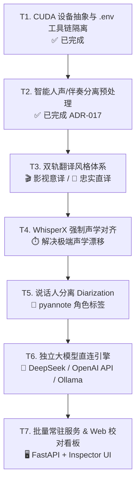

# V5 开发计划：CUDA / Windows 部署 + 翻译与声学衍生能力演进

> 状态：**阶段一已落地，全面升级修订版**
> 创建：2026-07-31
> 修订：2026-08-21（完成 T1 CUDA+.env 工具链隔离；引入双轨翻译风格与智能人声分离预处理；扩展独立 LLM API 与 Web 校对看板）
> 目标分支：`feat/v5-cuda-windows`
> 当前版本：`4.0.0` $\rightarrow$ 目标版本：`5.0.0`

---

## 0. 背景与核心铁律

### 0.1 现状与已完成成果（已核对代码库）
- **T1 阶段成果（已全部落地）**：
  - **CUDA 与设备抽象（ADR-014）**：实现 `resolve_device()`，支持 `VT_DEVICE=auto`（GPU 命中 `cuda/int8_float16`，Mac/无卡平滑回退 `cpu/int8`）。
  - **工具链环境隔离（`toolchain.py`）**：建立 `.env` / `.env.win` / `.env.mac` / `.env.linux` 分层加载机制，自动探测并注入 `VT_FFMPEG_DIR` 和 `VT_CUDA_DIR`，彻底消除手动 `$env:PATH` 注入与单机路径污染。
  - **文档架构规范化**：`README.md` 与 `AGENTS.md` 完成重构，确立「避坑防呆红线速查表」与标准五阶段状态机；外部工具链指引收敛至 `TOOLCHAIN.md`。
- **主线质量护栏状态**：
  - ADR-011 / ADR-012：VAD 默认裸跑，`doctor --video` 音频画像自动路由 VAD；统一三 Lane 门禁 `verify`。
  - ADR-015 / ADR-016：`--adaptive-vad` 按 chunk 动态路由 VAD；`fill_gaps` 裸跑恢复网与 `uncovered-audio` 漏检探测；语义回读默认开启。
  - **ADR-020（已落地）**：尾部回音幻觉防御。`drop_hallucination_segments` 新增第四信号（段窗口被邻居时间窗包含且含零时长词，确定性，可区分边界模糊）与第五信号（Whisper 低 `avg_logprob` 门控 `no_speech_prob`）；`transcribe.py` 经 `_seg_to_dict` 携带置信度字段。覆盖本次 6 条 sitcom 实战样本 + 单测。
- **当前核心瓶颈与新诉求**：
  1. 翻译风格单一体感，缺乏针对影视二创与学术科普的定制化分轨（建议 2）；
  2. 强 BGM、爆破、笑声掩盖下的音频，Whisper 偶尔存在底噪幻觉或微弱吞字，需前置伴奏分离（建议 3）；
  3. 声学对齐精度在极端语速下仍有毫秒级微小抖动，需引入强制对齐（原 T2）；
  4. 现有翻译引擎在 `--engine agent` 与基础机翻 `--engine google` 之间，缺少直接对接主流大模型 API（DeepSeek / OpenAI 兼容协议）的通道（建议 1 / 原 T5）；
  5. 缺乏轻量可视化的原片对齐与 `verify` 告警检查看板（建议 4 / 原 T4）。

### 0.2 铁律（不可违反）
1. **声学时间戳不可篡改**：转写与切分生成的时间戳为声学绝对事实，翻译和后处理阶段只改文本，绝不在下游重新算轴。
2. **跨平台兼容与优雅降级**：所有 GPU/Windows 专享特性（WhisperX、Demucs 人声分离、CUDA 加速）均为增量可选，在 Mac / CPU 环境下必须**自动平滑降级**或告警回退，绝不破坏基础流水线运行。
3. **分块断点续跑与缓存指纹防护**：任何影响转写产物的参数（模型、VAD、对齐后端、人声分离）必须纳入 chunk 缓存指纹（sha1），绝不误用脏缓存。
4. **SDD + TDD 先行**：每项新特性先定 Spec/ADR，测试覆盖（`pytest` 全绿 + 关键 golden 保护），文档随代码同步提交。

---

## 1. 任务路线图与优先级规划



---

## 2. 详细任务拆解

### T1 — CUDA 设备抽象与 .env 工具链隔离【✅ 已落地】
> **状态**：已在 `feat/v5-cuda-windows` 分支落地（ADR-014）。
- **主要产物**：
  - `src/video_translate/toolchain.py`：支持 `.env` / `.env.<platform>` 跨平台环境变量解析与自动注入。
  - `src/video_translate/config.py` & `cli.py`：支持 `VT_DEVICE`、`VT_COMPUTE_TYPE`（默认 `auto` 自动探测）。
  - 测试套件更新，全量回归测试通过。

---

### T2 — 智能人声/伴奏分离预处理（抗强 BGM 与底噪）【✅ 已落地】
> **状态**：已在 `feat/v5-cuda-windows` 分支落地（ADR-017 / Spec 19）。
- **主要产物**：
  - `src/video_translate/vocal_sep.py`：实现 `demucs` 伴奏剥离、16kHz mono 转换、指纹缓存与显存显式清理。
  - `src/video_translate/transcribe.py` & `fill_gaps.py`：在转写和补洞时挂接纯人声音轨（`vocals.wav`），时间戳严格锚定原视频真实时间轴。
  - `cli.py`：`transcribe` 与 `run` 命令新增 `--separate-vocals` 旗标。
  - `tests/test_vocal_sep.py`：13 个单元测试覆盖指纹生成、缓存重用、Demucs 不可用优雅降级等。

---

### T3 — 双轨翻译风格体系（影视意译 vs 忠实直译）【下一阶段核心 / 高优先级】
> **背景**：不同视频场景对翻译诉求完全不同——电影/美剧/脱口秀需要“口语化、接地气、短促有力、情绪饱满”；而科技演讲/公开课/财报会议则需要“术语严谨、概念忠实、保留逻辑从句”。
**核心设计：**
1. **预设 Persona 矩阵**：
   - `film`（默认/影视二创）：信达雅 + 口语感，短句节奏优先，文化梗意译，限制单行字数。
   - `literal`（忠实直译）：严谨对齐原文主谓宾，保留学术/专业修饰，专有名词严格忠实。
   - `bilingual_study`（双语精读）：直译为主，生僻词/熟词生义在括号内追加注记。
2. **CLI 与配置接入**：
   - `--style {film,literal,bilingual_study}`（或 `VT_STYLE`），注入 `translate_task.json` 的 `persona` 与 `guidelines`。
3. **输出多轨可选**：
   - 支持通过参数同时生成两套独立字幕（如 `<base>.film.bilingual.srt` 与 `<base>.literal.bilingual.srt`），方便创作者对比选优。

---

### T4 — WhisperX 强制声学对齐（修极端声学漂移）【GPU 专享】
> **背景**：ADR-013 决策。在 Windows/Linux GPU 环境下，通过 wav2vec2 模型进行词级强制对齐，将词时间戳精度从 82% 提升至 96% 以上。
**核心设计：**
1. CLI 增加 `--align {none,whisperx}`（默认 `none`）。
2. 仅在 Windows/Linux 且安装了 `whisperx` 时调用；在 Mac/无该库环境下显式告警并**优雅降级回退 `none`**，绝不崩溃。
3. 对齐只优化词级时间戳，绝不修改文本内容与断句分组。
4. 缓存指纹中追加 `align` 维度，隔离不同对齐模式的缓存。

---

### T5 — 说话人分离（Diarization，随 WhisperX 扩展）
**核心设计：**
1. 基于 pyannote 管道，识别多人交谈中的发言人身份。
2. CLI 增加 `--diarize` 开关（需配置 `HF_TOKEN`）。
3. 在 `merge.py` 与 `generate.py` 中为不同角色的台词添加可配置的 Speaker 标识（如 `[Speaker 1]: ...`），并映射到 `translate_task.json` 中辅助大模型识别说话人关系。

---

### T6 — 独立大模型直连引擎（`--engine llm`：DeepSeek / OpenAI / Ollama）
> **背景**：解决无 Agent 介入时、纯脚本/流水线批处理场景下 Google 机器翻译质量不足的问题。
**核心设计：**
1. **统一 LLM Client 抽象**：
   - 支持任何兼容 OpenAI 接口标准的提供商（如 DeepSeek、OpenAI、Moonshot、Ollama 本地 7B/14B 等）。
2. **环境配置与参数**：
   - `.env` 支持：`VT_LLM_API_KEY`、`VT_LLM_BASE_URL`（如 `https://api.deepseek.com/v1`）、`VT_LLM_MODEL`（如 `deepseek-chat`）。
   - CLI 扩展 `--engine {agent,google,llm,ollama}`。
3. **批量并发与鲁棒重试**：
   - 结构化读取 `translate_task.json` 的 batch 列表，通过标准 Prompt 调用，自动解析 JSON 返回并组装成 `zh_segments.json`。
   - 自动内置指数退避与 JSON 格式校验修复机制。

---

### T7 — 批量常驻服务与 Web UI 校对看板（Inspector）
> **背景**：提供简单直观的图形化交互界面，降低操作门槛，并实现 `verify` 门禁结果的可视化精修。
**核心设计：**
1. **后台 FastAPI 服务**：
   - 提供视频上传、任务提交、进度轮询（`GET /jobs/{id}`）与产物下载接口。
2. **WebUI 校对看板 (Subtitle Inspector)**：
   - 左侧：原视频/音频同步播放器（支持点击字幕跳转到对应时间点）。
   - 右侧：双语字幕列表，**高亮标出 `verify` 触发的异常行**（如声学跨静音、漏译英文夹生词、低置信度段落）。
   - 交互：支持直接在线双击微调中文字幕文本，一键重新打包生成 4 个最终产物文件。

---

## 3. 依赖与环境隔离矩阵

| 特性模块 | 依赖项 | 依赖分组 (pyproject.toml) | 运行环境要求 |
|---|---|---|---|
| **基础转写 & Agent 翻译** | `faster-whisper`, `deep-translator` | 核心依赖 (无附加) | 跨平台 (Win / Mac / Linux) |
| **.env 工具链隔离** | 纯 Python 标准库 (os/re/sys) | 核心依赖 | 跨平台 |
| **智能人声分离 (T2)** | `demucs`, `torch`, `torchaudio` | 核心依赖 (默认安装) | 跨平台：Windows/Linux 自动 CUDA wheel，macOS 自动 CPU wheel |
| **双轨翻译风格 (T3)** | 纯 Prompt 与业务逻辑 | 核心依赖 (无附加) | 跨平台 |
| **强制对齐 & 说话人 (T4/T5)** | `whisperx`, `pyannote.audio` | `[windows]` / `[gpu]` extra | 需 NVIDIA CUDA 12 + Python 3.12 |
| **独立 LLM API (T6)** | `httpx` (支持异步高并发) | `[llm]` extra | 跨平台 |
| **Web UI 看板 (T7)** | `fastapi`, `uvicorn`, 轻量静态前端 | `[web]` extra | 跨平台 |

---

## 4. 推荐实施顺序与迭代里程碑

1. **里程碑 1 (已完成)**：T1 CUDA 抽象与 `.env` 工具链隔离，文档全面梳理完毕。
2. **里程碑 2 (已完成)**：T2 智能人声/伴奏分离预处理（ADR-017 / Spec 19 落地，Demucs 纯人声剥离 + 显存显式清理 + 缓存指纹）。
3. **里程碑 3 (下一阶段核心)**：
   - **第一步**：实施 **T3 双轨翻译风格体系**（纯逻辑与 Prompt 体系，扩展影视口语二创与严谨直译两套译文）。
   - **第二步**：实施 **T4 WhisperX 强制对齐** 与 **T5 说话人分离**（GPU 盒专享加速）。
4. **里程碑 4 (自动化与可视化闭环)**：
   - 实施 **T6 独立大模型直连引擎**（DeepSeek / 本地 Ollama 自动化）。
   - 实施 **T7 Web UI 批量服务与可视化校对看板**。

---

## 5. 打包与 Windows 部署

- **工具**：PyInstaller onefile，`Makefile` 加目标
  ```make
  build-win:
  	py -3.12 -m venv .venv-win && .venv-win\Scripts\activate && \
  	pip install -e ".[windows]" && \
  	pyinstaller --onefile --name video-translate src/video_translate/cli.py
  ```
- **CUDA DLL**：把 Purfview `whisper-standalone-win` 的 NVIDIA 库（cuBLAS/cuDNN 12）复制到 exe 同目录并加入 PATH；或在文档里要求装 CUDA Toolkit 12.x。
- **首次运行**：需联网拉 `large-v3` 进 Windows HF 缓存（`%USERPROFILE%\AppData\Local\huggingface`），之后离线。
- **专项测试**：中文路径、文件锁、长视频续跑（`transcribe_video` 已有 chunk 续跑，需确认 Windows 下同样生效）。

---

## 6. 风险与回退

| 风险 | 触发条件 | 对策 |
|---|---|---|
| faster-whisper 升级改 VAD | 引入 WhisperX 自带更新版 | Mac 锁 `1.2.1`；WhisperX 仅 Windows extra；升级后回测 B2 类误杀 |
| 8GB OOM | `float16` + 大模型同驻 | 转写用 `int8_float16`；转写/翻译/对齐**分步**执行；必要时降模型 |
| WhisperX 与 1.2.1 冲突 | 依赖不兼容 | 回退 `stable-ts`（3.12 可装）或仅对齐不换核心 |
| ctranslate2 无 3.13 wheel | Windows 误用 3.13 | 构建 venv 强制 3.12 |
| 中文路径 / 文件锁 | Windows 文件系统差异 | 部署前专项测试 |
| cuDNN 9 冲突 | `nvidia-cudnn-cu12` 9.x 异常 | 对齐 cuDNN 版本；必要时钉 `ctranslate2` 版本 |

---

## 7. 验收标准（每任务）

- **T1**：Mac 本地回归通过（`device=auto` 等价原 `cpu/int8`，产物与历史一致）；Windows `nvidia-smi` 下 `device=cuda` 生效、速度提升；cpu/int8 产物与历史一致。【已通过】
- **T2**：`--separate-vocals` 成功分离出 `vocals.wav` 喂给 Whisper，强 BGM 场景无多余幻觉，时间戳保持 100% 原始对齐。【已通过，13 条单测全绿】
- **T3**：`--style film` 与 `--style literal` 能产出对应风格的译文，支持双轨输出。
- **T4**：鲍德温类漂移样本时间戳误差 < 150ms；可用 `verify --video` 声学 lane 量化（ADR-012 / Spec 18）。
- **T5**：多人视频 cue 带 `Speaker N:` 标签。
- **T6**：`--engine llm` 支持直接调用 DeepSeek / OpenAI API 自动完成翻译与格式自愈。
- **T7**：Web 提交 → 产出全流程跑通，Inspector 看板高亮 `verify` 异常行并支持在线微调。

---

## 8. 分支与文档协同

- GitHub 处于 `feat/v5-cuda-windows` 分支进行开发。
- 已落地 ADR 引用：
  - **ADR-011**：VAD 由默认开改为选开（默认关 / 裸跑）。
  - **ADR-012**：修订「时间戳是声学事实」不变量，引入独立声学参照 + `verify` 三 lane。
  - **ADR-013**：WhisperX 强制对齐（GPU 盒）引入决策（对应 T4）。
  - **ADR-014**：撤销 ADR-001 的 CUDA 硬编码禁令，`device`/`compute_type` 改为 `auto` 自动探测（对应 T1）。
  - **ADR-020**：尾部回音幻觉防御——第四信号（共享音频确定性指纹）+ 第五信号（Whisper 置信度字段），补 V4 双信号盲区（对应 sitcom 实战发现的 57s 回音）。
- 本计划文档（`MAJOR_VERSION_PLAN.md`）随仓库走，作为后续任务开发的唯一事实来源。
