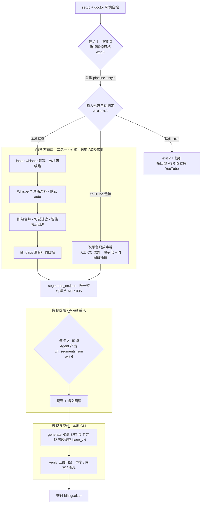

# video-translate

> 🎬 **视频转剪映中英双语字幕工具**：基于 faster-whisper 转写与 WhisperX 词级对齐的声学高保真管线、Agent 即引擎（Agent-as-engine）高质量上下文翻译、剪映即插即用双语字幕输出与三维质量自检门禁。

---

## 🤖 给 AI Agent 的引导（Agent Onboarding）

> 你是被召唤来操作本项目的 Agent。**不要直接猜命令，先按顺序读完以下协议再动手。**

1. **[`AGENTS.md`](AGENTS.md)** — 必读。规定执行协议、避坑防呆红线（声学时间戳不可改、开对齐必须重译、剪映缓存自动递增等）与状态机。
2. **[`TOOLCHAIN.md`](TOOLCHAIN.md)** — 环境搭建与 `.env` / 代理 / 镜像配置。
3. **[`docs/TOOLING.md`](docs/TOOLING.md)** — 工具与依赖管理（操作手册）：新增任何外部工具或 Python 依赖都照其第 2 节标准套路执行。
4. **[`docs/index.md`](docs/index.md)** — 文档库总索引（按角色导航 + ADR/Spec 全量清单 + 单一维护源约定）。
5. **[`docs/specs/00-overview.md`](docs/specs/00-overview.md)** — 行为总览；**[`docs/adr/`](docs/adr)** — 架构决策理由速查。

> **入口唯一 = `pipeline`，两种输入形态都直接丢给它**：
> `uv run video-translate pipeline "<视频路径>"` **或** `uv run video-translate pipeline "<YouTube 链接>"`。
> 入口按输入形态**自动判定** —— URL 走**接口型 ASR**（取平台现成字幕，零算力），
> 本地路径走**本地 Whisper**（[ADR-043](docs/adr/043-input-form-auto-routing.md) /
> [Spec 24](docs/specs/24-pipeline-behavior.md) §6）。
> **Agent 不需要判断输入是什么、也不需要挑选子命令。**
>
> 它同时是**幂等推进器**：每次调用自动定位进度并推进到下一个停点
> （[ADR-033](docs/adr/033-control-plane-pipeline-entry.md)）。**不要自行编排
> `run` → `generate` → `verify`** ——「该跑哪一步」由状态机决定，Agent 只在两个停点
> 接手（**决策点问风格** / **翻译 + 语义回读**）；`run` / `generate` / `verify` 退为
> 底层原语，仅供脚本与回归使用（`captions` 亦为显式直达入口，见下）。

**环境一律走 `uv run video-translate setup && uv run video-translate doctor`（命令统一 `uv run` 前缀，恒定位项目 `.venv`，见 [Spec 23](docs/specs/23-environment-location.md)），不要手动散落工具链、不要裸 `pip install torch`、不要改声学时间轴。** 任何依赖变更必须 `uv lock` 与 `pyproject.toml` 同 commit 提交。

---

---

## 🌟 核心特性 (Key Highlights)

- **🎙️ 声学绝对对齐 (Acoustic-Accurate Alignment)**：严格保留 whisper 转写产生的底层时间戳，下游断句与翻译**只改文本、绝不重算时间轴**，彻底杜绝字幕音画漂移（[ADR-012](docs/adr/012-acoustic-timestamp-truth.md)）。
- **🔧 强制声学对齐 (Forced Alignment, T4)**：**默认 `--align auto`** —— CUDA + whisperx 可用时自动用 WhisperX 的 wav2vec2 把每个词的时间戳校准到真实发音，消除快语速 / 长台词的字幕抢跑滞后；Mac / 未安装自动优雅降级 `none`（行为零变化），显式 `--align none` 可关闭（[ADR-028](docs/adr/028-whisperx-alignment-pass.md) / [Spec 22](docs/specs/22-whisperx-alignment.md)）。
- **🎵 人声/伴奏分离预处理 (Vocal Separation, T2)**：可选 `--separate-vocals` 用 Demucs 从原音轨剥离纯人声喂给 Whisper / `fill_gaps`，抑制强 BGM、哄笑、环境噪导致的幻觉词与吞字；**仅换输入源、不改时间轴运算**，未装库自动回退原音频（[ADR-017](docs/adr/017-vocal-separation.md) / [Spec 19](docs/specs/19-vocal-separation.md)）。
- **🌐 接口型 ASR（零算力取现成字幕）**：对**已在 YouTube 发布**的视频可直接 `pipeline "<YouTube 链接>"` —— 取平台现成字幕轨（人工 CC 优先于自动 ASR）当 ASR 结果，**不下载音视频、不跑 GPU 转写**，产物与本地转写**同契约**、直接接翻译。代价**明确标注、不粉饰**：无词级时间戳、无置信度字段、声学 lane 不可用（`verify` 产出 `acoustic-unavailable` 红灯）；无字幕即报错，**绝不静默回退本地转写**（[ADR-042](docs/adr/042-youtube-captions-as-asr-source.md) / [Spec 29](docs/specs/29-interface-asr-captions.md)）。
- **🤖 Agent 即引擎 (Agent-as-Engine)**：CLI 专注于声学重计算与切分，将翻译任务以结构化 JSON 抛给宿主 AI Agent（Claude / Cursor / VS Code Copilot 等）完成高质量上下文翻译，本地无需配置庞大 LLM 运行时；同时提供 `--engine google` 作为全自动无头兜底（[ADR-005](docs/adr/005-agent-as-engine.md)）。
- **⚡ 硬件自适应与工具链隔离**：支持 NVIDIA CUDA 自动加速与 CPU/int8 平滑降级；通过 `.env` / `.env.<platform>` 自动加载 FFmpeg 与 CUDA 库，彻底解耦宿主环境与业务代码（[TOOLCHAIN.md](TOOLCHAIN.md)）。
- **🛡️ 三维质量护栏 (Three-Lane Guardrails)**：
  - **声学层**：基于 `silencedetect` 独立参考自检跨静音与漏检（`uncovered-audio`），动态音频画像自动推荐 VAD 模式。
  - **内容层**：翻译行数覆盖率检查 + Pearson 索引对齐防串行 + 未翻译英文检测 + 语义回读任务。
  - **表现层**：默认维持 `tail 0.3s / min-dur 1.0s` 呼吸余量；输出目录自动递增版本号（`_v2`, `_v3`），规避剪映导入同名文件的内部缓存失效问题。
- **🔄 断点续跑与分块恢复 (Resumable Pipeline)**：转写过程按分块持久化缓存（`chunk_N.json`），中断后重跑自动跳过已完成分块，长视频重试零浪费。

---

## 🏗️ 架构与工作流 (Architecture & Workflow)



> **两条 ASR 通路的分工**（[ADR-042](docs/adr/042-youtube-captions-as-asr-source.md)）：
> **URL → 接口型**（零算力、**无词级**；声学 lane 不可用）；**本地路径 → Whisper**
> （有词级 / 置信度；声学 lane 可用）。两条在 `segments_en.json` 处汇合，**此后完全同路**。
> URL 输入的决策点仍会问翻译风格，但**跳过音频画像**（无本地音频）；`verify` 因缺音频参照
> 产出 `acoustic-unavailable` 红灯（strict 下 exit 8，`--no-strict` 显式弃权）。

---

## ⚡ 极速上手 (Quick Start)

### 0. 先决条件 (Prerequisites)
- **Python >= 3.10**
- **安装 [uv](https://docs.astral.sh/uv/)**（一次性引导器；Windows `irm https://astral.sh/uv/install.ps1 | iex`，macOS/Linux `curl -LsSf https://astral.sh/uv/install.sh | sh`）：`uv run video-translate setup` 默认走 `uv sync`（由 `uv.lock` 固化依赖版本，跨机器可复现）。
- **命令入口**：所有命令在项目根执行并统一加 `uv run` 前缀（`uv run video-translate ...` / `uv run python ...`），`uv` 自动定位项目 `.venv`，不依赖 PATH 里的系统 Python（[Spec 23](docs/specs/23-environment-location.md)）。
- **FFmpeg / ffprobe**：`uv run video-translate setup` 之后若 `doctor` 报 ffmpeg 缺失，运行 `uv run video-translate setup --ffmpeg` 即可**自动下载便携版**到 `tools/`（无需手动安装）。
- **WhisperX 对齐语料（GPU 用户）**：默认 `--align auto` 在 GPU 环境走 whisperx，需 nltk 的 `punkt`/`punkt_tab`。若 `doctor` 报缺失，运行 `uv run video-translate setup --align` 自动下载到 `models/nltk_data`（零 C 盘，[ADR-028](docs/adr/028-whisperx-alignment-pass.md) 决策 6）。
- Whisper 模型权重（约 3GB）会在下一步**自动下载**，无需手动获取。

### 1. 一键安装（依赖 + 模型）
```bash
cd <repo>
uv run video-translate setup
```
该命令一次性完成：通过 `uv sync` 安装全部依赖、并**自动预拉 `large-v3` 模型权重**到项目根 `models/large-v3/`（零 C 盘，随项目拷贝）。无需手动配置模型路径。

> 若你的网络需要代理/镜像，请先参考 [TOOLCHAIN.md](TOOLCHAIN.md) 配置代理环境变量，再重跑 `uv run video-translate setup`。

### 2. 配置本地工具链（FFmpeg / CUDA，可选）
若 FFmpeg / CUDA 不在系统 PATH 中，根据操作系统复制对应的环境模板（详细说明见 [TOOLCHAIN.md](TOOLCHAIN.md)）：
```bash
# Windows
copy .env.win.example .env.win
# macOS
cp .env.mac.example .env.mac
# Linux
cp .env.linux.example .env.linux
```
在 `.env.win` 中配置你本地的工具路径（**通常留空即可**——CUDA 由 venv 内 torch 自动探测、FFmpeg 可由 `uv run video-translate setup --ffmpeg` 自动下载；仅覆盖时填写）：
```dotenv
VT_FFMPEG_DIR=
VT_CUDA_DIR=
```

### 3. 环境自检 (Doctor)
```bash
uv run video-translate doctor
```
确保命令入口（`entry: uv-run` / `venv` 才正确）、`ffmpeg`、`ffprobe`、模型缓存处于 `[OK]` 状态；GPU 环境另关注 `whisperx`（对齐）与 `demucs`（人声分离）状态行。若模型显示 `[MISS]`，重跑 `uv run video-translate setup` 即可（不要手动改 `.env` 假设那是模型配置）。

### 4. 运行完整管线

> **输入可以是本地视频，也可以直接是 YouTube 链接** —— 入口自动判定，用法完全一样
> （[ADR-043](docs/adr/043-input-form-auto-routing.md) / [Spec 24 §6](docs/specs/24-pipeline-behavior.md)）：
>
> - `pipeline "videos/example.mp4"` → **本地 Whisper** 转写（有词级 / 置信度；声学 lane 可用）
> - `pipeline "https://www.youtube.com/watch?v=..."` → **接口型 ASR**，取平台现成字幕
>   （零算力、无词级；产物落在 `videos/<video_id>/`）
>
> 非 YouTube 的 URL（B站 / 直链等）会**明确报错**（exit 2）并给指引 —— 目前仅支持 YouTube，
> 本地文件请直接传路径。**不要自己判断该用哪个命令，丢给 `pipeline` 就行。**

#### 模式 A：Agent 引擎模式（推荐，默认）

> 用 **`pipeline` 单一入口**：每次调用自动推进到下一个停点，**重复调用永远安全**（断点续跑）。
> 全程只需「跑 pipeline → 按停点提示接手 → 再跑 pipeline」。

```bash
# ① 首次执行 → 停在「决策点」（exit 6），提示选择翻译风格
uv run video-translate pipeline "videos/example.mp4"
#     film（默认，影视口语）/ literal（忠实直译）/ bilingual_study（双语精读）
#     双轨对比：--style film,literal 一次生成两套任务文件

# ② 带上选择重跑 → 自动转写，完成后停在「翻译停点」（exit 6）
uv run video-translate pipeline "videos/example.mp4" --style film
#     强 BGM / 哄笑视频可加 --separate-vocals 先剥离人声；--align 默认 auto 无需手填
#     输出 videos/example/example.translate_task.json

# ③ Agent（或人工）阅读 task 文件，生成 videos/example/example.zh_segments.json

# ④ 再跑 pipeline → 自动 generate + verify，输出双语字幕
uv run video-translate pipeline "videos/example.mp4"
```

<details>
<summary>底层原语（脚本 / 回归用，日常无需手写）</summary>

```bash
uv run video-translate run "videos/example.mp4" --style film
uv run video-translate generate --segments "videos/example/example.segments_en.json" --zh "videos/example/example.zh_segments.json" --outdir "videos" --base "example"
uv run video-translate verify --segments "videos/example/example.segments_en.json" --zh "videos/example/example.zh_segments.json" --video "videos/example.mp4"
```

</details>

#### 模式 B：Google 翻译无头模式（全自动）
```bash
uv run video-translate run "videos/example.mp4" --engine google
```

链接来源同样可全自动（**零算力取字幕 + 无头翻译 + 一路出 SRT**，无需 GPU、无需 Agent）：
```bash
uv run video-translate pipeline "<YouTube 链接>" --engine google --prompt never
```

---

## 🛠️ CLI 命令与参数速查 (CLI Reference)

> 所有命令均在项目根执行，统一 `uv run` 前缀（恒定位项目 `.venv`，Spec 23）。

| 命令 (Subcommand) | 作用 | 核心参数示例 |
|---|---|---|
| **`pipeline`** | **单一入口幂等推进器（推荐）**：自动定位进度，执行下一步并推进到下一个停点，重复调用永远安全。**输入按形态自动判定**（本地路径 → 本地 Whisper；YouTube 链接 → 接口型 ASR；其他 URL → exit 2 并指引），Agent 无需挑选入口（[ADR-043](docs/adr/043-input-form-auto-routing.md)） | `uv run video-translate pipeline "videos/sample.mp4" [--style film\|literal\|bilingual_study] [--prompt always\|never\|require-profile] [--vad] [--separate-vocals]`<br>**或** `uv run video-translate pipeline "<YouTube 链接>" [--style ...] [--engine google] [--prompt never]` |
| `captions` | **接口型 ASR 直达入口**（详见 [ADR-042](docs/adr/042-youtube-captions-as-asr-source.md) / [Spec 29](docs/specs/29-interface-asr-captions.md)）：取平台现成字幕当 ASR 结果，与 `pipeline "<链接>"` **同产物、同目录**。用于探轨道 / 强制重取 / 直连排查通路（`pipeline` 不提供这些开关） | `uv run video-translate captions "<YouTube 链接>" [--list] [--lang en] [--no-auto] [--refresh] [--outdir videos] [--base <id>]` |
| `doctor` | 检查命令入口、环境依赖、GPU/whisperx/demucs 状态，分析视频音频画像推荐 VAD | `uv run video-translate doctor --video "videos/sample.mp4"` |
| `run` | 一站式执行流水线（转写 $\rightarrow$ 任务生成 $\rightarrow$ 生成字幕） | `uv run video-translate run "videos/sample.mp4" [--vad] [--adaptive-vad] [--style film\|literal\|bilingual_study] [--separate-vocals] [--align auto\|none\|whisperx]`（`--align` 默认 `auto`：GPU 走 whisperx） |
| `transcribe` | 仅执行音频抽取、Whisper 转写、WhisperX 对齐、合并断句与漏音补洞 | `uv run video-translate transcribe "videos/sample.mp4" [--separate-vocals] [--align auto\|none\|whisperx]` |
| `translate` | 执行翻译任务（Agent 模式下生成 task，Google 模式下直接调用） | `uv run video-translate translate --segments "...segments_en.json" --out "...zh_segments.json"` |
| `generate` | 将中英文合并生成 4 个产物，自动防剪映同名缓存碰撞 | `uv run video-translate generate --segments "...segments_en.json" --zh "...zh_segments.json"` |
| `verify` | 运行声学、内容、表现三维度门禁校验与语义回读 | `uv run video-translate verify --segments "...segments_en.json" --zh "...zh_segments.json" --video "...mp4"` |
| `backfill` | 针对 Google 模式下失败的段落进行回填补录 | `uv run video-translate backfill --pending "...agent_pending.json" --out "...zh_segments.json"` |
| `resegment` | 对特定时间窗口强制重转写指定语言（如修复混合语种） | `uv run video-translate resegment --segments "...segments_en.json" --video "...mp4" --windows 12.0-18.5 --lang ja [--separate-vocals]` |
| `setup` | 安装依赖、下载 `large-v3` 模型；`--ffmpeg` 下便携 FFmpeg；`--align` 下 nltk 对齐语料 | `uv run video-translate setup [--model large-v3] [--ffmpeg] [--align]` |

---

## ⚙️ 配置分层与优先级

参数解析优先级从高到低为：
```
CLI 参数 > 系统环境变量 / .env.local > .env.<platform> > .env > .video-translate.toml > 默认配置
```

### 常用环境变量表
| 环境变量 | 对应配置 | 默认值 | 作用说明 |
|---|---|---|---|
| `VT_FFMPEG_DIR` | - | `None` | FFmpeg/FFprobe 可执行文件目录（自动注入 PATH） |
| `VT_CUDA_DIR` | - | `None` | CUDA 运行库目录（Windows 自动注入 PATH 并添加 DLL 目录） |
| `VT_MODEL` | `model` | `large-v3` | 默认 Whisper 模型名称或本地目录路径 |
| `VT_DEVICE` | `device` | `auto` | 计算设备：`auto` (优先 CUDA，无 GPU 退回 cpu) / `cuda` / `cpu` |
| `VT_COMPUTE_TYPE`| `compute_type` | `auto` | 量化精度：`auto` (CUDA 为 `int8_float16`，CPU 为 `int8`) |
| `VT_CHUNK` | `chunk` | `240.0` | 转写分块时长（秒），支持断点续跑 |
| `VT_ENGINE` | `engine` | `agent` | 翻译引擎：`agent` (任务分发) 或 `google` (无头模式) |
| `VT_STYLE` | `style` | `film` | 翻译风格轨：`film` / `literal` / `bilingual_study`，可逗号多轨（T3，[ADR-027](docs/adr/027-translation-style-tracks.md)） |
| `VT_ALIGN` | `align` | `auto` | 词级强制对齐后端：`auto`（GPU + whisperx 可用走 whisperx，否则 `none`）/ `none` / `whisperx`（T4，[ADR-028](docs/adr/028-whisperx-alignment-pass.md)） |
| `VT_SEPARATE_VOCALS` | `separate_vocals` | `false` | 是否先用 Demucs 剥离纯人声再转写，抑制 BGM/噪声幻觉（T2，[ADR-017](docs/adr/017-vocal-separation.md)） |
| `VT_DEMUCS_MODEL` | `demucs_model` | `htdemucs` | Demucs 人声分离模型名（T2 高级参数，如 `htdemucs_ft` / `htdemucs_6s`） |
| `VT_PROXY` | `proxy` | `None` | HTTP 代理地址（仅 Google 引擎与模型下载需用，SOCKS 不支持） |
| `HF_ENDPOINT` | - | `None` | 国内 HuggingFace 镜像源（如 `https://hf-mirror.com`） |
| `PIP_EXTRA_INDEX_URL` | - | `None` | 国内 PyTorch wheel 镜像（CN 无代理安装用，如 `https://mirrors.tuna.tsinghua.edu.cn/pytorch-wheels/cu128/`；版本须与 `pyproject` 的 cu128 一致。`uv sync` 已内置，pip 需手动设） |

---

## 📂 项目产物说明

执行完成后，单个视频的全部产物（中间产物、缓存、状态链、最终字幕）统一收进以视频基名命名的子目录 `videos/<base>/`：

- `videos/<base>/<base>.bilingual.srt`：**中英双语字幕**（剪映直接导入主文件，顶部英文/底部中文）
- `videos/<base>/<base>.zh.srt`：纯中文字幕
- `videos/<base>/<base>.en.srt`：纯英文字幕
- `videos/<base>/<base>.txt`：中英文双语对照纯文本剧本

> 外层 `videos/` 下只保留源视频本体；所有 `<base>.` 前缀产物不再平铺在外层。

---

## 📖 文档导航中心 (Documentation Index)

> **完整索引见 [`docs/index.md`](docs/index.md)** —— 按角色导航 + ADR/Spec 全量清单 + 单一维护源约定。

| 文档 | 定位 |
|---|---|
| 🤖 **[AGENTS.md](AGENTS.md)** | AI Agent 执行协议、避坑防呆红线速查与状态机（翻译 Agent 必读） |
| 📚 **[docs/index.md](docs/index.md)** | 文档库总索引：目录结构、ADR/Spec 全量清单、维护约定 |
| 🛠️ **[TOOLCHAIN.md](TOOLCHAIN.md)** | 环境搭建操作手册：CUDA 配置、模型下载、依赖隔离 |
| 📦 **[docs/TOOLING.md](docs/TOOLING.md)** | 工具与依赖管理（操作手册）：E1–E4 操作速查、新增工具标准套路 |
| 🗺️ **[MAJOR_VERSION_PLAN.md](MAJOR_VERSION_PLAN.md)** | 任务路线图（E 系列 + T 系列 + §2B 接口型 ASR），含 §3.2 依赖与外部工具规则 R1–R7；图后附**进度快照** |
| 📜 **[docs/HISTORY.md](docs/HISTORY.md)** | 版本演进史、实战案例与踩坑复盘（V3–V18） |
| 🔍 **[docs/RESEARCH-voice-pro.md](docs/RESEARCH-voice-pro.md)** | Voice-Pro 对标研究（E 系列与依赖规则的论证来源；四项借鉴已全部落地） |
| 💀 **[docs/POSTMORTEM-JamieFoxx.md](docs/POSTMORTEM-JamieFoxx.md)** | Jamie Foxx 混剪事故复盘（V8–V13 护栏体系的由来） |
| 📐 **[docs/specs/](docs/specs/)** | 行为规格契约 SDD（00–29） |
| 🏛️ **[docs/adr/](docs/adr/)** | 架构决策记录 ADR（001–043，不可变历史） |
| 🗄️ **[docs/archive/](docs/archive/)** | 已归档（历史 / 废弃，不参与日常查阅，**勿照做**） |

---

## 📄 开源许可证 (License)

本项目基于 **MIT 许可证** 发布，完整文本见 [LICENSE](LICENSE)。

Copyright (c) 2026 BruceYang
