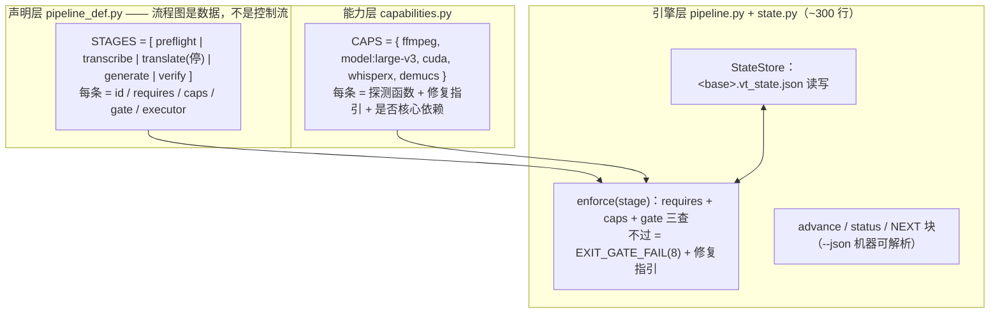

# CONTROL-PLANE-PLAN — 控制平面改造方案（已批准，全量落地 2026-09-01）

> 前置阅读：原 `CURRENT_PIPELINE.md`（master 基线 @ 5845102：9 个静默点 / 3 个介入点 / 3 处失控交接处，已删除，历史对照见 git 记录）。
> 定位：消灭 Agent-as-Orchestrator（编排收归代码），保留 Agent-as-Translator（翻译走文件契约，ADR-005 / Spec 09）。
> 状态：**已批准 · 全量落地**（2026-09-01，落地记录见 [ADR-030](adr/030-control-plane.md)）—— 不分期：原 S1/S2/S3 合并为依赖序 Steps 0–10 一次实施完毕（验收清单见 §7）。

---

## 0. 结论摘要

- 失控不在算法层（19 模块、333 测试、断点续跑、幻觉拦截均健康），在三个无强制力的交接处：
  **P0 地基只打印不应用** → **停点 A 之后 generate 无前置校验** → **P4 verify 默认放行**。
- 改造 = 把交接处的约定从 Agent 的脑子里搬进代码：**状态落盘（`<base>.vt_state.json`）+ 每阶段前置 `enforce()` 闸门 + 意图分级（显式选择必须被满足）**。
- Agent 的角色在改造后**收窄为纯翻译引擎**：AGENTS.md 从「翻译剧本 + 编排手册」双职责改为「翻译剧本 + 状态机接口说明」（§1.4）—— 翻译与语义回读永远留给 agent，流程推进收归代码状态机。
- **不引任何工作流框架**（Prefect/Airflow/Temporal/LangGraph 全部否决，理由见 §1.2）。

---

## 1. 三个裁决

### 1.1 裁决一：意图分级 ——「auto 可降级，显式必满足」

现状（master 代码实证，均有出处）：

| 场景 | 现状行为 | 代码位置 | 判定 |
|---|---|---|---|
| `align=auto`（默认）+ whisperx 不可用 | stderr 一条 info，降级 `none` 继续跑 | `transcribe.py:479-487` | ✅ 正确，保留 |
| `--align whisperx` **显式** + whisperx 不可用 | WARN + 降级 `none` 继续跑 | `transcribe.py:492-499` | ❌ 静默背叛显式意图 |
| `--separate-vocals` **显式** + demucs 不可用 | WARN + 回退原音频继续跑 | `cli.py:888`(transcribe) / `cli.py:487`(resegment) | ❌ 更严重（见下） |

demucs 缺失回退的额外代价：用户选 vsep 的唯一动机是强 BGM 会产幻觉字幕，静默回退 =
「想避免的坏结果被静默制造出来」+ 白烧整个转写时长。且 demucs 已是 pyproject 顶层核心依赖，
正常 `uv sync` 不缺 —— 缺 = 环境坏了，更无静默绕过的理由。

**通用规则**（进所有闸门）：

```
decision origin = default（用户未指定，程序取默认值）
    → 能力缺失时自动降级：打印 INFO + `实际生效值 / 降级原因` 写入状态文件
decision origin = explicit（命令行/env/config 点名要了）
    → 能力缺失 = 硬停：新退出码 EXIT_GATE_FAIL(8) + 修复指引，绝不静默降级
```

一句话：**auto 意味着「你帮我决定」；显式指定意味着「我要这个」。前者可降级但必须留痕，后者必须停。**

### 1.2 裁决二：不上工作流框架，包内声明式状态机（~300 行）

| 框架解决的问题域 | 本工具实际形态 |
|---|---|
| 常驻服务 + 分布式 worker + UI | 单机 GPU、一次性 CLI 进程 |
| DAG：并行、条件分支、跨机重试 | **线性 + 2 个停点**；分支只在 P0 拍板，拍板后路径唯一 |
| 框架级失败重试调度 | chunk 缓存断点续跑已解决（ADR-002，勿动） |
| LangGraph：agent 内部循环编排 | LLM 边界是文件契约 + 退出码，进程内零 LLM SDK |

另叠加红线 R6 新依赖准入第④项「有无纯标准库等价实现」直接否决：需求 =
状态持久化 + 顺序检查 + 门禁判定，标准库 json / hashlib / dataclass 足够。

**「好扩展容易配置」的正确形态**：不是运行时可配置的流程文件，而是「流程图 = 声明式数据 + git 版本化」。

- STAGES / CAPS / gates 全部是 Python 数据声明（引用函数对象，静态可查、可 diff）；
- 加阶段 = `STAGES` 加一条 + 一个执行函数，引擎零改动；
- 改流程 = 改声明 = 走 git diff / review。
- **元设计**：流程若可运行时配置，agent 就能配置出一条野路子；流程图锁死在代码里，agent 只能顺着走。

扩展点（全部零引擎改动）：

| 想加什么 | 动哪里 |
|---|---|
| 新阶段（如 OCR 烧录、自动上传） | `pipeline_def.STAGES` 加一条 + 对应 `cmd_*` |
| 新能力探测（如新对齐后端） | `capabilities.CAPS` 加一条（探测函数 + 修复指引文案） |
| 新闸门 | 实现 `gate(state, ctx) -> GateResult`，挂到相关 stage 声明 |
| 新翻译引擎 | `--engine` 插槽加模块（见 §1.3） |

### 1.3 裁决三：LLM 边界维持文件契约 —— 换 LLM 零改动

现状即答案（ADR-005 / Spec 09）：CLI 进程内永不调 LLM，边界 =
`translate_task.json`（出）→ `zh_segments.json`（回）→ exit 6 协议。

- **换宿主 agent**（Claude Code → Cline → GPT → 纯人工）：接口 = task 文件 schema + AGENTS.md Phase 2 指令，**零代码改动**；
- **换/增内嵌引擎**（不依赖宿主 agent）：既有 `--engine {agent,google}` 插槽，加 `--engine openai` 之类 = 新模块实现同一翻译契约，状态机只记录 `engine` 名，pipeline 零改动；
- 所有翻译质量守卫（`validate_zh` 覆盖 / `verify_align` 索引对齐 / semantic reread）都设在 **LLM 边界之外的机器侧** —— 换什么 LLM，闸门同样生效。这正是闸门放机器侧而非 prompt 侧的意义。

### 1.4 裁决四：AGENTS.md 双重职责分离 —— 翻译剧本保留，编排指令降级为接口说明

**现状（实测不足的根源之一）**：AGENTS.md 是**双职责**文件——
① 给 agent 当**翻译引擎的角色剧本**（§3 Phase 2：读 `translate_task.json` → 翻 → 写 `zh_segments.json`，含 persona/guidelines/schema/100% 覆盖）；
② 给 agent 当**编排执行手册**（§3 Phase 0-4 一步步教：先 doctor → 选 flag → `run` → 收 exit 6 → 手动 `generate` → 手动 `verify`，外加 VAD 路由决策表）。
它把**流程写成文字让 agent 照着背**——这就是「Agent-as-Orchestrator」的文字化版本：文字是**软约束**，agent 可跳步 / 回退 / 自行解读，甩锅链条正是从这里长出来的。

**改造目标**：双职责 → **单职责（引擎）+ 客户端接口说明**。约束源从「文档文字」移到「代码状态机」，AGENTS.md 不再教 agent 怎么编排，只告诉 agent 三件事：你是谁、你该做什么、怎么读机器给的下一步。

| 板块 | 现状 | 改造后 |
|---|---|---|
| §3 Phase 2 翻译剧本 | 保留 | **保留并强化** —— 这是 agent 唯一产出（persona + guidelines + schema + 100% 覆盖），是「Agent-as-Translator」的本体，一字不删 |
| §3 Phase 0/1/3/4 编排指令 | 手把手教执行 | **降级为状态机客户端接口**：用 `video-translate status [--json]` 读「你在哪 / 缺什么 / 下一步」；停点 A 翻译完 → 跑 `generate`（机器自带 enforce，gate fail 读出 8 跟指引）；跑 `verify`（红灯也跟 8） |
| §1 避坑红线表 | 行为约束 | **保留**（禁 `rm chunk_*.json`、禁改时间戳、禁 `--tail 0`、禁裸 `python`…… 这些是 agent 行为准则，与流程收归代码不冲突，反而互补） |
| VAD 路由决策表 / doctor 建议 | agent 自己重演决策 | 保留为「**如何读到建议 + 如何显式拍板**」：doctor 给建议 → run 落盘 decisions（含 origin）→ 显式选择受意图闸保护 → agent 不再需要自己当「音频画像专家」 |
| （新增）状态机速查 | — | 退出码 0–8 表、`status --json` 字段示例、NEXT 块含义、`pending_agent`（semantic 回读）处理 |

**关键边界**：
- **AGENTS.md 仍是唯一操作协议入口**，不删指令、只改性质 —— 纯人工 / 纯 Claude / 纯 Cline 照它都能跑通同一状态机（人也能读 `status`、也能手动翻译，`generate`/`verify` 的闸对人和 agent 一视同仁）；
- **翻译与回读永远留给 agent/人**：机器把任务文件给足（`translate_task.json` / `semantic_reread_task.json`），但翻译语感与语义忠实判断不可自动化，这是保留 Agent-as-Translator 的正当理由；
- Makefile（编排的第二份软约束，且 `$(...)` 在 Windows 必挂）按红线 R7 处置：删除或改 PowerShell 兼容，**不再承担流程入口**。

---

## 2. 三层架构与状态文件



职责边界：

- **声明层**只描述流程长什么样（阶段、依赖、能力需求、闸门），不含执行逻辑；
- **引擎层**唯一知道怎么推进（顺序检查 → 执行 → 落状态 → 打 NEXT）；硬上限 ~400 行；
- **能力层**唯一做环境探测（doctor 既有探测逻辑迁入/复用，doctor 变成 CAPS 的一种渲染）。

### 2.1 状态文件 `<base>.vt_state.json`（按 base 隔离，吸收旧设计）

```json
{
  "schema_version": 1,
  "base": "apollo_story",
  "video": "videos/apollo_story.mp4",
  "stage": "translate",
  "decisions": {
    "separate_vocals": {"value": true,  "origin": "explicit"},
    "align":           {"value": "auto", "resolved": "whisperx", "origin": "default"}
  },
  "capabilities": {"ffmpeg": true, "cuda": true, "whisperx": true, "demucs": true, "model:large-v3": true},
  "stages": {
    "transcribe": {"status": "ok", "segments_sha": "sha256:…", "n_segments": 42, "align_backend": "whisperx"},
    "translate":  {"status": "ok", "engine": "agent", "coverage": 1.0, "segments_sha": "sha256:…"},
    "generate":   {"status": "pending"},
    "verify":     {"status": "pending"}
  }
}
```

关键设计：

1. **按 base 隔离**：与 `<base>.segments_en.json` 同目录同命名法，多视频并行不互踩；
2. **segments_sha 指纹链**：transcribe 产出时算 sha → translate 完成时记录「翻译时所见 sha」→ generate 的 `enforce()` 比对该 sha 与当前文件 sha，**不一致 = 翻译陈旧**（对齐收紧段边界 → merge 段数变化 → 旧翻译按 index 错行的根因）→ 硬停；
3. **decisions 带 origin**：意图分级落点 —— `explicit` 决策要求对应 capability 必须满足；
4. **吸收而非并存**：architecture-reorg 分支的 `.preflight_decision` / `.vt_checkpoint` / `.vt_verify_gate` 三文件设计合并为本文件的 `decisions` / `stages` / `verify` 三节，**不再有第二份状态**；
5. **闸门独立于状态文件可用**：generate 硬校验（覆盖率 / 段数 / verify_align 阻断）只依赖 segments + zh 两个文件本身，不依赖 state 是否存在 —— agent 绕过 `run` 直接手敲 `generate`，闸门照样生效；state 只增强（陈旧检测），不是闸门前提。**这是防绕过的关键。**

### 2.2 退出码协议（现有 0–7，扩展 8）

`0 OK / 1 RUNTIME / 2 ARGS / 3 MISSING_DEP / 4 PROXY / 5 KILLED / 6 AWAITING_AGENT / 7 DOCTOR_FAIL` 之外新增：

```
EXIT_GATE_FAIL = 8   # 闸门拦截：显式能力缺失 / 覆盖不足 / 段数不匹配 / 翻译陈旧 / verify 红灯
```

语义与 3 区分：**3 = 环境坏了装不上（基础设施）**；**8 = 环境没事，但这条路径按契约不许走（编排）**。

### 2.3 工具解析失继（S1 前置第 0 项）—— 根因与分支补丁评估

> 用户实测现象：`doctor` / 转写第一步 ffmpeg 都在；到 **fill_gaps** 与 **verify（三重质量检查）** 阶段却找不到工具，Agent 据此做出错误判断。
> 本文件批准前已定位根因（master @ 5845102 代码实证），**必须作为 S1 的第 0 项前置先修**。

**根因（确定性问题，非偶发）**：

1. `init_toolchain()`（`toolchain.py:265-335`）把 ffmpeg/ffprobe 绝对路径解析进 `status.ffmpeg_path / ffprobe_path`（第 314-315 行），
   **但下游 `_resolve_binary`（`ffmpeg_utils.py:12-21`）从不消费这两个字段** —— 每次调用重新 `shutil.which(name)`，解析结果白存；
2. `_resolve_binary` 失败只回退**裸名** `"ffmpeg"`（不报错）→ 运行时 `FileNotFoundError`，
   或 `analyze_audio` 返回 `ok=False` → verify 打印 `"lane skipped"`（`cli.py:1082`）/ uncovered 被 `except` 吞成 `[]`（`cli.py:1102-1103`，静默点 7/8）；
3. Agent 看到 `lane skipped / uncovered=[]` 即误判「音频没洞、无需补录」—— 这正是「Agent 做出错误判断」的机器侧根源：
   **工具解析靠的是进程级一次性 PATH 注入这个隐式全局状态**（只保证 `main()` 入口），一旦脱轨（直接库调用 / 脚本 / 子进程 / 环境无系统级 ffmpeg）就静默丢失。

**分支补丁（architecture-reorg）方向正确**：

- `toolchain.py` 新增 `_TOOL_REGISTRY` / `resolve_tool(name)` / `tool_available(name)`：**工具二进制在 `init_toolchain` 一次性解析并持久化**，禁止调用点 ad-hoc `shutil.which`；
- `ffmpeg_utils._resolve_binary` 改为**优先读 `get_toolchain_status().ffmpeg_path`**（再 `shutil.which`，再裸名）；`get_toolchain_status()` lazy init 使**绕过 `main()` 的库调用也能自愈**；
- 注释点题：「a binary found at one pipeline stage is never *lost* at a later stage — no per-call PATH search, no CWD dependence」。

**吸收时的加固（分支补丁的残余缺口）**：

- 分支 fallback 末尾仍是 `shutil.which(name) or name` —— 若 `main()` 进了但 PATH 注入失败（如 `.env.local` 缺失）仍会裸名；
- 所以**光靠补丁不够**，必须叠加 S1 能力闸：`capabilities.py` 把 ffmpeg/ffprobe 列为首批能力项，状态机 `enforce()` 前置校验，不可用即 `EXIT_MISSING_DEP(3)` / 显式 `EXIT_GATE_FAIL(8)`，**绝不让下游静默丢失或返回 `lane skipped`**。

---


## 3. 九个静默点 → 闸门行为映射（落地清单）

| # | 基线静默点（CURRENT_PIPELINE §2） | 改造后行为 | 码 |
|---|---|---|---|
| 1 | `doctor --video` 建议只打印 | 建议照旧打印；`run` 落盘 decisions（含 origin），默认值生效但在状态与 NEXT 块**可见** | 0 |
| 2 | 显式 `--separate-vocals` 缺 demucs → 回退原音频 | **硬停** + `uv sync` 修复指引（改 `cli.py:888` 与 `cli.py:487` 两处） | 8 |
| 3 | `align=auto` 缺 whisperx 静默降级 | 保留降级；`state.decisions.align.resolved` + 原因写入，随时可查 | 0 |
| 3b | 显式 `--align whisperx` 缺包 → WARN 降级 | **硬停** + `uv sync --extra gpu` 指引（改 `transcribe.py:492-499`） | 8 |
| 4 | generate 前置不校验；verify_align 仅 stderr warning | `enforce()`：覆盖 100% + 段数匹配 + segments_sha 一致 + verify_align 命中即阻断（`cli.py:697-709` warning 升级为阻断；`validate_zh` 由可选命令变为 generate 内置闸门） | 8 |
| 5 | verify 默认非 strict 红灯退 0 | **strict 默认化**（红灯 = 8）；`--no-strict` 显式逃生门保留 | 8 |
| 6 | verify 缺 `--zh` / `--video` → lane skip | 缺参直接拒跑（verify 必须全 lane） | 2 |
| 7 | 音频画像失败 → lane skipped | 失败 = 声学 lane 红灯（非 skip） | 8 |
| 8 | uncovered 探测异常被吞 → 空数组 | 异常 = 红灯 + 报告记录摘要 | 8 |
| 9 | semantic reread 只产不消费 | verify 末尾查 result：缺失 → 重挂 reread task + 状态 `pending_agent` + NEXT 块提示（已产出的 SRT 不撤回，但状态链不显示「完成」） | 提示 |

> 三个介入点（P0 拍板 / 停点 A 翻译 / P4 语义回读）本质不变：**人/agent 仍要做这些事**，区别是现在有机器闸门在背后盯 —— 没做就不让你前进。

---

## 4. 分期落地

### S1 —— 意图闸 + 状态链（堵最疼的洞，预计 1 天）

**第 0 项前置 —— 工具解析持久化（§2.3，先于一切闸门）**：

0. 吸收分支补丁：`toolchain.py` 加 `_TOOL_REGISTRY` / `resolve_tool(name)` / `tool_available(name)`；
   `ffmpeg_utils._resolve_binary` 改为优先读 `get_toolchain_status()` 持久化路径（lazy init 自愈直接库调用）；
   verify 的 `lane skipped`（`cli.py:1082`）与 uncovered `except` 吞异常（`cli.py:1102-1103`）改为显式红灯 + 报告记录（联动静默点 7/8）；
   契约测试：**绕过 `main()`**直接调 `probe_duration` / `analyze_audio`（系统 PATH 无 ffmpeg，仅 `tools/` 便携版）仍解析到 `tools/ffmpeg/bin`；verify 在 ffmpeg 缺失时必红非零，不再 `lane skipped`。

1. `src/video_translate/capabilities.py`：探测函数 + 修复指引（复用 doctor 既有探测，不重复实现，doctor 保持输出兼容）；
2. 意图分级落地：`transcribe.py:_resolve_align_backend` 显式分支（492-499）、`cli.py:888`（transcribe vsep 回退）、`cli.py:487`（resegment vsep 回退）→ 一律 `EXIT_GATE_FAIL(8)` + 指引；
3. `src/video_translate/state.py`：`<base>.vt_state.json` 读写 + segments_sha 链；`run` / `transcribe` 完成时落盘；
4. `cmd_generate` 前置 `enforce()`：`validate_zh` 覆盖率 100% + en/zh 段数匹配 + segments_sha 一致 + verify_align 阻断（不依赖 state，独立生效）—— 现有 697-709 的 warning 路径升级为阻断；`--no-align-check` 语义保留为显式逃生门（改名考虑见 §5）；
5. **契约测试（红灯先行）**：
   - 显式 `--align whisperx` 缺包 → 8；显式 `--separate-vocals` 缺 demucs → 8；
   - zh 覆盖 <100% → generate 8；zh 段数 ≠ en 段数 → generate 8；翻译后 segments 变更（陈旧）→ generate 8；
   - **零回归**：align=auto 降级路径、demucs 可用时的 vsep 路径行为不变；既有 333 测试全绿。

### S2 —— 声明式流程 + 驱动器（可视化，预计 1 天）

1. `src/video_translate/pipeline_def.py`：STAGES 声明（含 requires / caps / gate / executor / stop_point）+ `src/video_translate/pipeline.py` 引擎（enforce / advance / status，<400 行）；
2. `video-translate status [--json]`：读 state 打印「你在哪 / 缺什么 / 下一步干什么」；缺 state 时从产物文件推断可用进度（兼容存量）；
3. `run` / `generate` 尾部 NEXT 块支持 `--json`（机器可解析，agent 不再靠读散文找下一步）；
4. 契约测试：任意中间态 status 输出含当前 stage 名与下一动作。

### S3 —— verify 收口 + 文档对齐（预计半天）

1. verify strict 默认化 + 缺参拒跑 + 画像失败 / uncovered 异常转红（静默点 5–8，`cli.py:1053` cmd_verify）；
2. semantic reread result 消费闭环（静默点 9）；
3. **AGENTS.md 双职责分离（按 §1.4）**：
   - Phase 2 翻译剧本 + Phase 4 语义回读：**原样保留**（Agent-as-Translator 本体，一字不删）；
   - Phase 0/1/3/4 编排指令：改写为状态机客户端接口（用 `status` 读「你在哪 / 下一步」，`generate` / `verify` 自带 enforce，gate fail 读出 exit 8 跟指引）；
   - §1 避坑红线表：保留（agent 行为准则），删除「流程编排建议」类条目；
   - 新增状态机速查章节（退出码 0–8、`status --json` 字段示例、NEXT 块含义、`pending_agent` 处理）；
   - Makefile 处置：删除或用 PowerShell 兼容语法重写（当前 `$(...)` sh 语法在 Windows 必挂，且与红线 R7 自相矛盾），**不再承担流程入口**；
4. 契约测试：verify 红灯必非零；缺参必拒跑。

---

## 5. 向后兼容承诺

- 默认路径行为不变：`align=auto` 降级保留；demucs 可用时 vsep 正常；既有 CLI 参数全部兼容；
- 存量产物无 state：`run --skip transcribe` / 直接 generate 时按当前文件 sha 补录重建状态；
- golden 回归：align=none 字节级路径、chunk 缓存指纹（ADR-002）一概不动；
- 逃生门只能显式打开（`--no-strict`；align/vsep 的逃生暂用 `--no-align-check`，S3 统一为 `--allow-degrade` 语义），**静默不复存在，但总有出路**。

---

## 6. 风险与边界

| 风险 | 对策 |
|---|---|
| 硬停激怒脚本用户（CI/批处理） | 逃生门一律显式 flag；默认严格，给了出路就不算锁死 |
| state 文件被手工编辑 / 损坏 | schema_version 校验；损坏即重建（从产物 sha 补录）；闸门不依赖 state 故不拒服务 |
| 引擎层膨胀回「上帝模块」 | 硬上限 ~400 行；新增逻辑进声明层（数据）或能力层（探测），引擎只留推进/判定/落盘 |
| 与 architecture-reorg 分支合并冲突 | 该分支 3 份状态文件设计已在 §2.1 吸收；分支保留作参考，落地按本文重做，不 cherry-pick |
| 换 LLM 后翻译质量下降 | 质量闸门（覆盖/对齐/语义回读）全在机器侧、独立于 LLM，见 §1.3 |

---

## 7. 验收清单（用户拍板后逐项打勾）

- [x] 设计文档获批（本文）
- [x] 意图闸（explicit 缺能力 → exit 8）+ `state.py` + generate 前置闸完工，契约测试绿 + 基线零回归（cp Steps 1–5）
- [x] `pipeline_def` / `pipeline.py`（<400 行）/ `status` 子命令 / NEXT 块（`--json` 可解析）完工（cp Steps 7–8）
- [x] verify 收口（strict 默认 / 缺参拒跑 / 画像失败即红）+ semantic 消费闭环 + AGENTS.md 双职责分离（§1.4）+ Makefile 移除（cp Steps 6/9）
- [x] 全量 `uv run pytest` 绿（416 passed / 12 skipped，基线 333 零回归）；`uv run video-translate doctor` 全绿（cp Step 10 终验，2026-09-01）

---

## 附录 A：本次设计与既有代码的锚点（master @ 5845102）

| 改动点 | 位置 |
|---|---|
| 退出码 0–7 | `cli.py:39-46` |
| transcribe 内 vsep 缺 demucs 回退 | `cli.py:888` |
| resegment vsep 缺 demucs 回退 | `cli.py:487` |
| `_resolve_align_backend` 显式 whisperx 降级 | `transcribe.py:492-499` |
| align=auto 降级 | `transcribe.py:479-487` |
| generate 前置 verify_align warning | `cli.py:697-709` |
| `cmd_generate` 入口 | `cli.py:684` |
| `cmd_run` 停点 A / exit 6 | `cli.py:722`（750-798） |
| `cmd_verify` 入口 | `cli.py:1053` |
| `validate_zh` | `translate.py:342` |
| 对齐后端常量 | `align.py:41` |
| `init_toolchain` 解析但下游不消费 | `toolchain.py:314-315` ↔ `ffmpeg_utils.py:12-21` |
| verify `lane skipped` / uncovered 吞异常 | `cli.py:1082` / `cli.py:1102-1103` |
| 分支补丁机制（待吸收） | `architecture-reorg`: `toolchain.py` `resolve_tool` + `ffmpeg_utils._resolve_binary` |