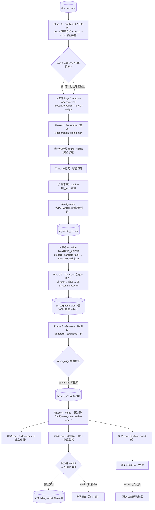

# CURRENT_PIPELINE — master 现状全链路流程图（基线）

> 数据来源：`master @ 5845102`（`git checkout master` 后的干净基线，333 passed / 12 skipped）。
> 本文件如实记录**当前代码实际行为**，不做任何整改建议之外的加工——尤其标出「静默点」（不报错但有问题）
> 与「介入点」（必须人/agent 动手的环节）。这是后续控制层改造的对照基线。

---

## 0. 总览图

---

## 1. 分阶段明细

| 阶段 | 入口命令 | 产物 | 执行者 | 介入点 | 静默点 |
|---|---|---|---|---|---|
| **P0 Preflight** | `video-translate doctor` / `doctor --video x.mp4` | 环境报告 + **打印**建议 | 机器算、人拍板 | 人必须自己记下 VAD/人声分离/风格选择 | 建议只打印，**不自动应用**；不拍板则默认静默生效 |
| **P1 Transcribe** | `video-translate run x.mp4`（或 `transcribe`） | `segments_en.json` | 机器全自动 | 无 | vsep 未装 demucs → warn + 回退原音频；align 未装 whisperx → 静默降级 none |
| **停点 A** | `run` 自动触发 | `translate_task.json` | — | **exit 6 挂起，等 agent/人** | 无（显式挂起） |
| **P2 Translate** | （agent 操作） | `zh_segments.json` | **agent** | agent 翻译完需 100% 覆盖 index | 覆盖不足不立即报错；**没有代码状态记录“翻译已完成”，链状态活在 agent context 里** |
| **P3 Generate** | `video-translate generate --segments --zh` | `{base}/_vN/*.srt` | **外部调用方（agent）发起，机器不自动衔接** | ①前置不校验（不查覆盖/段数/是否已重译）②verify_align 只打 **stderr warning，不阻断渲染** → 错行字幕后置暴露 |
| **P4 Verify** | `video-translate verify --segments --zh --video` | `<base>.verify_report.json` 打印 + `<base>.semantic_reread_task.json` | 机器报告、agent 回读 | agent 可回读 semantic task | ①**默认非 --strict 红灯也退 0**（静默放行）；②缺 `--zh`/`--video` → lane 直接 skip 打印；③audio 画像失败 → lane skipped；④uncovered 异常被吞 → 空数组；⑤semantic **只产不消费 result** |

---

## 2. 静默点清单（不报错但有问题）⭐

| # | 位置 | 现象 | 后果 |
|---|---|---|---|
| 1 | `doctor --video` | 建议只打印不定档 | 地基参数（vsep/风格）默认值静默生效，选错 = 整条链重跑才暴露 |
| 2 | `transcribe --separate-vocals` | demucs 未装 → warn + 回退原音频 | 强 BGM 幻觉问题未治，warn 极易被淹没 |
| 3 | `align=auto` | whisperx 不可用 → 静默降级 none | 时间戳精度未提升（**这是设计**，但发生与否无日志可查） |
| 4 | `generate` | verify_align 命中 → **仅 stderr warning，继续渲染** | 中英错行 SRT 照常产出，不看 stderr 就发现不了 |
| 5 | `verify` | **默认非 `--strict` → 任何红灯退 0** | 报告型门禁形同虚设；`run`/`generate` 也不自动触发它 |
| 6 | `verify` 缺参 | `--zh`/`--video` 未传 → lane skip | 验证不完整却不报错，以为验证过实际没有 |
| 7 | `verify` 音频画像 | analyze_audio 失败 → "lane skipped" | 声学 lane 缺失无告警 |
| 8 | `verify` uncovered | 探测异常被 `except` 吞掉 → `uncovered=[]` | 漏检窗口消失，观众看到没字幕 |
| 9 | `verify` semantic | 只生成 reread task，**result 无人读** | 忠实度检查（语义层）整个空转 |

---

## 3. 介入点清单（必须人/agent 动手的环节）

| # | 位置 | 谁 | 做什么 | 漏掉后果 |
|---|---|---|---|---|
| 1 | P0 → P1 | 人 | 拍板地基参数（vsep / 风格 / vad） | 默认静默生效，选错重跑全链 |
| 2 | 停点 A（exit 6） | **agent** | 读 `translate_task.json` → 翻译 → 写 `zh_segments.json` | 流程物理停在原地，无 SRT |
| 3 | P4 语义回读 | agent | 回读 `<base>.semantic_reread_task.json` → 产 result | 无强制、无人消费，此闸 = 空转 |

---

## 4. 一句话点评

> 算法层（声学计算、对齐、生成）是**全自动且可靠**的；失控集中在**三个没有强制力的交接处**：
> P0 的地基拍板（建议只打印）、停点 A 之后的 `generate`（永远等人工手敲）、P4 的 verify（默认放行 + 只产不消费）。
> 这就是「需要全程盯」的三个根源——它们全部是**编排/契约问题，不是算法问题**。